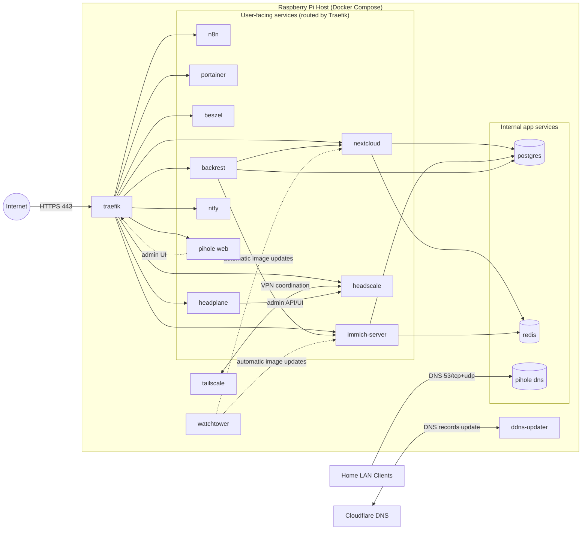

# pi-web

[](https://docker.com/)
[](https://www.raspberrypi.org/)

`pi-web` is a compact self-hosting stack for Raspberry Pi, managed with a single Docker Compose setup.

It includes:
- Private cloud servers (`nextcloud`, `immich`, `n8n`)
- Push notifications (`ntfy`)
- Personal DNS filtering (`pihole`)
- VPN Connectivity (`tailscale`, `headscale`, `headplane`)
- Secured network access using reverse proxy + TLS (`traefik` with Cloudflare DNS challenge and DDNS updater)
- Monitoring (`beszel`) and container management (`portainer`)
- Backup management (`backrest`)
- Internal data services (`postgres`, `redis`)
- Maintenance (`watchtower`)

---

## Requirements

### Hardware Requirements

**Minimum:**
- Raspberry Pi 5 with 8GB RAM
- MicroSD card (16GB+) or SSD storage

**Recommended:**
- Raspberry Pi 5 with 16GB RAM
- NVMe SSD HAT for storage (significantly improves performance and reliability)

### Prerequisites

Before installing pi-web, you'll need:

1. **Domain Name**: A registered domain name for accessing your services via HTTPS
2. **Cloudflare Account**: Free Cloudflare account for:
   - DNS management
   - Dynamic DNS (DDNS) updates
   - SSL/TLS certificate provisioning via DNS challenge
3. **Cloudflare API Token**: Generate an API token with DNS edit permissions for your zone
4. **Docker & Docker Compose**: Installed on your Raspberry Pi (checked during `make preflight`)

---


## Architecture



## Connecting Devices with Tailscale
This stack includes Headscale for managing your private Tailscale network. To connect new devices:

### Quick Command

```bash
make headscale-register <key>
```

### Detailed Steps
```bash
make headscale-register <key>
```
Replace `<key>` with the actual key from the client.

Your device will now be connected to your private VPN network managed by Headscale.

  

---

## Install guide

1. Clone the repository.
2. Copy `.env.dist` to `.env` and fill required values.
3. Run preflight checks using `make preflight`.
4. Install/start the stack using `make install`.

```bash
git clone https://github.com/florianajir/pi-web.git
cd pi-web
cp .env.dist .env
make preflight
make install
make status
make logs
```

---


## Connecting Devices with Tailscale

This stack includes Headscale for managing your private Tailscale network. To connect new devices:

### Quick Command

```bash
make headscale-register <key>
```

### Detailed Steps

1. On the client device, install Tailscale and run the join command. It will output a registration key and prompt for approval.
2. Copy the key provided by the client.
3. On your Pi-Web host, run:

   ```bash
   make headscale-register <key>
   ```

   Replace `<key>` with the actual key from the client.

Your device will now be connected to your private VPN network managed by Headscale.


---

## Make commands

| Command | Description |
| --- | --- |
| `make preflight` | Verify Docker/cgroup readiness |
| `make install` | Install systemd units and start stack |
| `make uninstall` | Remove stack, volumes, and units (destructive) |
| `make start` | Start stack |
| `make stop` | Stop stack |
| `make restart` | Restart stack |
| `make status` | Show stack status |
| `make logs` | Follow stack logs |
| `make headscale-register <key>` | Register a Headscale node |
| `make headscale-reset` | Reset all Headscale registrations (destructive) |

---

## Variables listing (`.env`)

### Personal
- `HOST_NAME`
- `TIMEZONE`
- `EMAIL`
- `USER`
- `PASSWORD`
- `DATA_LOCATION` (default: `./data`)

### Network
- `HOST_LAN_IP`
- `HOST_LAN_PARENT` (default: `eth0`)
- `HOST_LAN_SUBNET` (default: `192.168.1.0/24`)
- `HOST_LAN_GATEWAY` (default: `192.168.1.1`)
- `PIHOLE_IP` (default: `192.168.1.250`)
- `ALLOW_IP_RANGES` (default: `127.0.0.1/32,192.168.1.0/24,100.64.0.0/10,172.30.0.0/16`)

### Traefik / Cloudflare
- `CLOUDFLARE_DNS_API_TOKEN`
- `CLOUDFLARE_ZONE_ID`

### Backup tuning (optional)
- `NEXTCLOUD_SQL_BACKUP_KEEP` (default: `2`)

---

## License

[](https://opensource.org/licenses/MIT)
