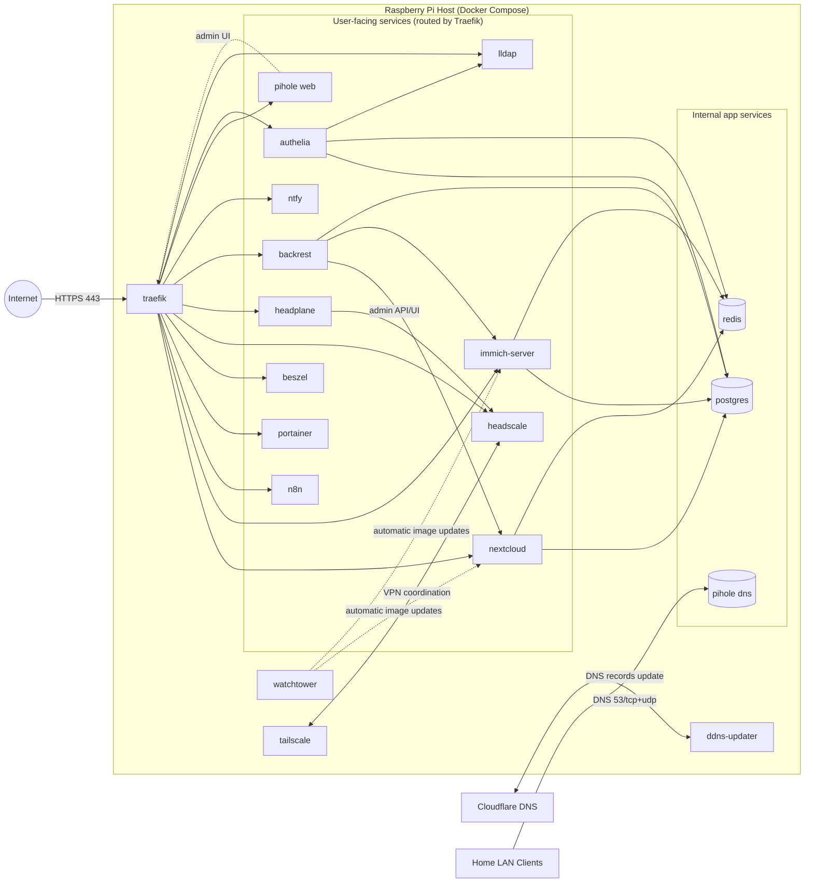
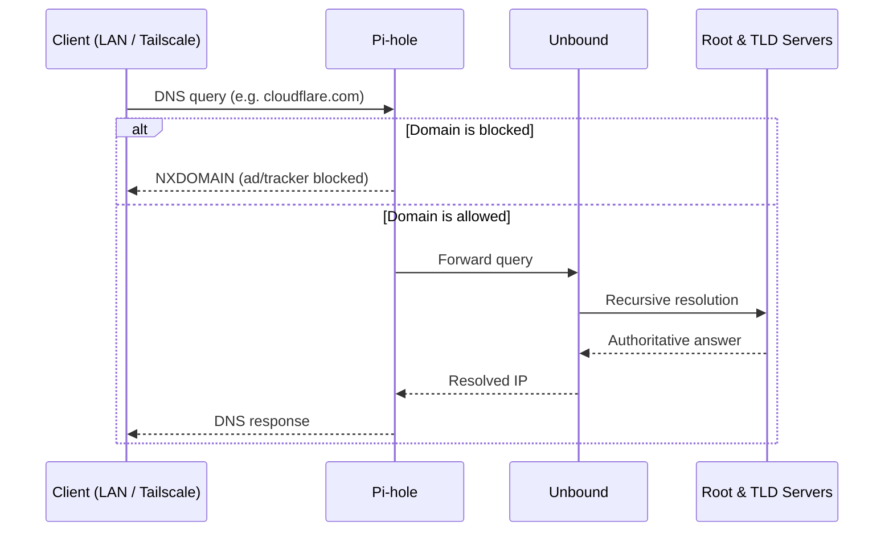
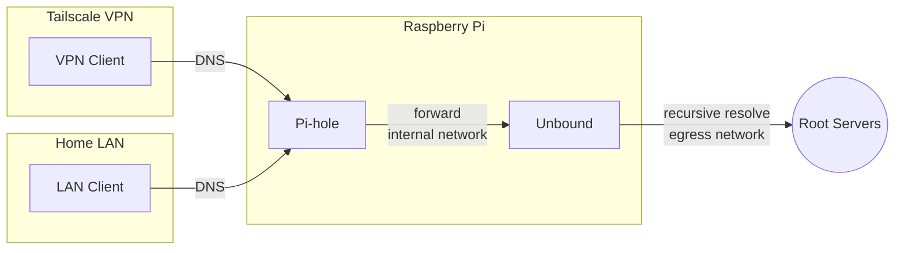
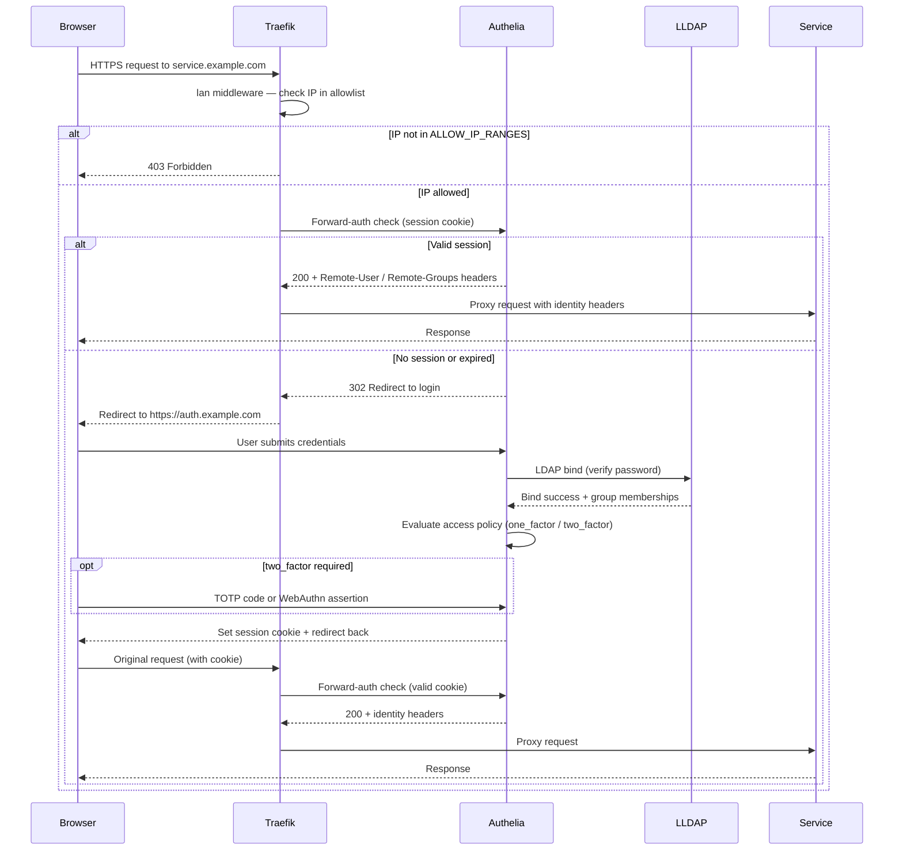
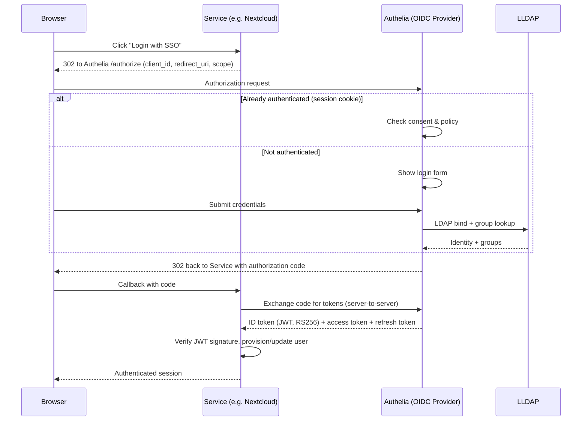
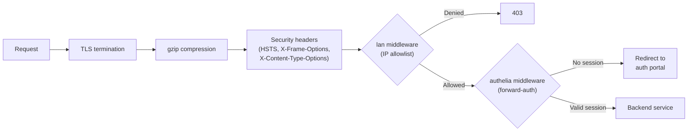
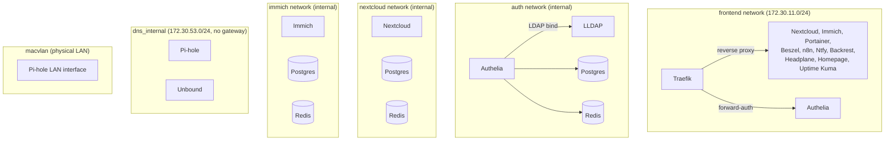

# pi-web

[](https://docker.com/)
[](https://www.raspberrypi.org/)

`pi-web` is a compact self-hosting stack for Raspberry Pi, managed with a single Docker Compose setup.

It includes:
- Private cloud servers (`nextcloud`, `immich`, `n8n`)
- Push notifications (`ntfy`)
- Personal DNS filtering (`pihole`)
- VPN Connectivity (`tailscale`, `headscale`, `headplane`)
- Secured network access using reverse proxy + TLS (`traefik` with Cloudflare DNS challenge and DDNS updater)
- **Single Sign-On (SSO)** authentication via OIDC with `authelia` (backed by `lldap` user directory)
- Monitoring (`beszel`) and container management (`portainer`)
- Backup management (`backrest`)
- Internal data services (`postgres`, `redis`)
- Maintenance (`watchtower`)

---

## Requirements

### Hardware Requirements

**Minimum:**
- Raspberry Pi 5 with 8GB RAM
- MicroSD card (16GB+) or SSD storage

**Recommended:**
- Raspberry Pi 5 with 16GB RAM
- NVMe SSD HAT for storage (significantly improves performance and reliability)

### Prerequisites

Before installing pi-web, you'll need:

1. **Domain Name**: A registered domain name for accessing your services via HTTPS
2. **Cloudflare Account**: Free Cloudflare account for:
   - DNS management
   - Dynamic DNS (DDNS) updates
   - SSL/TLS certificate provisioning via DNS challenge
3. **Cloudflare API Token**: Generate an API token with DNS edit permissions for your zone
4. **Docker & Docker Compose**: Installed on your Raspberry Pi (checked during `make preflight`)

---


## Architecture



---

## DNS Architecture

This stack implements a privacy-first, three-tier recursive DNS pipeline. No third-party DNS provider (Google, Cloudflare, etc.) ever sees your queries.

### Components

| Tier | Container | Role |
|------|-----------|------|
| 1 | **Pi-hole** | Ad/tracker filtering, local hostname resolution |
| 2 | **Unbound** | Recursive resolver — walks the DNS delegation tree from root servers |
| 3 | **Root servers** | Authoritative source of truth |

### DNS Query Flow



### Tailscale DNS integration

Headscale is configured with [MagicDNS](https://tailscale.com/kb/1081/magicdns) and pushes Pi-hole as the global nameserver to all connected clients. Any device that joins the Tailscale network with `--accept-dns=true` automatically uses Pi-hole for DNS over the encrypted WireGuard tunnel — no manual client configuration required.

Headscale also sets up split DNS for the local domain (e.g. `pi.ajir.dev`) so that service hostnames like `nextcloud.pi.ajir.dev` resolve correctly inside the VPN.

### Network isolation

Pi-hole and Unbound communicate over a dedicated internal Docker bridge network that has no internet gateway — the two containers can reach each other, but nothing else can reach Unbound directly. Unbound is additionally attached to a separate egress network exclusively for outbound recursive queries to root servers.



---

## Security & Authentication

This stack implements a defense-in-depth authentication architecture with multiple layers: network-level IP filtering, a VPN mesh, a central SSO portal, and per-service OIDC integration — all backed by a lightweight LDAP directory.

### Components overview

| Component | Role |
|-----------|------|
| **Traefik** | Reverse proxy — terminates TLS, applies middleware chains (IP allowlist, forward-auth) |
| **Tailscale / Headscale** | WireGuard VPN mesh — only devices on the tailnet can reach services behind the `lan` middleware |
| **Authelia** | SSO portal & OIDC provider — handles login, session management, 2FA, and issues OIDC tokens |
| **LLDAP** | Lightweight LDAP directory — single source of truth for user identities and group memberships |
| **Redis** | Session store for Authelia (cookie-based sessions with inactivity/absolute timeouts) |
| **PostgreSQL** | Persistent storage for Authelia (user preferences, TOTP devices, WebAuthn credentials) |

### Authentication flow



### OIDC single sign-on

Services that support OpenID Connect bypass forward-auth and authenticate directly against Authelia as an OIDC provider. This gives each service its own token-based session while the user only logs in once.



**Registered OIDC clients:**

| Client | Scopes | Auth method | Consent | Policy | Notes |
|--------|--------|-------------|---------|--------|-------|
| Nextcloud | openid profile email groups offline_access | client_secret_post | implicit | one_factor | Group provisioning enabled |
| Immich | openid profile email | client_secret_post | implicit | one_factor | Mobile app callback supported |
| Beszel | openid profile email | client_secret_basic | implicit | one_factor | PKCE (S256) enabled |
| Portainer | openid profile email groups | client_secret_basic | implicit | one_factor | Auto-team provisioning |
| Headplane | openid profile email | client_secret_basic | implicit | **two_factor** | VPN admin — stricter policy |

### Traefik middleware layers

Every incoming request passes through Traefik, which applies a chain of middlewares before reaching the backend service.



**Middleware assignment per service:**

| Service | `lan` (IP allowlist) | `authelia` (forward-auth) | Own OIDC | Notes |
|---------|:---:|:---:|:---:|-------|
| Authelia portal | — | — | — | Public entry point for login |
| Nextcloud | — | — | yes | Handles auth via OIDC plugin |
| Immich | yes | — | yes | LAN-only + built-in OIDC |
| Portainer | yes | — | yes | LAN-only + API-configured OIDC |
| Beszel | yes | — | yes | LAN-only + PKCE OIDC |
| n8n | yes | — | — | LAN-only, own auth |
| Ntfy | yes | — | — | LAN-only, own auth |
| Traefik dashboard | yes | yes | — | Admin: requires 2FA |
| Pi-hole | yes | yes | — | Admin: requires 2FA |
| Uptime Kuma | yes | yes | — | Admin: requires 2FA |
| Backrest | yes | yes | — | Admin: requires 2FA |
| Homepage | yes | yes | — | Admin: requires 2FA |
| LLDAP | yes | — | — | LAN-only (avoids double auth) |
| Headplane | yes | — | yes | LAN-only + two_factor OIDC |

### Access control policies

Authelia enforces group-based access rules defined per domain:

| Domain pattern | Required group | Policy | Description |
|----------------|---------------|--------|-------------|
| `auth.*` | — | bypass | Login portal itself |
| `backrest.*`, `pihole.*`, `traefik.*`, `uptime.*` | admin or lldap_admin | one_factor | Admin tools |
| `headscale.*/admin` | admin or lldap_admin | **two_factor** | VPN administration |
| `*.*` (catch-all) | users | one_factor | All other services |

### Network segmentation

Docker networks enforce east-west isolation between services:



### Secret management

All secrets are **auto-generated on first start** by `scripts/authelia-pre-start.sh` and stored under `${DATA_LOCATION}/authelia-config/secrets/` with `600` permissions:

| Secret | Purpose |
|--------|---------|
| `jwt_secret` | Authelia identity validation tokens |
| `session_secret` | Session cookie signing |
| `storage_encryption_key` | Database credential encryption |
| `oidc_hmac_secret` | OIDC token HMAC signing |
| `oidc_private_key.pem` | RSA-2048 key for JWT RS256 signatures |
| `oidc_<client>_secret.txt` | Per-client OIDC shared secrets |
| `ldap_password` | LDAP bind password (= `PASSWORD` from `.env`) |

OIDC client secrets are injected into services via Docker volume mounts (read-only). No secrets are baked into images or committed to the repository.

---

## Email & SMTP Configuration

The stack supports outbound email for notifications, password resets, and workflow automation. All services share a single set of SMTP credentials defined in `.env`.

### Environment variables

| Variable | Description | Default |
|----------|-------------|---------|
| `SMTP_HOST` | SMTP server hostname | `localhost` |
| `SMTP_PORT` | SMTP server port | `587` |
| `SMTP_USERNAME` | SMTP authentication username | *(empty)* |
| `SMTP_PASSWORD` | SMTP authentication password | *(empty)* |
| `EMAIL` | Sender address (also used as admin email across services) | `noreply@localhost` |

Optional per-service overrides (rarely needed):

| Variable | Used by | Description | Default |
|----------|---------|-------------|---------|
| `SMTP_SECURE` | Nextcloud | Connection security (`tls`, `ssl`, or empty) | `tls` |
| `SMTP_AUTHTYPE` | Nextcloud | Authentication method | `LOGIN` |
| `SMTP_ENCRYPTION` | LLDAP, Authelia | Encryption mode | `STARTTLS` |
| `SMTP_SSL` | n8n | Enable SSL | `false` |
| `SMTP_ENABLED` | LLDAP | Enable password-reset emails | `false` |
| `MAIL_FROM_ADDRESS` | Nextcloud | Local part of sender address | `nextcloud` |
| `MAIL_DOMAIN` | Nextcloud | Domain part of sender address | `${HOST_NAME}` |

### Services using SMTP

#### Auto-configured from `.env`

These services read SMTP settings directly from environment variables at startup — no manual configuration needed:

| Service | Purpose | Notes |
|---------|---------|-------|
| **Authelia** | 2FA enrollment emails, password reset, identity verification | Uses `submission://` URI scheme; `disable_startup_check` is enabled so the stack starts even without valid SMTP |
| **Nextcloud** | Sharing notifications, activity digests, password resets | Sender is `${MAIL_FROM_ADDRESS}@${MAIL_DOMAIN}` (e.g. `nextcloud@pi.example.com`) |
| **LLDAP** | Self-service password reset emails | Disabled by default (`SMTP_ENABLED=false`); set to `true` in `.env` to enable |
| **n8n** | Workflow email nodes (Send Email action), error notifications | Standard SMTP envelope; uses `N8N_SMTP_*` env vars mapped from the shared variables |
| **Ntfy** | Outbound email notifications for push topics | Sends via `${SMTP_HOST}:${SMTP_PORT}` as the sender relay |

#### Manual setup via UI

These services support email notifications but must be configured through their web interface:

| Service | Where to configure | Notes |
|---------|-------------------|-------|
| **Uptime Kuma** | *Settings → Notifications → Add* | Add an SMTP notification type with your server details |
| **Beszel** | *Settings → Notifications* | Configure email alerts for host monitoring events |
| **Immich** | Not currently supported | Immich does not have built-in email notifications |
| **Portainer** | Not currently supported | Portainer does not expose SMTP settings for notifications |

### Quick setup example

To enable email across all services, add your SMTP provider credentials to `.env`:

```env
SMTP_HOST=smtp.example.com
SMTP_PORT=587
SMTP_USERNAME=you@example.com
SMTP_PASSWORD=app-password-here
EMAIL=noreply@example.com
```

> **Note:** If `SMTP_HOST` is left unset or set to `localhost`, services will start normally but email delivery will silently fail. Authelia disables its SMTP startup check to keep the stack resilient in this case.

---

## Install guide

1. Clone the repository.
2. Copy `.env.dist` to `.env` and fill required values.
3. Run preflight checks using `make preflight`.
4. Install/start the stack using `make install`.

```bash
git clone https://github.com/florianajir/pi-web.git
cd pi-web
cp .env.dist .env # Edit .env with your values
make preflight
make install
make status
make logs
```

> **Note:** On first start, all authentication secrets and OIDC configuration are auto-generated
> (see [Security & Authentication](#security--authentication) for details). The LLDAP admin
> username is `admin` with the `PASSWORD` from `.env`. The SSO portal is at `https://auth.<HOST_NAME>`.

---


## Connecting Devices with Tailscale

This stack includes Headscale for managing your private Tailscale network. To connect new devices:

### Quick Command

```bash
make headscale-register <key>
```

### Detailed Steps

1. On the client device, install Tailscale and run the join command. It will output a registration key and prompt for approval.
2. Copy the key provided by the client.
3. On your Pi-Web host, run:

   ```bash
   make headscale-register <key>
   ```

   Replace `<key>` with the actual key from the client.

Your device will now be connected to your private VPN network managed by Headscale.


---

## Make commands

| Command | Description |
| --- | --- |
| `make preflight` | Verify Docker/cgroup readiness |
| `make install` | Install systemd units and start stack |
| `make uninstall` | Remove stack, volumes, and units (destructive) |
| `make start` | Start stack |
| `make stop` | Stop stack |
| `make restart` | Restart stack |
| `make status` | Show stack status |
| `make logs` | Follow stack logs |
| `make headscale-register <key>` | Register a Headscale node |
| `make headscale-reset` | Reset all Headscale registrations (destructive) |

---

## Variables listing (`.env`)

### Personal
- `HOST_NAME`
- `TIMEZONE`
- `EMAIL`
- `USER`
- `PASSWORD`
- `DATA_LOCATION` (default: `./data`)

### Network
- `HOST_LAN_IP`
- `HOST_LAN_PARENT` (default: `eth0`)
- `HOST_LAN_SUBNET` (default: `192.168.1.0/24`)
- `HOST_LAN_GATEWAY` (default: `192.168.1.1`)
- `PIHOLE_IP` (default: `192.168.1.250`)
- `ALLOW_IP_RANGES` (default: `127.0.0.1/32,192.168.1.0/24,100.64.0.0/10,172.30.0.0/16`)

### Traefik / Cloudflare
- `CLOUDFLARE_DNS_API_TOKEN`
- `CLOUDFLARE_ZONE_ID`

### Backup tuning (optional)
- `NEXTCLOUD_SQL_BACKUP_KEEP` (default: `2`)

### Authentication (auto-configured)
- `USER` and `PASSWORD` from the personal section are used for lldap admin and Authelia LDAP bind.
  All Authelia secrets (JWT, session, storage encryption key, OIDC HMAC, RSA key, lldap JWT) are
  auto-generated on first start by `scripts/authelia-pre-start.sh` and stored in
  `${DATA_LOCATION}/authelia-config/secrets/`.
- Headplane OIDC SSO uses Authelia as issuer and loads:
  - client secret from `${DATA_LOCATION}/authelia-config/secrets/oidc_headplane_secret.txt`
  - Headscale API key from `config/headplane/headscale_api_key` (auto-generated by `scripts/headscale-init.sh`)
- Portainer OIDC bootstrap is enabled by default and uses `EMAIL` / `PASSWORD` from `.env`
  (`USER` then `admin` are used as fallback usernames).
- Portainer OAuth auto-provisioning also ensures a default `oidc-users` team exists when needed,
  uses it as the default team for newly created OAuth users, backfills existing teamless standard
  users, and only grants that team endpoint access when no explicit endpoint/group access policies
  are already present.
- SMTP configuration is shared across services — see [Email & SMTP Configuration](#email--smtp-configuration) for details.
- Administration web UIs (`traefik`, `portainer`, `backrest`, `pihole`, `beszel`,
  `uptime`, and `headscale/admin` via `headplane`) are protected by Authelia and require an admin
  account with 2FA.
- `lldap` keeps its own native login flow and is restricted to allowed network ranges via Traefik `lan`
  middleware (to avoid double authentication prompts).

---

## License

[](https://opensource.org/licenses/MIT)
