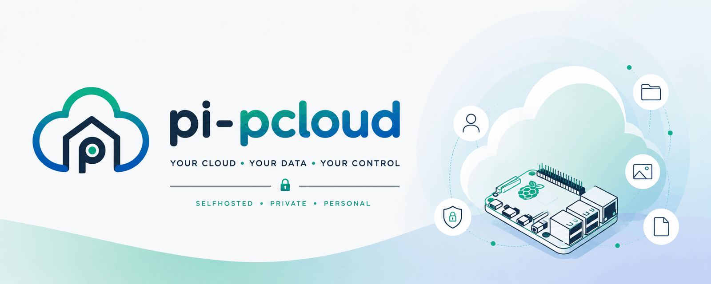

<div align="center">



**Your own private cloud, on a Raspberry Pi.**
Photos, files, passwords, VPN, ad-blocking DNS, backups and monitoring — one command, no subscription, no vendor.

[](https://github.com/florianajir/pi-pcloud/actions/workflows/ci.yml)
[](https://github.com/florianajir/pi-pcloud/actions/workflows/codeql.yml)
[](LICENSE)
[](https://github.com/florianajir/pi-pcloud/actions/workflows/dependabot/dependabot-updates)

[Quick start](#quick-start) · [What you get](#what-you-get) · [Documentation](docs/README.md)

</div>

---

## Quick start

```bash
curl -fsSL https://raw.githubusercontent.com/florianajir/pi-pcloud/main/install.sh | sh
```

The installer checks prerequisites, clones the repo, asks only for what it cannot detect (domain, Cloudflare token, admin password), lets you pick which services to run, and deploys. Expect 5–10 minutes on a Pi 5.

Then open `https://lldap.<HOST_NAME>` to create your users, and `https://auth.<HOST_NAME>` to log in.

Prefer doing it by hand? See the [Installation guide](docs/INSTALLATION.md).

## What you get

- **One login for everything.** Authelia SSO + LLDAP directory, with 2FA on the admin surfaces. Services speak OIDC where they can, forward-auth where they can't.
- **Real HTTPS, everywhere.** Traefik terminates TLS with wildcard Let's Encrypt certificates issued over the Cloudflare DNS challenge, so nothing but `443` ever has to reach the internet.
- **Private DNS.** Pi-hole filters ads and trackers for your whole LAN; Unbound resolves recursively from the root servers, so no DNS provider sees your queries.
- **Reachable from anywhere, exposed to no one.** Headscale runs your own Tailscale control plane; everything but the login portal is restricted to your LAN and your tailnet.
- **Backups you can restore.** Backrest (restic) snapshots app data and databases nightly, encrypted and deduplicated, to any S3-compatible bucket.
- **Alerts on your phone.** Beszel watches the hardware, Uptime Kuma watches the services *through* Traefik, and everything pushes to ntfy — split into muteable topics.
- **A local AI assistant.** Open WebUI on top of llama.cpp, with speech in and out, running entirely on the Pi's CPU. It can even report the machine's own health.

### Why not something else?

| | pi-pcloud | Manual install | Umbrel / CasaOS |
|---|---|---|---|
| Setup effort | one command | days of glue work | one command |
| HTTPS + SSO + DNS pre-wired | ✅ | ❌ | partial |
| Plain Docker Compose you can read | ✅ | ✅ | ❌ app store |
| Runs on standard Linux, no custom OS | ✅ | ✅ | ❌ |
| Reproducible from Git, scriptable | ✅ | depends | ❌ |

## The stack

| Category | Services |
|----------|----------|
| **Cloud & storage** | Nextcloud, Immich, Vaultwarden, n8n, ntfy |
| **Network & access** | Traefik, Authelia, LLDAP, Headscale + Headplane, Tailscale |
| **DNS & filtering** | Pi-hole, Unbound |
| **Download & media** | qBittorrent, Prowlarr, Kapowarr, Kavita, Stremio + Comet, FlareSolverr, Gluetun |
| **AI** | Open WebUI, llama.cpp, Piper (TTS), Parakeet (STT), system-tools |
| **Monitoring & backup** | Beszel, Uptime Kuma, Homepage, Backrest, Dockhand |
| **Infrastructure** | PostgreSQL, Redis (Valkey), ddns-updater |

You don't have to run all of it. Core infrastructure always starts; every other service is toggled per-install with `make enable` / `make disable`, or the `make config` checklist — see [Choosing which services run](docs/CONFIGURATION.md#choosing-which-services-run).

## Requirements

| | |
|---|---|
| **Hardware** | Raspberry Pi 5, 8 GB RAM minimum — 16 GB recommended for the full stack |
| **Storage** | NVMe SSD HAT recommended (MicroSD degrades fast under continuous I/O) |
| **Domain** | A domain on Cloudflare (free tier) + an API token with `Zone → DNS → Edit` |
| **Software** | Docker and the Compose plugin — the installer offers to add them |
| **Router** | Forward `443/tcp`. Optionally `41641/udp` and `3478/udp` for direct VPN links |
| **Off-site backup** | An S3-compatible bucket (optional but recommended) |

## Everyday use

`make install` puts a `pi-pcloud` command on your `PATH`, so these work from any directory (`pi-pcloud status` = `make status`).

| Task | Command |
|------|---------|
| Start / stop | `make start` / `make stop` |
| Follow logs | `make logs` |
| Health at a glance | `make status`, `make doctor` |
| Turn a service on/off | `make enable <service>` / `make disable <service>` |
| Update code and images | `make update` |
| Update the images only | `make update-images` |

Full list: [Commands reference](docs/COMMANDS.md).

## Documentation

Everything lives in **[docs/](docs/README.md)** — start there. The pages people open first:

[Installation](docs/INSTALLATION.md) · [Configuration](docs/CONFIGURATION.md) · [Commands](docs/COMMANDS.md) · [Security](docs/SECURITY.md) · [Troubleshooting](docs/TROUBLESHOOTING.md)

## Contributing

Issues and pull requests are welcome. Read [CONTRIBUTING.md](CONTRIBUTING.md) for the workflow and [AGENTS.md](AGENTS.md) for the conventions this repository holds itself to.

## License

[MIT](LICENSE) © Florian Ajir
