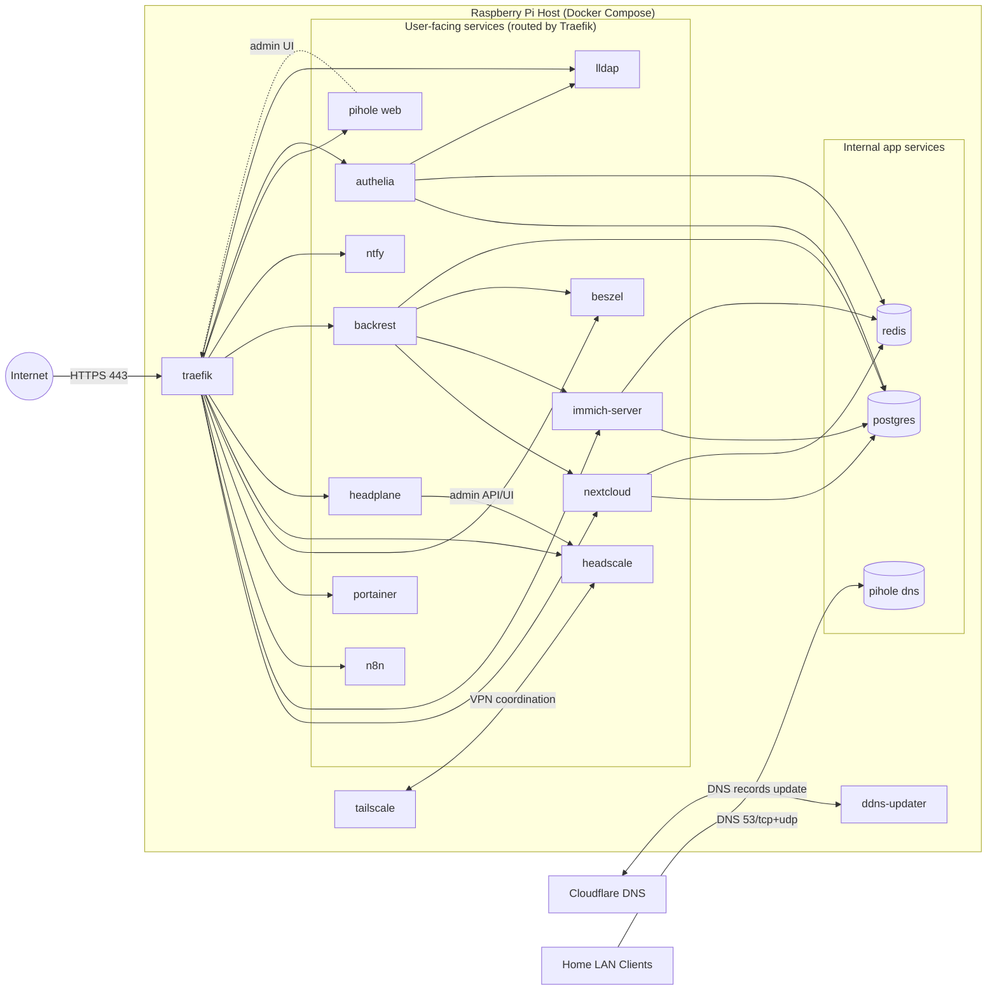
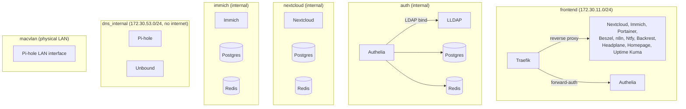
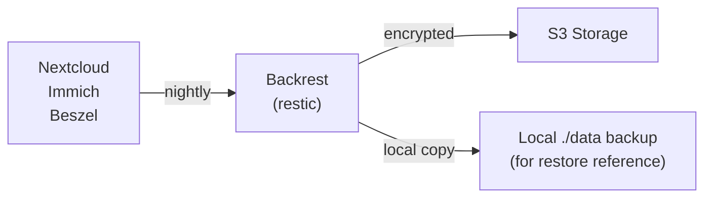

# Architecture

## System Overview



## Service Roles

| Service | Purpose | Clients |
|---------|---------|---------|
| **Traefik** | Reverse proxy, TLS termination, request routing | Internet |
| **ddns-updater** | Keeps Cloudflare DNS pointing to your Pi's public IP | Cloudflare API |
| **Authelia** | SSO portal, OIDC provider, forward-auth middleware | All users |
| **LLDAP** | Lightweight LDAP directory for user management | Authelia, Nextcloud, Portainer, etc. |
| **Nextcloud** | File storage, collaboration | Users via Traefik + SSO |
| **Immich** | Photo/video library with ML tagging | Users via Traefik + SSO |
| **n8n** | Workflow automation | Users via Traefik |
| **Portainer** | Container & stack management UI | Admins via Traefik + SSO + 2FA |
| **Beszel** | Server monitoring, alerts, webhooks | Admins via Traefik + SSO |
| **Headscale** | Self-hosted Tailscale control plane | VPN clients |
| **Headplane** | Web UI for Headscale admin | Admins via Traefik + SSO + 2FA |
| **Ntfy** | Push notifications | Other services, webhooks |
| **Pi-hole** | Ad blocking, local DNS resolution | LAN & VPN clients |
| **Unbound** | Recursive DNS resolver | Pi-hole |
| **Backrest** | Automated backups (restic) | S3 storage, scheduled jobs |
| **PostgreSQL** | Database for Nextcloud, Immich, Authelia | App containers |
| **Redis** | Session store, caching | App containers |
| **Tailscale** | WireGuard VPN mesh agent | Your VPN devices |

## Docker Networks

Containers are isolated by network for security:



**Network isolation strategy:**

- **frontend** — Only this network is exposed to Traefik; handles all external traffic
- **auth** — Internal network; LDAP & auth secrets never exposed to services
- **service networks** — Separate isolated networks for Nextcloud, Immich with their own databases
- **dns_internal** — Pi-hole & Unbound on isolated network with no internet gateway; only DNS traffic
- **macvlan** — Pi-hole binds physical LAN interface for DHCP/DNS from home network

## Data Flow

### HTTPS Request → Service

```
Client (Internet/LAN/VPN)
  ↓
Traefik (TLS termination)
  ↓
Security Headers Middleware
  ↓
IP Allowlist (lan middleware)
  ↓
Forward-auth to Authelia (check session)
  ↓
Route to Backend Service
  ↓
Service handles request
```

### Service → Database

- **Nextcloud** → PostgreSQL + Redis (isolated network)
- **Immich** → PostgreSQL + Redis (isolated network)
- **Authelia** → PostgreSQL + Redis (auth network)
- **Beszel** → PocketBase SQLite (embedded)

### Service → External APIs

- **Traefik** → Cloudflare DNS API (for SSL cert provisioning)
- **ddns-updater** → Cloudflare DNS API (IP updates)
- **Backrest** → S3-compatible storage (backups)
- **Beszel** → S3, SMTP (backups, alerts)
- **Ntfy** → SMTP (email notifications)

## Backup Strategy



Two layers of protection:

1. **PocketBase built-in** (Beszel only) — SQLite snapshots per `BESZEL_BACKUP_CRON`
2. **Backrest (restic)** — Full application data + databases, with deduplication and encryption

See [Monitoring & Alerts](MONITORING.md#backup-strategy) for configuration details.

## Scaling & Failover

**Single-instance design:**
- Pi-web runs on one Raspberry Pi
- All data in `./data` directory (mount on external SSD for reliability)
- Backups to S3 for disaster recovery
- No clustering or replication built-in

**Backup & restore:**
- All data + config is backup-enabled
- Can restore to new Pi from S3 backups
- See [Monitoring & Alerts](MONITORING.md) for backup verification

## Storage Layout

```
pi-web/
├── .env                          # Configuration (secrets)
├── compose.yaml                  # Docker services definition
├── Makefile                      # Convenient commands
├── scripts/                      # Initialization & bootstrap scripts
├── config/                       # Service config files
│   ├── traefik/                  # Reverse proxy routes
│   ├── authelia/                 # SSO & OIDC config (regenerated)
│   ├── nextcloud/                # Nextcloud app config
│   ├── immich/                   # Immich config
│   └── ...
├── data/                         # ⚠️ Persistent data (mount on SSD!)
│   ├── nextcloud/                # Nextcloud files
│   ├── immich/                   # Immich library
│   ├── authelia-config/          # Auth secrets & config
│   ├── postgres/                 # Database files
│   ├── redis/                    # Cache/session data
│   ├── pihole/                   # Pi-hole config & blocklists
│   └── ...
└── docs/                         # Documentation
```

**Recommended setup:**
- Clone on SSD: `git clone ... /mnt/ssd/pi-web`
- Symlink from `/opt`: `ln -s /mnt/ssd/pi-web /opt/pi-web`
- Run systemd service from `/opt/pi-web`
