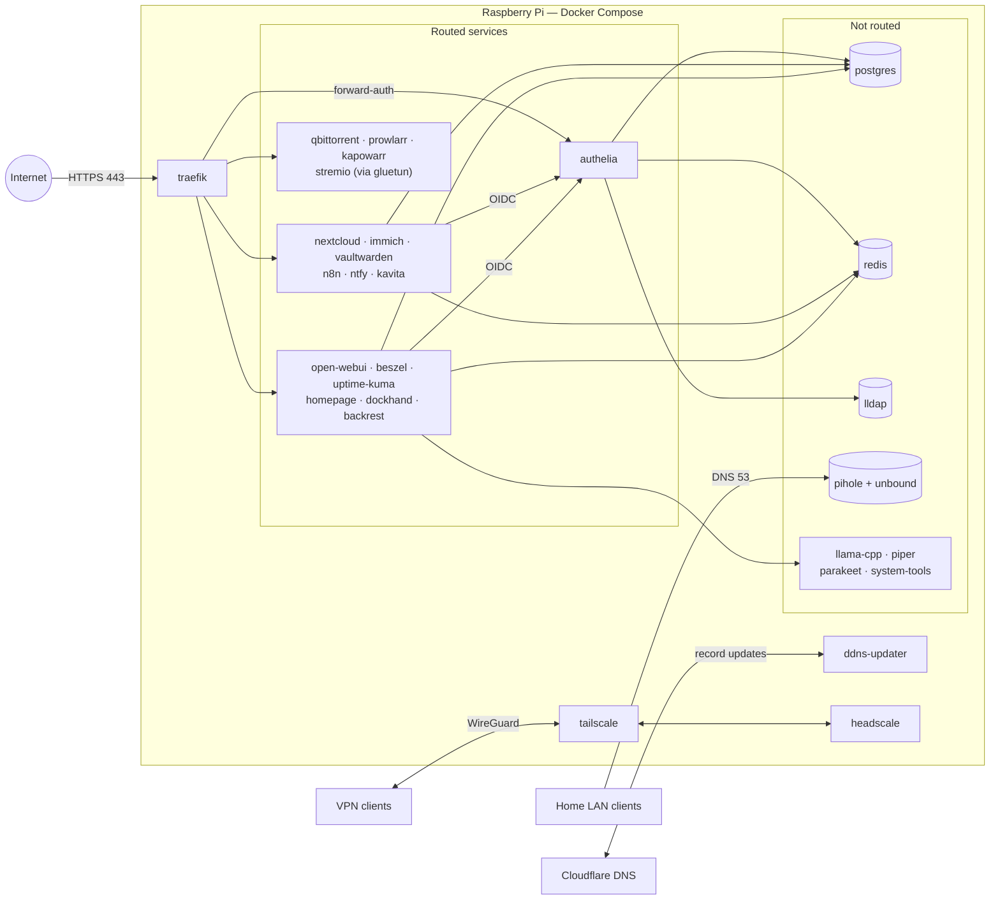
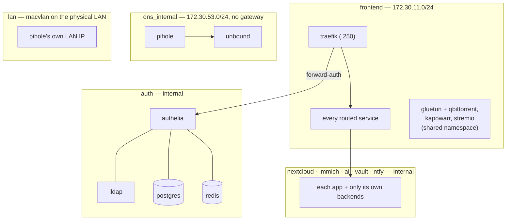

# Architecture

One Raspberry Pi, one Docker Compose file, one systemd unit. Traefik is the only way in from the internet; everything else is reachable only from the LAN, the tailnet, or another container.

## The shape of it


```mermaid
flowchart LR
  Internet((Internet))
  Cloudflare[Cloudflare DNS]
  LAN[Home LAN clients]
  VPN[VPN clients]

  subgraph Pi["Raspberry Pi — Docker Compose"]
    DDNS[ddns-updater]
    Traefik[traefik]
    Tailscale[tailscale]
    Headscale[headscale]

    subgraph Apps["Routed services"]
      A1["nextcloud · immich · vaultwarden\nn8n · ntfy · kavita"]
      A2["qbittorrent · prowlarr · kapowarr\nstremio (via gluetun)"]
      A3["open-webui · beszel · uptime-kuma\nhomepage · dockhand · backrest"]
      Authelia[authelia]
    end

    subgraph Internal["Not routed"]
      Postgres[(postgres)]
      Redis[(redis)]
      LLDAP[(lldap)]
      PiholeDNS[(pihole + unbound)]
      AI["llama-cpp · piper\nparakeet · system-tools"]
    end
  end

  Internet -->|HTTPS 443| Traefik
  Cloudflare <-->|record updates| DDNS
  Traefik --> A1 & A2 & A3
  Traefik -->|forward-auth| Authelia
  A1 & A3 -->|OIDC| Authelia
  Authelia --> LLDAP & Postgres & Redis
  A1 & A3 --> Postgres & Redis
  A3 --> AI
  LAN -->|DNS 53| PiholeDNS
  VPN <-->|WireGuard| Tailscale
  Tailscale <--> Headscale
```

Every routed service follows the same path: TLS at Traefik, then the `lan` IP allowlist, then either forward-auth to Authelia or the service's own OIDC login. The rules per service are in [Security](SECURITY.md#per-service-protection).

## What each service is for

| Service | Purpose | Reached by |
|---------|---------|------------|
| **Traefik** | Reverse proxy, TLS termination, middleware chains | the internet, on 443 |
| **ddns-updater** | Keeps the Cloudflare records pointed at your public IP | Cloudflare API |
| **Authelia** | SSO portal, OIDC provider, forward-auth backend | all users |
| **LLDAP** | The user and group directory — one source of truth | Authelia, Nextcloud, Dockhand |
| **PostgreSQL** | Database for Nextcloud, Immich, Authelia, LLDAP, Vaultwarden, Open WebUI | app containers |
| **Redis (Valkey)** | Session store and cache | app containers |
| **Pi-hole** | Ad blocking, local DNS for `*.<HOST_NAME>` | LAN and VPN clients |
| **Unbound** | Recursive resolver — walks the delegation tree itself | Pi-hole only |
| **Headscale** | Self-hosted Tailscale control plane | VPN clients, from anywhere |
| **Headplane** | Web UI for Headscale | admins, LAN-only + 2FA |
| **Tailscale** | The Pi's own VPN node; advertises the LAN and an exit node | your devices |
| **Nextcloud** | Files, sharing, collaboration | users |
| **Immich** | Photo and video library with ML tagging | users |
| **Vaultwarden** | Bitwarden-compatible password manager | Bitwarden clients |
| **n8n** | Workflow automation | users |
| **ntfy** | Push notifications | the other services |
| **Kavita** | Comics, manga and ebook reader | users, and OPDS clients |
| **Gluetun** | VPN gateway; owns the network namespace for qBittorrent, Kapowarr and Stremio | those three |
| **qBittorrent** | Torrent client, all traffic through Gluetun | users |
| **Prowlarr** | Indexer manager, with FlareSolverr for protected indexers | users |
| **Kapowarr** | Comics and manga manager; feeds the Kavita libraries | users |
| **Stremio + Comet** | Streaming server and its debrid addon | users |
| **Open WebUI** | Local AI chat frontend — see [Local AI](AI.md) | users |
| **llama.cpp / Piper / Parakeet / system-tools** | Inference, TTS, STT and the host-status tool | Open WebUI |
| **Homepage** | Dashboard with live widgets | users |
| **Beszel** | Hardware metrics and threshold alerts | admins |
| **Uptime Kuma** | Service and route monitoring | admins |
| **Dockhand** | Container management UI | admins, 2FA |
| **Backrest** | Nightly restic backups | S3 |

## Network isolation

Containers only share a network when they have to talk:


```mermaid
flowchart TB
    subgraph frontend["frontend — 172.30.11.0/24"]
        Traefik["traefik (.250)"]
        Services["every routed service"]
        Gluetun["gluetun + qbittorrent,\nkapowarr, stremio\n(shared namespace)"]
    end
    subgraph auth["auth — internal"]
        AutheliaB[authelia] --- LLDAP[lldap]
        AutheliaB --- PG_Auth[(postgres)]
        AutheliaB --- Redis_Auth[(redis)]
    end
    subgraph app["nextcloud · immich · ai · vault · ntfy — internal"]
        App["each app + only its own backends"]
    end
    subgraph dns["dns_internal — 172.30.53.0/24, no gateway"]
        PH[pihole] --> UB[unbound]
    end
    subgraph lan_net["lan — macvlan on the physical LAN"]
        PH_LAN["pihole's own LAN IP"]
    end

    Traefik --> Services
    Traefik -->|forward-auth| AutheliaB
    Services --> App
```

The effect: a compromised app container cannot query Unbound directly, cannot reach LLDAP, and cannot see another app's database traffic. The full table of networks, subnets and members is in [Networking](NETWORKING.md#network-isolation).

## Where the data is

```
pi-pcloud/
├── .env                # your configuration and secrets
├── compose.yaml        # every service, network and volume
├── Makefile            # the commands
├── scripts/            # pre-start, bootstrap and OIDC-wiring hooks
├── config/             # per-service configuration templates
└── docs/
```

Traefik is the exception to `config/` — it has no config directory, being driven entirely by CLI flags and Docker labels in `compose.yaml`.

Persistent state is split deliberately:

| Where | What | Why |
|-------|------|-----|
| `${DATA_LOCATION}` (default `./data`) | `nextcloud`, `immich`, `postgres`, `authelia-config`, `lldap`, `vaultwarden`, `uptime-kuma`, `backrest`, `download`, `comics`, `manga`, `n8n`, `open-webui`, … | Anything you would miss. **Point this at your SSD.** Backrest mounts most of it read-only |
| Named Docker volumes | Pi-hole, Redis, Headscale, Beszel, ntfy, Kavita config, llama.cpp weights, … | Smaller state, and the model weights that belong on the fast root filesystem rather than in backups |

### The reading libraries

Kavita gets one library per kind of content, because the library *type* decides how it
parses filenames and how it reads: right-to-left for manga, a comic parser for issues,
a text reader for epub/pdf. Each library therefore needs its own folder.

| Kavita library | Type | Reads | Filled by |
|----------------|------|-------|-----------|
| Comics | ComicVine | `comics/` | Kapowarr (root folder) |
| Manga | Manga | `manga/` + `download/manga/` | Kapowarr (second root folder) and the `manga` qBittorrent category |
| Books | Book | `download/books/` | the `books` qBittorrent category |

Everything else under `download/` stays invisible to Kavita, which matters because
Kavita indexes *every* subfolder of a folder it is given — point it at the download
root and a software torrent's installer tree becomes series named after its internals
(`AdpSdk`, `IPMClient`, `Template`, ...).

| Path | Written by | Read by Kavita |
|------|-----------|----------------|
| `download/manga/`, `download/books/` | the matching qBittorrent category | yes |
| `download/prowlarr/` | qBittorrent's `prowlarr` category (Prowlarr's default) | no |
| `download/incomplete/` | qBittorrent's temp path | no |
| `download/` (root) | torrents added by hand, and Kapowarr's seeding copies (`kapowarr` category) | no |

Prowlarr routes the split automatically: its qBittorrent download client carries a
category map, and Prowlarr resolves the client category as
`GetCategoryForRelease(release) ?? Settings.Category`. **newznab has no manga
category** — manga ships as 7030 `Books/Comics`, the same id as comics — so 7030 goes
to `manga` and the remaining Books subcategories (7010 Mags, 7020 EBook, 7040
Technical, 7050 Other, 7060 Foreign) go to `books`. Comics do not come through
Prowlarr at all: Kapowarr fetches them and imports into its own root folder.

Four places must agree on these paths, and all four are provisioned: the `kavita`
volumes in `compose.yaml`, `LIBRARY_CATEGORIES` in `scripts/qbittorrent-bootstrap.sh`,
`QB_CATEGORY_MAP` in `scripts/prowlarr-bootstrap.sh`, and `ROOT_FOLDERS` in
`scripts/kapowarr-bootstrap.sh`.

Kapowarr's `volume_folder_naming` is deliberately flat (`{series_name} ({year})`, no
volume subfolder): Kavita's ComicVine parser takes the series name from the folder and
`GetFoldersTillRoot` stops below the scan root, so any intermediate folder makes every
series come out named `Volume 01`.

The same three libraries are also mounted read-only into Nextcloud as `files_external`
mounts (`Comics`, `Manga`, `Books`, alongside the existing `Downloads`), so any file
can get a public share link the way Immich does for photos. The mounts are created by
`config/nextcloud/hooks/post-installation/20-external-storage.sh`, which is idempotent
and can be re-run by hand on an existing install.

**Recommended layout:** clone onto the SSD and symlink it into place, so systemd and the docs agree on one path.

```bash
git clone https://github.com/florianajir/pi-pcloud.git /mnt/ssd/pi-pcloud
ln -s /mnt/ssd/pi-pcloud /opt/pi-pcloud
```

## Backups

Two independent layers: Backrest takes the nightly full backup of application data plus database dumps, and Beszel snapshots its own metrics database. Schedules, retention and how failures are noticed: [Monitoring → Backup strategy](MONITORING.md#backup-strategy).

## Deliberate limits

This is a **single-instance design**: one Pi, no clustering, no replication, no failover. Resilience comes from backups, not redundancy — a dead Pi is restored onto a new one from the S3 repository, not failed over to. If uptime matters more than simplicity for you, this is the trade-off to know about up front.
