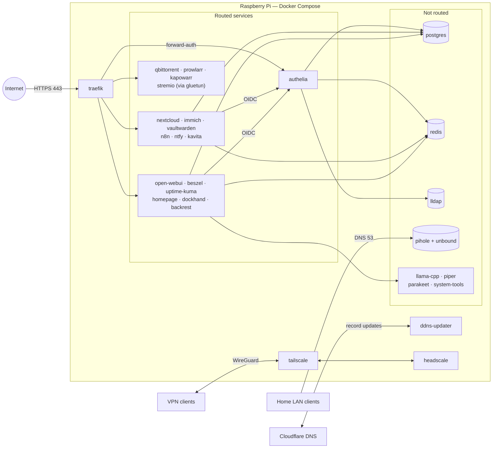
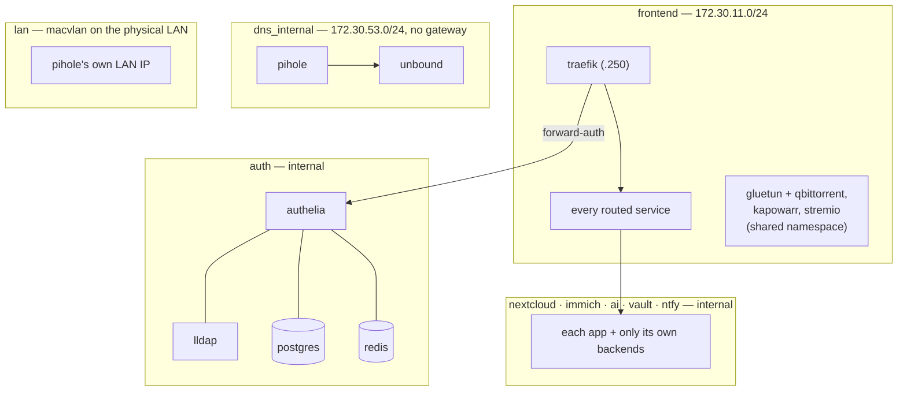

# Architecture

One Raspberry Pi, one Docker Compose file, one systemd unit. Traefik is the only way in from the internet; everything else is reachable only from the LAN, the tailnet, or another container.

## The shape of it


```mermaid
flowchart LR
  Internet((Internet))
  Cloudflare[Cloudflare DNS]
  LAN[Home LAN clients]
  VPN[VPN clients]

  subgraph Pi["Raspberry Pi — Docker Compose"]
    DDNS[ddns-updater]
    Traefik[traefik]
    Tailscale[tailscale]
    Headscale[headscale]

    subgraph Apps["Routed services"]
      A1["nextcloud · immich · vaultwarden\nn8n · ntfy · kavita"]
      A2["qbittorrent · prowlarr · kapowarr\nstremio (via gluetun)"]
      A3["open-webui · beszel · uptime-kuma\nhomepage · dockhand · backrest"]
      Authelia[authelia]
    end

    subgraph Internal["Not routed"]
      Postgres[(postgres)]
      Redis[(redis)]
      LLDAP[(lldap)]
      PiholeDNS[(pihole + unbound)]
      AI["llama-cpp · piper\nparakeet · system-tools"]
    end
  end

  Internet -->|HTTPS 443| Traefik
  Cloudflare <-->|record updates| DDNS
  Traefik --> A1 & A2 & A3
  Traefik -->|forward-auth| Authelia
  A1 & A3 -->|OIDC| Authelia
  Authelia --> LLDAP & Postgres & Redis
  A1 & A3 --> Postgres & Redis
  A3 --> AI
  LAN -->|DNS 53| PiholeDNS
  VPN <-->|WireGuard| Tailscale
  Tailscale <--> Headscale
```

Every routed service follows the same path: TLS at Traefik, then the `lan` IP allowlist, then either forward-auth to Authelia or the service's own OIDC login. The rules per service are in [Security](SECURITY.md#per-service-protection).

## What each service is for

| Service | Purpose | Reached by |
|---------|---------|------------|
| **Traefik** | Reverse proxy, TLS termination, middleware chains | the internet, on 443 |
| **ddns-updater** | Keeps the Cloudflare records pointed at your public IP | Cloudflare API |
| **Authelia** | SSO portal, OIDC provider, forward-auth backend | all users |
| **LLDAP** | The user and group directory — one source of truth | Authelia, Nextcloud, Dockhand |
| **PostgreSQL** | Database for Nextcloud, Immich, Authelia, LLDAP, Vaultwarden, Open WebUI | app containers |
| **Redis (Valkey)** | Session store and cache | app containers |
| **Pi-hole** | Ad blocking, local DNS for `*.<HOST_NAME>` | LAN and VPN clients |
| **Unbound** | Recursive resolver — walks the delegation tree itself | Pi-hole only |
| **Headscale** | Self-hosted Tailscale control plane | VPN clients, from anywhere |
| **Headplane** | Web UI for Headscale | admins, LAN-only + 2FA |
| **Tailscale** | The Pi's own VPN node; advertises the LAN and an exit node | your devices |
| **Nextcloud** | Files, sharing, collaboration | users |
| **Immich** | Photo and video library with ML tagging | users |
| **immich-machine-learning** | Immich's ML worker: face and object tagging, CLIP search | Immich only |
| **Vaultwarden** | Bitwarden-compatible password manager | Bitwarden clients |
| **n8n** | Workflow automation | users |
| **n8n-runners** | Isolated task runner that executes n8n Code nodes | n8n only |
| **ntfy** | Push notifications | the other services |
| **Kavita** | Comics, manga and ebook reader | users, and OPDS clients |
| **Gluetun** | VPN gateway; owns the network namespace for qBittorrent, Kapowarr and Stremio | those three |
| **qBittorrent** | Torrent client, all traffic through Gluetun | users |
| **Prowlarr** | Indexer manager | users |
| **FlareSolverr** | Solves the Cloudflare challenges of Prowlarr's protected indexers | Prowlarr only |
| **Kapowarr** | Comics and manga manager; feeds the Kavita libraries | users |
| **Shelfmark** | Book and audiobook search; files what it downloads into the Kavita Books library | users |
| **Audiobookshelf** | Audiobook player for `download/audiobooks/`, with Audible metadata matching and progress sync | users |
| **Stremio + Comet** | Streaming server and its debrid addon | users |
| **stremio-lan** | The same Stremio server on a LAN macvlan address instead of the VPN, for DLNA casting — mutually exclusive with `stremio` | users, LAN renderers |
| **Open WebUI** | Local AI chat frontend — see [Local AI](AI.md) | users |
| **llama.cpp / Piper / Parakeet / system-tools** | Inference, TTS, STT and the host-status tool | Open WebUI |
| **Homepage** | Dashboard with live widgets | users |
| **Beszel** | Hardware metrics and threshold alerts | admins |
| **beszel-agent** | Host-side collector feeding the Beszel hub over a shared Unix socket | Beszel only |
| **Uptime Kuma** | Service and route monitoring | admins |
| **Dockhand** | Container management UI | admins, 2FA |
| **Backrest** | Nightly restic backups | S3 |

## Network isolation

Containers only share a network when they have to talk:


```mermaid
flowchart TB
    subgraph frontend["frontend — 172.30.11.0/24"]
        Traefik["traefik (.250)"]
        Services["every routed service"]
        Gluetun["gluetun + qbittorrent,\nkapowarr, stremio\n(shared namespace)"]
    end
    subgraph auth["auth — internal"]
        AutheliaB[authelia] --- LLDAP[lldap]
        AutheliaB --- PG_Auth[(postgres)]
        AutheliaB --- Redis_Auth[(redis)]
    end
    subgraph app["nextcloud · immich · ai · vault · ntfy — internal"]
        App["each app + only its own backends"]
    end
    subgraph dns["dns_internal — 172.30.53.0/24, no gateway"]
        PH[pihole] --> UB[unbound]
    end
    subgraph lan_net["lan — macvlan on the physical LAN"]
        PH_LAN["pihole's own LAN IP"]
    end

    Traefik --> Services
    Traefik -->|forward-auth| AutheliaB
    Services --> App
```

The effect: a compromised app container cannot query Unbound directly, cannot reach LLDAP, and cannot see another app's database traffic. The full table of networks, subnets and members is in [Networking](NETWORKING.md#network-isolation).

## Where the data is

```
pi-pcloud/
├── .env                # your configuration and secrets
├── compose.yaml        # every service, network and volume
├── Makefile            # the commands
├── scripts/            # pre-start, bootstrap and OIDC-wiring hooks
├── config/             # per-service configuration templates
└── docs/
```

Traefik is the exception to `config/` — it has no config directory, being driven entirely by CLI flags and Docker labels in `compose.yaml`.

Persistent state is split deliberately:

| Where | What | Why |
|-------|------|-----|
| `${DATA_LOCATION}` (default `./data`) | `nextcloud`, `immich`, `postgres18`, `authelia-config`, `lldap`, `vaultwarden`, `uptime-kuma`, `backrest`, `download`, `comics`, `manga`, `n8n`, `open-webui`, … | Anything you would miss. **Point this at your SSD.** Backrest mounts most of it read-only |
| Named Docker volumes | Pi-hole, Redis, Headscale, Beszel, ntfy, Kavita config, llama.cpp weights, … | Smaller state, and the model weights that belong on the fast root filesystem rather than in backups |

### The reading libraries

Two readers, split by medium: Kavita for anything paged, Audiobookshelf for anything
listened to. Kavita has no audiobook library type at all, and Audiobookshelf reads only
audio — so neither is a subset of the other and both point at their own folders.

Kavita gets one library per kind of content, because the library *type* decides how it
parses filenames and how it reads: right-to-left for manga, a comic parser for issues,
a text reader for epub/pdf. Each library therefore needs its own folder.

| Kavita library | Type | Reads | Filled by |
|----------------|------|-------|-----------|
| Comics | ComicVine | `comics/` + `download/comics/` | Kapowarr (root folder) and the `comics` qBittorrent category |
| Manga | Manga | `manga/` + `download/manga/` | Kapowarr (second root folder) and the `manga` qBittorrent category |
| Books | Book | `download/books/` | the `books` qBittorrent category, and Shelfmark's imports |

Comics and Manga each pair a Kapowarr root folder with a `download/` one because
Kapowarr *owns* its roots: it moves files inside them with copy-then-delete, which
races a torrent seeding from the same tree. A hand-grabbed issue therefore goes to
`download/comics/`, which Kapowarr never touches, and Kavita reads both folders as one
library — so the parser, the metadata provider and the OIDC library grant are shared.

Everything else under `download/` stays invisible to Kavita, which matters because
Kavita indexes *every* subfolder of a folder it is given — point it at the download
root and a software torrent's installer tree becomes series named after its internals
(`AdpSdk`, `IPMClient`, `Template`, ...).

| Path | Written by | Read by Kavita |
|------|-----------|----------------|
| `download/manga/`, `download/comics/`, `download/books/` | the matching qBittorrent category | yes |
| `download/audiobooks/` | the `audiobooks` qBittorrent category, and Shelfmark (`DESTINATION_AUDIOBOOK`); read by **Audiobookshelf**, not Kavita | no |
| `download/shelfmark/` | qBittorrent's `shelfmark` and `shelfmark-audiobooks` categories, where Shelfmark's own grabs land before import | no |
| `download/prowlarr/` | qBittorrent's `prowlarr` category (Prowlarr's default) | no |
| `download/incomplete/` | qBittorrent's temp path | no |
| `download/` (root) | torrents added by hand with no category — nothing indexes it | no |

### qBittorrent categories

The category is the whole routing decision: its save path is the destination, so it is
also what to pick when adding a torrent by hand. `scripts/qbittorrent-bootstrap.sh` owns
the list, `scripts/prowlarr-bootstrap.sh` the newznab ids Prowlarr maps onto it.

| Category | Save path | Destination | Prowlarr ids |
|----------|-----------|-------------|--------------|
| `books` | `download/books/` | Kavita, **Books** | 7000, 7010, 7020, 7040, 7050, 7060 |
| `manga` | `download/manga/` | Kavita, **Manga** | 7030, 107103, 117084, 156719, 111160 |
| `comics` | `download/comics/` | Kavita, **Comics** | 107102, 107104 |
| `audiobooks` | `download/audiobooks/` | **Audiobookshelf** | 3030, 107105 |
| `shelfmark` | `download/shelfmark/` | staging — Shelfmark imports it | — |
| `shelfmark-audiobooks` | `download/shelfmark/` | staging, same folder; a label so the list distinguishes the two | — |
| `prowlarr` | `download/prowlarr/` | nothing; Prowlarr's fallback for unmapped ids | — |

A grab that falls through to `prowlarr` is recoverable rather than lost: qBittorrent has
`category_changed_tmm_enabled` on, so changing a torrent's category relocates its files
to the new save path — provided the torrent is in Automatic Torrent Management mode,
which Prowlarr's grabs are and Shelfmark's are not (it passes an explicit save path,
which forces Manual).

Two asymmetries are deliberate. **`comics` has no Prowlarr mapping**: comics and manga
share newznab id 7030, which goes to `manga`, so Prowlarr cannot tell them apart and the
category is hand-pick only — which is its whole purpose, as the fallback for issues
Kapowarr cannot find. And the **staging categories are not destinations** — Shelfmark
post-processes only torrents belonging to one of its own tasks, so a torrent added there
by hand downloads and then sits forever. Shelfmark itself routes by the task's content
type, not by category, which is why the two staging categories can share one folder.

Prowlarr routes the split automatically: its qBittorrent download client carries a
category map, and Prowlarr resolves the client category as
`GetCategoryForRelease(release) ?? Settings.Category`. **newznab has no manga
category** — manga ships as 7030 `Books/Comics`, the same id as comics — so 7030 goes
to `manga` and the remaining Books subcategories (7010 Mags, 7020 EBook, 7040
Technical, 7050 Other, 7060 Foreign) go to `books`. Audiobooks are 3030
`Audio/Audiobook`, a sibling of the music ids under 3000 rather than a Books
subcategory, so they are mapped on their own and 3010 MP3 and 3040 Lossless keep
falling through to the default. Comics do not come through Prowlarr at all: Kapowarr
fetches them and imports into its own root folder.

`books` also claims **7000**, the bare Books parent, which says nothing about *which*
kind of book. It has to: 6 of the enabled indexers — YggReborn, Torrent9, Nyaa.si,
World-torrent, Internet Archive, Torrent[CORE] — declare no Books subcategory at all, so
every book grab from them was unroutable and landed in the default `prowlarr` folder that
nothing indexes. Two of those six are rescued from `books` by their own tracker ids
below; the rest genuinely are ebooks. Wrong library beats invisible.

**The order of the mappings is load-bearing, and `books` must stay last.** Prowlarr
resolves the client category with `FirstOrDefault(x => x.Categories.Intersect(release
.Categories).Any())` (`DownloadClientBase.cs`) — first match in list order, not most
specific. Since `books` claims the catch-all 7000, anything above it in the list wins on
its own more specific id and anything below it is unreachable. `manga` likewise stays
above `books` so the indexers that report a leaf *and* its parent, as Knaben does with
`[7030, 7000]`, still reach it. All three verified by grabbing real releases and watching
where they landed.

### The 1071xx ids

Those are **YggReborn's own tracker categories**, which Prowlarr passes through in
`release.Categories` next to the newznab ones — and the map intersects raw ints, so they
can be mapped directly. Ygg is the only enabled indexer that separates these at all:

| Ygg id | Ygg name | mapped to |
|--------|----------|-----------|
| 107100, 107101 | Livres, Presse | `books` (via 7000) |
| 107102 | Bandes dessinées | `comics` |
| 107103 | Mangas | `manga` |
| 107104 | Comics | `comics` |
| 107105 | **Livres audio** | `audiobooks` |

`107105` is the most valuable of them, since Ygg carries French audiobooks Shelfmark
cannot see at all — it asks Prowlarr for 3030, which Ygg never emits.

**Nyaa.si** is the other indexer worth mapping this way, and it cancels the cost of
claiming 7000: Nyaa reports every book-shaped release as bare 7000, so they were all
becoming ebooks, when Literature on Nyaa is manga.

| Nyaa id | Nyaa name | mapped to |
|---------|-----------|-----------|
| 117084 | Literature — Raw | `manga` |
| 156719 | Literature — English-translated | `manga` |
| 111160 | Literature — Non-English-translated | `manga` |

Sampled 158 of them: Raw is Japanese manga (コミック EPUB), English-translated is manga
and light novels, Non-English-translated is manga scans — including its Batman entries,
which are Otomo's and Teshirogi's manga adaptations rather than western comics. Hence
`manga`, not `comics`.

**Every other indexer's tracker ids are a rigid 1:1 rename of the newznab leaf** and
carry no extra information, so mapping them would only add lines that can drift out of
sync. C411 is the clearest case: over ~500 sampled results every release is exactly one
pair — `[3030,103030]`, `[7010,107010]`, `[7020,107020]`, `[7030,107030]` — and `107030`
is itself named *"BDs & Comics & Manga"*, which is the proof C411 cannot separate the two
either. Its `107000 Ebook` never appears at all, being the parent node of a tracker that
always sends a leaf. Knaben looked promising (`9101000 EBooks`, `9102000 Comics`,
`1103000 Audiobook`) but not one sampled release carried any of those without the
matching newznab id alongside.

That is also why an ambiguous comic still lands in `manga` — 1337x `100039`, C411
`107030`, Knaben `9102000`, The Pirate Bay `100602`, TR4KER `107030` each come back
**identically for Batman and for Naruto**. Not a preference, just the only id available.

Seven places must agree on these paths, and all seven are provisioned: the `kavita`
volumes in `compose.yaml`, `DESIRED_LIBRARIES` in
`scripts/kavita-library-bootstrap.sh`, `LIBRARY_CATEGORIES` in
`scripts/qbittorrent-bootstrap.sh`, `QB_CATEGORY_MAP` in
`scripts/prowlarr-bootstrap.sh`, `ROOT_FOLDERS` in
`scripts/kapowarr-bootstrap.sh`, `INGEST_DIR` and `DESTINATION_AUDIOBOOK` on the
`shelfmark` service, and `LIBRARY_PATH` in `scripts/audiobookshelf-bootstrap.sh`.

Shelfmark is the manual half of that: you search, it fetches. Torrents go out through
the same qBittorrent instance (so through the VPN) under its own `shelfmark` category,
and Shelfmark then renames the finished file into `download/books/`, where Kavita
already looks — which is why its grabs are saved outside that folder in the first
place, so Kavita indexes the imported book and not the torrent's directory tree.
Shelfmark itself sits on `frontend`, not in gluetun's namespace: putting it behind the
VPN would add it to the set of routers that disappear when gluetun goes unhealthy. Its
direct downloads still egress through the tunnel, via gluetun's internal HTTP proxy
(`HTTPPROXY=on`, `gluetun:8888`) rather than by sharing its network namespace.

The dependency is soft, and stays soft: Shelfmark is **not** in gluetun's profile list,
so enabling it does not force a VPN container on an install that only wants
Prowlarr-backed search. `scripts/shelfmark-settings-bootstrap.sh` asks
`docker compose config --services` whether gluetun is part of the current selection —
not whether it is running, so a gluetun that is merely down does not flip the setting —
and configures the proxy only then. When it is not selected the script unwinds its own
proxy setting and says so in the start log; a proxy set by hand is left alone.

That split is deliberate, and it is narrower than it looks. `PROXY_MODE`/`HTTP_PROXY`
are set in Shelfmark's `plugins/network.json`, **not** in its environment, because
`HTTP_PROXY` and `NO_PROXY` are the names `requests` reads out of the environment on its
own — setting them there would route every other outbound call through the tunnel too.
In the config file they reach only the callers of `download/network.py get_proxies()`,
which is the release-source and download path. So Anna's Archive traffic is on the VPN,
while the Prowlarr API, the OIDC token exchange and the metadata providers stay direct —
and a gluetun outage costs you direct downloads, not search or login.

The proxy is addressed as `gluetun.docker`, an alias compose.yaml adds for exactly this:
the bundled bypasser hands the string to SeleniumBase, whose proxy validation rejects a
host with no dot in it and then fails to start the browser at all.

Audiobookshelf closes the other end of that chain. `download/audiobooks/` had a writer
and no reader: Shelfmark files audiobooks there, Kavita cannot open them, and Nextcloud
only stores them. Audiobookshelf mounts the same folder read-only as `/audiobooks` and
adds the listening half — progress sync across devices, and Audible metadata matching,
which is the only source in the stack carrying narrator, runtime and chapters. The
Audible storefront is regional and a French catalogue is invisible from `audible.com`,
so `scripts/audiobookshelf-bootstrap.sh` picks the provider from `DEFAULT_LANGUAGE`.

None of its configuration can come from the environment or a config file — server
settings live only in its SQLite database — so that bootstrap drives the admin API
instead, and has to create the root account first to have anything to authenticate
with. Three consequences worth knowing.

The root account *is* the SSO account: the bootstrap gives it `EMAIL` and sets
`authOpenIDMatchExistingBy: email`, so signing in through Authelia lands on the admin
rather than on a second, plain-user account.

Local login is then switched off (`authActiveAuthMethods: ["openid"]`), so the shared
`PASSWORD` is not a second door into a service that holds everyone's listening history —
the same stance as Shelfmark, Dockhand and Beszel. It is gated on the bootstrap first minting itself an
API key and storing it at `${DATA_LOCATION}/audiobookshelf/config/pi-web-api-key`,
because disabling `local` is otherwise a one-way door — `/login` is wired to passport's
local strategy, and turning the method off *unuses* that strategy, so the route stops
answering entirely (500, not 401) and the only remaining door is the API. The key is
what keeps that door open for `audiobookshelf-bootstrap.sh`,
`homepage-widgets-bootstrap.sh` and `rotate-password.sh` alike; it lives inside the
`/config` directory Backrest snapshots so a restore brings it back. Every client can do
OIDC, which is why this is safe here and would not be for Kavita's OPDS readers: the
mobile apps get their own registered redirect URI (`/auth/openid/mobile-redirect`),
which Audiobookshelf bounces to `audiobookshelf://oauth` itself.

And the client asks for no `groups` scope: Audiobookshelf reads the group claim as a
*role* and denies any login whose groups contain none of `admin`/`user`/`guest`, so
requesting it would lock out every regular user in a stack where only `admin` exists.

Podcasts are deliberately not offered. Audiobookshelf can serve them, but it
downloads episodes *into* the library folder, and **its own** mount of that
folder is `:ro` — a podcast library would fail with `EROFS` on its first fetch.
(Nextcloud's separate mount of the same path is read-write, for organising it;
that does not help a process writing through a different, read-only one.) It
would need a writable mount of its own, which nothing in the download chain
feeds.

Kapowarr's `volume_folder_naming` is deliberately flat (`{series_name} ({year})`, no
volume subfolder): Kavita's ComicVine parser takes the series name from the folder and
`GetFoldersTillRoot` stops below the scan root, so any intermediate folder makes every
series come out named `Volume 01`.

The same libraries are also mounted into Nextcloud as `files_external` mounts
(`Comics`, `Manga`, `Books` and `Audiobooks`, alongside the existing `Downloads`),
so any file can get a public share link the way Immich does for photos — and so
Nextcloud is where the tree gets **organised**: renamed, moved between libraries,
deleted. Audiobooks are in both places on purpose: Nextcloud shares the file,
Audiobookshelf plays it and keeps your position. The mounts are created by
`config/nextcloud/hooks/post-installation/20-external-storage.sh`, which is
idempotent and can be re-run by hand on an existing install — worth knowing,
because it is a *post-installation* hook and so does not fire again on an
existing Nextcloud when a mount is added to its list.

Write access took two pieces, and only one of them is obvious. The bind mounts
are read-write, but Nextcloud's PHP runs as uid 33 while the tree belongs to
uid/gid 1000 in mode 0755, so it would still only get `r-x`.
`scripts/nextcloud-pre-start.sh` grants uid 33 write access with a POSIX ACL.

Two traps are worth recording, because both look like the right answer:

- **`group_add: "1000"` does not work.** Apache calls `initgroups()` when it
  drops to `www-data`, which rebuilds the group list from the container's
  `/etc/group` and discards the supplementary gid compose added. The group *does*
  survive in a `docker exec`, so the mistake passes a hand test and then fails
  every real request.
- **`chmod -R g+w` does not last.** qBittorrent, Kapowarr and Shelfmark all run
  with umask 022, so every directory they create afterwards comes back `0755`
  and Nextcloud silently loses access to exactly the new downloads it is most
  likely to be asked to tidy up. A *default* ACL is inherited by whatever is
  created later, umask notwithstanding.

The trade-off is real and deliberate: `Downloads` is writable too, and
qBittorrent seeds from there, so deleting a file in Nextcloud can break the
torrent still serving it. Kapowarr's moves are copy-then-delete, so avoid
reorganising `Comics`/`Manga` while it has a task running.

**Recommended layout:** clone onto the SSD and symlink it into place, so systemd and the docs agree on one path.

```bash
git clone https://github.com/florianajir/pi-pcloud.git /mnt/ssd/pi-pcloud
ln -s /mnt/ssd/pi-pcloud /opt/pi-pcloud
```

## Rationing CPU and memory

Four cores and 16 GB, shared by ~40 containers including a local LLM. The sum of the
`mem_limit`s is close to twice the RAM, which is deliberate — they are ceilings on a
service that misbehaves, not an allocation. What matters is who gives way first when
the machine is actually short, and that is expressed in three separate knobs, none of
which substitutes for another.

### CPU

`cpuset` is the isolation, `cpu_shares` is the priority.

| Cores | Who | Why |
|---|---|---|
| `0` | Traefik, Headscale | The reverse proxy and the VPN control plane, kept off the cores the AI stack saturates |
| `0-1` | Pi-hole | Also `FTLCONF_misc_check_load: "false"` — FTL reads the *host* loadavg and compares it to the cores it can see |
| `1-3` | llama.cpp, Piper, Parakeet, Immich (server), Nextcloud | The compute set, pinned away from core 0 |
| `2-3` | immich-machine-learning | Narrower still; `MACHINE_LEARNING_*_THREADS` are matched to it |
| unpinned | everything else, Postgres and Unbound included | Free to land anywhere, arbitrated by shares |

Postgres is deliberately unpinned. It was on `1-3`, which is exactly the three cores
llama.cpp and Parakeet saturate, and left it the one core it could not use — for a
service every other service waits on.

`cpu_shares` (`x-cpu-prio-*` in `compose.yaml`) has four tiers — 4096 critical, 1024
normal, 256 batch, 128 idle — and orders them by **who waits on whom**, not by
appetite. The model services want the most CPU and get the least: a DNS answer or a
healthcheck blocked behind an inference is what actually breaks the stack, and an
inference that finishes a second later breaks nothing. It costs nothing when the box
is idle, which it is 95% of the time — cgroup weights are only consulted under
contention.

**It replaces `deploy: resources: reservations: cpus:`, which did nothing.** Compose
drops that key outside Swarm: `docker inspect` reported `CpuShares=0` and every
container sat at the default `cpu.weight=100`, tier notwithstanding. Five tiers were
declared across 40 services and not one of them reached the kernel.
`tests/compose-invariants.py` now fails on any `deploy:` key, so it cannot come back.

### Memory

`mem_limit` is the ceiling and counts page cache and shared memory, not just anonymous
pages — which is why a tight limit on an I/O-heavy service buys nothing and costs
re-reads. `oom_score_adj` only speaks at kill time, and nothing here has ever been
killed. Neither says *don't page this out*, so:

- **`mem_reservation`** (cgroup v2 `memory.low`) on the latency-critical set only:
  DNS, proxy, auth, Postgres, Redis, the VPN daemons. The kernel reclaims from
  cgroups over their reservation before touching one under it. The total stays around
  1.3 GB of 16 on purpose — the protection is proportional, so reserving everywhere
  protects nothing. The model services have none: they are the pages this is meant to
  evict first.
- **`memswap_limit`** on the eight services that either measurably swap or carry a
  limit big enough to take the whole file. Left unset, Docker
  gives every container a swap allowance equal to its `mem_limit`, so the stack
  claimed ~30 GB against a swap file a fraction of that size, and one idle llama.cpp
  held 2.6 GB of it while resident at 21 MB. `memswap_limit` is memory *plus* swap,
  so the ceiling is the difference: `mem_limit: 6g` with `memswap_limit: 8g` is a
  2 GB swap ceiling. Sized against `SWAP_SIZE_MB`
  ([Configuration](CONFIGURATION.md#host-swap)), not against RAM.

`mem_swappiness` is not used and cannot be: cgroup v2 has no per-cgroup swappiness,
and Docker answers `WARNING: Your kernel does not support memory swappiness
capabilities. Memory swappiness discarded.` The global `vm.swappiness = 10` in
`config/sysctl.d/pi-pcloud.conf` is the only lever.

### Swap, and zswap in front of it

`/var/swap` is a file on the NVMe, sized by `SWAP_SIZE_MB`
([Configuration](CONFIGURATION.md#host-swap)). A full one is not a fault here — the
model services evict their cold weights exactly once and that is what swap is for.
What *was* a fault is having no room left for the next spike.

`scripts/configure-kernel-params.sh` puts **zswap** in front of it: an evicted page
is compressed and kept in RAM, and only reaches the NVMe once the pool (20% of RAM)
is full. The kernel is built `CONFIG_ZSWAP=y` without `CONFIG_ZSWAP_DEFAULT_ON`, so
it is compiled in and idle until `zswap.enabled=1` is on the boot line. Two details
are not obvious:

- **The compressor stays at the built-in `lzo`.** `CRYPTO_ZSTD` and `CRYPTO_LZ4` are
  modules on this kernel while zswap is built in, so `zswap.compressor=zstd` on the
  boot line is read before the module exists and silently falls back to lzo. Moving
  to zstd means loading the module and writing
  `/sys/module/zswap/parameters/compressor` after boot, not a boot parameter.
- **`zswap.shrinker_enabled=1` is not the default and matters more than the pool
  size.** Without the shrinker a full pool simply stops accepting new pages, and it
  fills with whichever arrived first — on this box, the cold model weights nobody is
  going to ask for. The shrinker writes those back to disk and keeps the pool for
  pages with a future.

zswap is also the one setting here that can be tried without a reboot, which is why
it is worth trying before committing to the boot line:

```bash
cat /sys/module/zswap/parameters/enabled          # N until the next reboot
echo Y | sudo tee /sys/module/zswap/parameters/enabled
cat /sys/fs/cgroup/memory.zswap.current           # bytes held compressed
echo N | sudo tee /sys/module/zswap/parameters/enabled   # back off, no reboot
```

## Backups

Two independent layers: Backrest takes the nightly full backup of application data plus database dumps, and Beszel snapshots its own metrics database. Schedules, retention and how failures are noticed: [Monitoring → Backup strategy](MONITORING.md#backup-strategy).

## Deliberate limits

This is a **single-instance design**: one Pi, no clustering, no replication, no failover. Resilience comes from backups, not redundancy — a dead Pi is restored onto a new one from the S3 repository, not failed over to. If uptime matters more than simplicity for you, this is the trade-off to know about up front.
