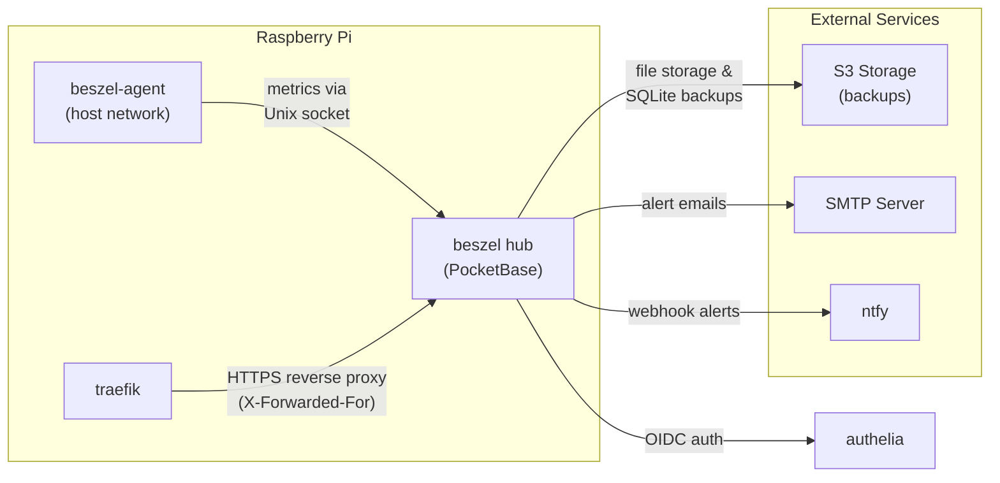
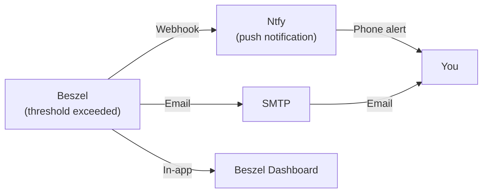

# Monitoring & Alerts

## Beszel Monitoring

Beszel provides lightweight server monitoring with a hub + agent architecture. The hub stores metrics in PocketBase (embedded SQLite), and the agent collects system metrics via Unix sockets.

### Architecture



### Accessing Beszel

**URL:** `https://beszel.<HOST_NAME>`

**Authentication:**
- Uses Authelia SSO
- Users in `users` group can log in
- No admin role requirement in Beszel itself (but Traefik `lan` middleware restricts to LAN-only)

### Auto-configured Settings

The bootstrap script (`scripts/beszel-agent-bootstrap.sh`) runs on first start and auto-configures:

| Setting | Configuration Source | Description |
|---------|---------------------|-------------|
| **SMTP** | `.env` variables | Email alerts for breaches, down time |
| **S3 file storage** | `.env` S3 credentials | PocketBase file uploads to S3 |
| **S3 backups** | `.env` + cron schedule | SQLite snapshots to S3 |
| **Trusted proxy** | Auto-set | `X-Forwarded-For` header trusted for real client IPs |
| **OIDC** | Auto-generated secrets | SSO via Authelia |
| **Ntfy webhook** | `config/ntfy/ntfy.env` | Push notifications for alerts |
| **Temperature alerts** | `.env` `BESZEL_TEMP_*` | Automatic for all monitored systems |

### Metrics & Alerts

**Collected per system:**
- CPU usage, load average
- Memory (used, free, swap)
- Disk usage (root, all mounts)
- Network (bytes sent/received)
- Uptime
- System info (CPU cores, total memory, OS)

**Built-in alert types:**
- **Disk usage** — Alert when usage exceeds threshold
- **Memory usage** — Alert when RAM usage exceeds threshold
- **CPU usage** — Alert when load average exceeds threshold
- **Temperature** — Auto-created if `BESZEL_TEMP_ALERT_VALUE` is set (default: 70°C)
- **Offline** — Alert if system stops reporting metrics for 5 minutes

**Alert notifications via:**
1. **Email** — SMTP configured from `.env`
2. **Webhook** — Posts to Ntfy for push notifications
3. **In-app** — Visible on Beszel dashboard

### Configuration

**Backup schedule:**

```bash
BESZEL_BACKUP_CRON=0 3 * * *      # Daily at 3:00 AM
BESZEL_BACKUP_MAX_KEEP=7          # Keep 7 most recent backups
```

**Cron format:** `minute hour day month weekday`

**Temperature alerts:**

```bash
BESZEL_TEMP_ALERT_VALUE=70        # Alert when > 70°C
BESZEL_TEMP_ALERT_MIN=5           # Don't repeat for 5 minutes
```

To modify: Edit `.env` and run `make restart`, then re-run the bootstrap script:

```bash
docker compose exec beszel /opt/beszel/scripts/beszel-agent-bootstrap.sh
```

### Monitoring Your Pi

1. Visit `https://beszel.<HOST_NAME>`
2. Dashboard shows all monitored systems (you'll see your Pi)
3. Click system to view detailed metrics & alerts
4. Set up alert thresholds:
   - Click **Systems**
   - Select your Pi
   - Set disk, memory, CPU thresholds
5. Configure notifications:
   - **Settings** → **SMTP** (if not already auto-configured)
   - **Settings** → **Webhook** (for Ntfy push)

### Storage & Backups

**PocketBase data:**
- Location: `${DATA_LOCATION}/beszel_data/`
- Size: Grows slowly (metrics are aggregated)
- Typical: 50-200 MB per month

**Two backup layers:**

1. **PocketBase built-in** — SQLite snapshots on `BESZEL_BACKUP_CRON` schedule
   - Stored to S3 if configured
   - Else stored locally: `${DATA_LOCATION}/beszel_backup/`
   - Retention: `BESZEL_BACKUP_MAX_KEEP` snapshots

2. **Backrest (restic)** — Full application backup
   - Includes `beszel_data` volume
   - S3 or local backup
   - Daily schedule (see [Backup Strategy](#backup-strategy))

Both layers protect against data loss. For disaster recovery, you can restore from either.

### Troubleshooting

**Agent not reporting metrics:**
```bash
docker compose logs beszel-agent
```

Check if Unix socket exists:
```bash
ls -la /var/run/docker.sock
```

Beszel agent needs access to Docker socket. Verify in compose.yaml:
```yaml
beszel-agent:
  volumes:
    - /var/run/docker.sock:/var/run/docker.sock:ro
```

**S3 backup failing:**
- Verify S3 credentials in `.env`
- Check bucket exists and is accessible
- Review logs: `docker compose logs beszel`

**Ntfy webhook not sending:**
- Verify `config/ntfy/ntfy.env` has correct Ntfy topic
- Check Authelia OIDC credentials for Beszel
- Test manually: `curl -d "test alert" https://ntfy.<HOST_NAME>/your-topic`

## Uptime Kuma Monitoring

Optional service for website/API uptime monitoring. Works with status pages, webhooks, and notifications.

**Access:** `https://uptime.<HOST_NAME>` (LAN-only + SSO)

**Setup:**
1. Log in with SSO
2. Create monitors for services you want to track
3. Configure notifications (SMTP, Slack, Discord, etc.)

## Alerting Workflow



## Backup Strategy

**Two independent layers:**

### Layer 1: PocketBase Built-in Backups

For Beszel data (metrics, alerts):

- **What:** SQLite database snapshots
- **When:** Daily at `BESZEL_BACKUP_CRON` (default: 3:00 AM)
- **Where:** S3 or local directory
- **Retention:** Last `BESZEL_BACKUP_MAX_KEEP` snapshots (default: 7)
- **Restore:** Import snapshot via Beszel admin UI

**Configuration:**
```env
BESZEL_BACKUP_CRON=0 3 * * *       # Cron schedule
BESZEL_BACKUP_MAX_KEEP=7           # Snapshots to keep
S3_ENDPOINT=...                    # Optional: S3 storage
S3_BUCKET=...
S3_REGION=...
S3_ACCESS_KEY_ID=...
S3_SECRET_ACCESS_KEY=...
```

### Layer 2: Backrest (Restic) Full Backups

Comprehensive backup including all application data:

- **What:** Nextcloud files, Immich library, databases, configs, Beszel data
- **When:** Nightly (configurable)
- **Where:** S3 or local directory
- **Retention:** Configurable (typically 30 days)
- **Restore:** Full system restore from restic snapshots

**Configuration:**
```env
BACKREST_S3_URI=s3:${S3_ENDPOINT}/${S3_BUCKET}/restic
BACKREST_S3_REPO_PASSWORD=your-encryption-key
S3_ENDPOINT=...
S3_BUCKET=...
S3_REGION=...
S3_ACCESS_KEY_ID=...
S3_SECRET_ACCESS_KEY=...
```

### Recommended Backup Plan

1. **Enable Beszel backups** — Daily SQLite snapshots
   - Quick restore of monitoring history
   - Low overhead

2. **Enable Backrest** — Nightly restic backups
   - Full application & data recovery
   - Encryption + deduplication
   - Off-site storage (S3)

3. **Test restores** — Monthly
   - Verify backups are working
   - Practice restore procedure
   - Catch issues early

### Monitoring Backups

Check backup status in Beszel:
- **Dashboard** → Select system
- **Recent backup date** should be today or yesterday
- Missing backups = alert triggered

Or manually:
```bash
# List local backups
ls -lah ${DATA_LOCATION}/beszel_backup/

# Check S3 backups (requires AWS CLI)
aws s3 ls s3://my-bucket/beszel/
```

## Logging & Log Retention

Logs are managed by systemd journald. View logs:

```bash
make logs                          # Follow stack logs (10 containers)
docker compose logs <service>      # Specific service
docker compose logs -f traefik     # Follow traefik logs
```

**Log retention:**
- Journald default: 10% of disk or 4GB (whichever is smaller)
- Change: Edit `/etc/systemd/journald.conf`, set `SystemMaxUse=`

**Cleanup old logs:**
```bash
journalctl --vacuum=30d            # Keep 30 days
journalctl --vacuum=2G             # Keep 2 GB max
```

## Performance Monitoring

**Key metrics to watch:**

1. **CPU load** — Should stay under `number_of_cores`
   - High load = services struggling
   - May need:Increase Nextcloud/Immich workers, reduce background jobs

2. **Memory usage** — Should stay under 70% normally
   - OOM kills containers
   - Set swap or upgrade RAM

3. **Disk usage** — Keep under 80% for healthy FS
   - Above 90% = risky
   - Clean old photos/videos, reduce backup retention

4. **Temperature** — Raspberry Pi 5 thermal throttles at 80°C
   - Add cooling (heatsink, fan)
   - Reduce workload

5. **Network I/O** — Bottleneck for Immich/Nextcloud
   - Large photo syncs = sustained high I/O
   - Normal; no action needed unless services timeout

Beszel dashboard shows all these in real-time. Set up alerts if thresholds are exceeded.
