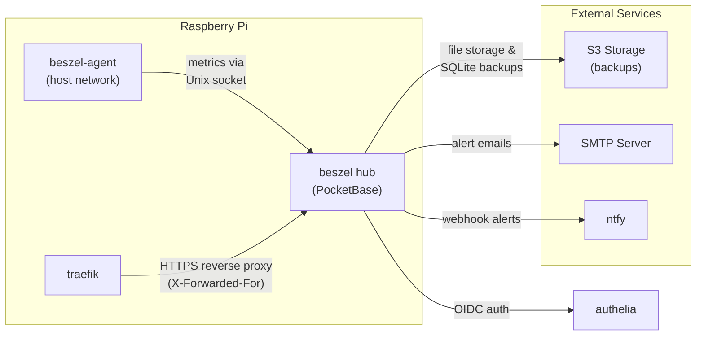
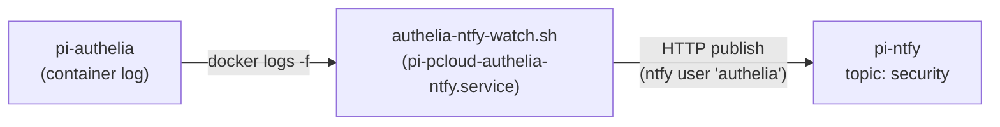
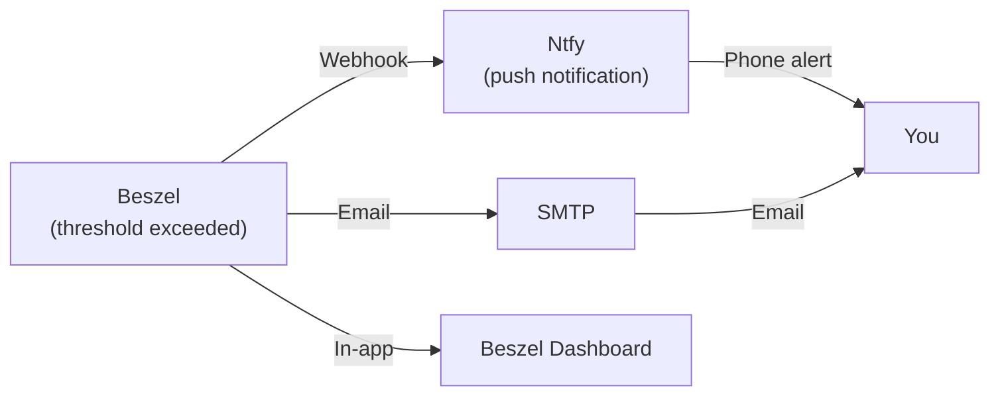

# Monitoring & Alerts

## Beszel Monitoring

Beszel provides lightweight server monitoring with a hub + agent architecture. The hub stores metrics in PocketBase (embedded SQLite), and the agent collects system metrics via Unix sockets.

### Architecture


```mermaid
flowchart LR
    subgraph Pi["Raspberry Pi"]
        Agent["beszel-agent\n(host network)"]
        Hub["beszel hub\n(PocketBase)"]
        Traefik["traefik"]
    end

    subgraph External["External Services"]
        S3["S3 Storage\n(backups)"]
        SMTP["SMTP Server"]
        Ntfy["ntfy"]
    end

    Agent -->|metrics via\nUnix socket| Hub
    Traefik -->|"HTTPS reverse proxy\n(X-Forwarded-For)"| Hub
    Hub -->|"OIDC auth"| Authelia["authelia"]
    Hub -->|file storage &\nSQLite backups| S3
    Hub -->|alert emails| SMTP
    Hub -->|webhook alerts| Ntfy
```

### Accessing Beszel

**URL:** `https://beszel.<HOST_NAME>`

**Authentication:**
- Uses Authelia SSO
- Users in `users` group can log in
- No admin role requirement in Beszel itself (but Traefik `lan` middleware restricts to LAN-only)

### Auto-configured Settings

The bootstrap script (`scripts/beszel-agent-bootstrap.sh`) runs on first start and auto-configures:

| Setting | Configuration Source | Description |
|---------|---------------------|-------------|
| **SMTP** | `.env` variables | Email alerts for breaches, down time |
| **S3 file storage** | `.env` S3 credentials | PocketBase file uploads to S3 |
| **S3 backups** | `.env` + cron schedule | SQLite snapshots to S3 |
| **Trusted proxy** | Auto-set | `X-Forwarded-For` header trusted for real client IPs |
| **OIDC** | Auto-generated secrets | SSO via Authelia |
| **Ntfy webhook** | `config/ntfy/ntfy.env` | Push notifications for alerts |
| **Temperature alerts** | `.env` `BESZEL_TEMP_*` | Automatic for all monitored systems |

### Metrics & Alerts

**Collected per system:**
- CPU usage, load average
- Memory (used, free, swap)
- Disk usage (root, all mounts)
- Network (bytes sent/received)
- Uptime
- System info (CPU cores, total memory, OS)

**Built-in alert types:**
- **Disk usage** — Alert when usage exceeds threshold
- **Memory usage** — Alert when RAM usage exceeds threshold
- **CPU usage** — Alert when load average exceeds threshold
- **Temperature** — Auto-created if `BESZEL_TEMP_ALERT_VALUE` is set (default: 70°C)
- **Offline** — Alert if system stops reporting metrics for 5 minutes

**Alert notifications via:**
1. **Email** — SMTP configured from `.env`
2. **Webhook** — Posts to Ntfy for push notifications
3. **In-app** — Visible on Beszel dashboard

### Default Ntfy alerts

- **Uptime Kuma** notifies with a priority that depends on the monitor's group,
  from urgent (core infrastructure) down to low (media, tooling). It also checks
  the public request path, DNS resolution, the VPN egress and the wildcard TLS
  certificate. See [Uptime Kuma Monitoring](#uptime-kuma-monitoring).
- **Dockhand** notifies only on container OOM and unhealthy healthchecks.
- **Backrest** notifies only when a backup fails.
- **Beszel** sends temperature (70°C), CPU (90%), memory (90%), and disk (85%)
  alerts to ntfy after five minutes over the threshold.
- **Authelia** notifies on every failed login attempt and on regulation bans
  (see below).

### ntfy topics

Alerts are split across three topics, one per reading mode, so each can be
muted, scheduled or exempted from do-not-disturb independently on the phone:

| Topic | Publishers | What lands there |
|-------|-----------|------------------|
| `monitoring` | uptime-kuma, beszel, dockhand, backrest | Service health: outages, thresholds, container events, failed backups |
| `downloads` | prowlarr, qbittorrent | Grabs and completed downloads |
| `security` | authelia | Failed logins, unknown-user attempts, regulation bans |

Topics and per-user ACLs are generated by `scripts/ntfy-pre-start.sh` into
`config/ntfy/ntfy.env`: each service account gets `rw` on its own topic and
nothing else, so a compromised download client cannot publish fake outage or
security alerts. Only the admin account (`ADMIN_USER`) can read all of them.

Change the split in one place — the topic constants at the top of
`scripts/ntfy-pre-start.sh` — then re-run it and recreate ntfy; the per-service
bootstraps pick the new topic up from `ntfy.env` on their next run.

**Subscribe on the phone to all three**, they are independent subscriptions.
The Homepage ntfy widget reads a single topic and is pointed at `monitoring`.

### Configuration

**Backup schedule:**

```bash
BESZEL_BACKUP_CRON=0 3 * * *      # Daily at 3:00 AM
BESZEL_BACKUP_MAX_KEEP=7          # Keep 7 most recent backups
```

**Cron format:** `minute hour day month weekday`

**Temperature alerts:**

```bash
BESZEL_TEMP_ALERT_VALUE=70        # Alert when > 70°C
BESZEL_TEMP_ALERT_MIN=5           # Don't repeat for 5 minutes
```

To modify: Edit `.env` and run `make restart`, then re-run the bootstrap script:

```bash
docker compose exec beszel /opt/beszel/scripts/beszel-agent-bootstrap.sh
```

### Monitoring Your Pi

1. Visit `https://beszel.<HOST_NAME>`
2. Dashboard shows all monitored systems (you'll see your Pi)
3. Click system to view detailed metrics & alerts
4. Set up alert thresholds:
   - Click **Systems**
   - Select your Pi
   - Set disk, memory, CPU thresholds
5. Configure notifications:
   - **Settings** → **SMTP** (if not already auto-configured)
   - **Settings** → **Webhook** (for Ntfy push)

### Storage & Backups

**PocketBase data:**
- Location: `${DATA_LOCATION}/beszel_data/`
- Size: Grows slowly (metrics are aggregated)
- Typical: 50-200 MB per month

**Two backup layers:**

1. **PocketBase built-in** — SQLite snapshots on `BESZEL_BACKUP_CRON` schedule
   - Stored to S3 if configured
   - Else stored locally: `${DATA_LOCATION}/beszel_backup/`
   - Retention: `BESZEL_BACKUP_MAX_KEEP` snapshots

2. **Backrest (restic)** — Full application backup
   - Includes `beszel_data` volume
   - S3 or local backup
   - Daily schedule (see [Backup Strategy](#backup-strategy))

Both layers protect against data loss. For disaster recovery, you can restore from either.

### Troubleshooting

**Agent not reporting metrics:**
```bash
docker compose logs beszel-agent
```

Check if Unix socket exists:
```bash
ls -la /var/run/docker.sock
```

Beszel agent needs access to Docker socket. Verify in compose.yaml:
```yaml
beszel-agent:
  volumes:
    - /var/run/docker.sock:/var/run/docker.sock:ro
```

**S3 backup failing:**
- Verify S3 credentials in `.env`
- Check bucket exists and is accessible
- Review logs: `docker compose logs beszel`

**Ntfy webhook not sending:**
- Verify `config/ntfy/ntfy.env` has correct Ntfy topic
- Check Authelia OIDC credentials for Beszel
- Test manually: `curl -d "test alert" https://ntfy.<HOST_NAME>/your-topic`

## Authelia failed-login alerts

Authelia has no webhook or event notifier — its `notifier` is SMTP-only and used
for user-facing mails (password reset, identity verification). Failed logins only
surface in its log stream, so `scripts/authelia-ntfy-watch.sh` follows
`docker logs -f --tail 0 pi-authelia` and publishes matching lines to ntfy.

### Architecture


```mermaid
flowchart LR
    Authelia["pi-authelia\n(container log)"] -->|docker logs -f| Watcher["authelia-ntfy-watch.sh\n(pi-pcloud-authelia-ntfy.service)"]
    Watcher -->|"HTTP publish\n(ntfy user 'authelia')"| Ntfy["pi-ntfy\ntopic: security"]
```

The watcher runs on the host as a systemd unit (no extra container), is started
and stopped with the stack (`Wants=` on `pi-pcloud.service`, `PartOf=` on its
side) and has `Restart=always`. `--tail 0` means a restart follows only new
lines, so old attempts are never replayed as fresh alerts.

### Notifications

| Event | Log message matched | Title | Priority | Tags |
|-------|---------------------|-------|----------|------|
| Wrong password / failed 2FA | `Unsuccessful <method> authentication attempt by user '<user>'` | Authelia: failed login | default | `warning` |
| Regulation ban | same, with `and they are banned until <time>` | Authelia: user banned | high | `lock,rotating_light` |
| Attempt on a nonexistent username | `Error occurred getting details for user with username input '<user>' …` | Authelia: unknown user login attempt | default | `warning,detective` |

Each message carries the username, client IP (`remote_ip`, which is the real
client IP since Traefik forwards it), the auth method, the endpoint hit and the
Authelia timestamp. Bans additionally carry the expiry — bans follow the
`regulation` block in `config/authelia/configuration.yml.template` (3 retries
within 2 minutes → 5 minute ban).

Authelia logs the "Unsuccessful …" line with an empty username when the account
does not exist, so those alerts come from the paired "username input" line
instead — the alert always names the attempted username.

### Noise control

Identical `(event kind, user, IP)` events are collapsed inside a 60 second
window, so a browser retry loop or a slow brute-force yields one alert plus the
ban alert rather than a stream. Suppressed events are logged to the journal, not
to ntfy. Override with `AUTHELIA_NTFY_DEDUPE_WINDOW` (seconds) in the unit:

```bash
sudo systemctl edit pi-pcloud-authelia-ntfy.service   # [Service] Environment=AUTHELIA_NTFY_DEDUPE_WINDOW=300
```

### Credentials

`scripts/ntfy-pre-start.sh` provisions an `authelia` ntfy user with `rw` on the
`security` topic and stores its generated password in `config/ntfy/ntfy.env`
(`NTFY_AUTHELIA_PASSWORD`, `NTFY_AUTHELIA_TOPIC`). The watcher reads that file at
publish time — so `make rotate-password` is picked up without restarting it — and
passes the credentials to curl on stdin, never on the command line, so they never
appear in the host process table. ntfy is reached over the docker network by
container IP (resolved per publish), not through Traefik.

### Troubleshooting

```bash
sudo systemctl status pi-pcloud-authelia-ntfy.service
sudo journalctl -u pi-pcloud-authelia-ntfy.service -f
```

A `WARNING: NTFY_AUTHELIA_PASSWORD missing` line means `ntfy-pre-start.sh` has
not run since the feature was added — run it and recreate ntfy:

```bash
sh scripts/ntfy-pre-start.sh && docker compose up -d ntfy
```

## Uptime Kuma Monitoring

**Access:** `https://uptime.<HOST_NAME>` (LAN-only + SSO)

Everything below is created and kept in sync by `scripts/uptime-kuma-bootstrap.sh`,
which runs on stack start and can be re-run at any time. It converges existing
monitors instead of only creating missing ones, so changing the topology in
`scripts/uptime-kuma-bootstrap.py` and re-running is the supported way to reshape
the instance. Monitors paused by hand in the UI stay paused.

### Monitor groups

Monitors are grouped by blast radius rather than by theme, because the group
decides the check interval, the retry budget and the ntfy priority:

| Group | Contents | Interval | Alert tier | Alerts from |
|-------|----------|----------|------------|-------------|
| **Core** | traefik, authelia, lldap, postgres, redis, unbound, pihole, ddns-updater, ntfy, DNS resolution | 60s | `ntfy-critical` (prio 5) | each monitor |
| **Remote Access** | headscale, headplane, tailscale, gluetun, VPN public IP | 60s | `ntfy-high` (prio 4) | each monitor |
| **External Chain** | route checks, TLS certificate | 120s | `ntfy-high` (prio 4) | each monitor |
| **Personal Data** | immich, immich-ml, nextcloud, vaultwarden, kavita, backrest | 120s | `ntfy` (prio 3) | each monitor |
| **Media & Downloads** | qbittorrent, stremio, comet, prowlarr, kapowarr, flaresolverr, route qbittorrent | 300s | `ntfy-low` (prio 2) | the group only |
| **Tools & Observability** | homepage, beszel, beszel-agent, dockhand | 300s | `ntfy-low` (prio 2) | the group only |
| **Automation & AI** | n8n, n8n-runners, open-webui, llama-cpp, piper | 300s | `ntfy-low` (prio 2) | the group only |

`ntfy` sits in **Core** because it delivers every other alert. A container that
is in `compose.yaml` but in no group above is monitored under
**Tools & Observability**.

**Where the notification is attached** matters as much as the priority. A Kuma
group is a worst-of-children aggregate whose down message lists the failing
children. Groups marked *the group only* have silent children, so a gluetun
outage sends one `Child monitors down: qbittorrent, prowlarr, ...` push instead
of six. Groups marked *each monitor* alert individually, for the tiers where the
exact failing component matters.

The four ntfy notifications all publish to the **same `monitoring` topic** and
differ only by priority, which is what drives do-not-disturb on the phone. See
[ntfy topics](#ntfy-topics) for how the topics are split.

Ongoing outages are repeated after ~30 minutes (`resendInterval`) for the three
alerting tiers; the low tier never repeats.

### What is actually checked

Docker monitors only prove a container is running. These monitors cover what
they cannot see:

| Monitor | Type | What it catches |
|---------|------|-----------------|
| `route <sub>` (auth, immich, nextcloud, vault, kavita, ntfy, homepage, qbittorrent) | HTTP | Traefik router dropped (404), middleware or backend broken (5xx) - the container can be perfectly healthy |
| `dns resolution` | DNS | Pi-hole up, forwarding to Unbound, and Unbound still reaching the internet |
| `vpn public ip` | JSON query | gluetun running *and* egress actually going through the tunnel |
| `TLS certificate` | HTTP | Wildcard certificate expiry (daily) |

Route checks are sent to the **Traefik container with a `Host` header**, not to
the public URL: Kuma resolves the public name to the WAN address, so the request
would hairpin through the router and hit the `lan@docker` allowlist with an
outside source IP (403). Talking to the container keeps the source inside the
frontend subnet while still exercising the real router rules. TLS verification
is off for those (the certificate is issued for the public name), which is why
certificate expiry has its own monitor.

Authelia-protected routers answer `302` towards the SSO portal, which counts as
healthy: those checks validate the routing chain, not the protected app itself -
the app's docker monitor covers that.

### Homepage widget

The `uptimekuma` widget reads the public **`homepage` status page** and only
reports how many of its monitors are up. The page lists the seven group
monitors, so the widget reads `7 up` / `6 up 1 down` and tells you which side of
the stack broke, instead of the single aggregate it showed before.

### Retention

`keepDataPeriodDays` is set to **90**. Pruning runs daily at 03:14 and also drops
non-important heartbeats older than 24h (long-term history lives in the
`stat_minutely` / `stat_hourly` / `stat_daily` tables, not in `heartbeat`).
SQLite does not return freed pages to the filesystem (`auto_vacuum` is off), so
the file plateaus rather than shrinking; to reclaim space once, use
**Settings → Monitor History → Shrink Database** (a full `VACUUM`).

**If `data/uptime-kuma/kuma.db` keeps growing, the prune is failing silently.**
The job catches its own exceptions, so the only trace is
`data/uptime-kuma/error.log`. A corrupt page anywhere in `heartbeat` makes every
nightly run abort with `SQLITE_CORRUPT`, and the database then grows without
bound:

```bash
docker exec pi-uptime-kuma grep -c SQLITE_CORRUPT /app/data/error.log
docker exec pi-uptime-kuma sqlite3 /app/data/kuma.db "PRAGMA integrity_check(5);"
```

Never `VACUUM` a database that fails `integrity_check` - it rewrites the whole
file and can fail halfway. Recover it instead, from a copy, with a **recent**
sqlite (the 3.40 shipped in the Kuma image aborts `.recover` with
`SQL logic error`; `alpine:latest` carries a working one):

```bash
docker stop pi-uptime-kuma          # clean shutdown, then copy kuma.db aside
docker run --rm -v /path/to/backup:/bk alpine:latest sh -c \
  'apk add --no-cache sqlite && cd /bk && \
   sqlite3 kuma.db ".recover" | sqlite3 kuma-recovered.db && \
   sqlite3 kuma-recovered.db "PRAGMA integrity_check;"'
```

Then prune + `VACUUM` the recovered copy and swap it in (`chown 1000:1000`, and
delete the stale `kuma.db-wal` / `kuma.db-shm` alongside the old file).

### Known blind spot

Uptime Kuma cannot alert on its own host being down. A whole-Pi outage (power,
kernel, disk) is invisible to it; an external heartbeat service would be needed
to cover that.

## Dockhand Notifications (Ntfy)

Dockhand notification delivery is auto-configured by `scripts/dockhand-oidc-bootstrap.sh`.

The bootstrap creates/updates an Apprise notification channel named **Dockhand ntfy** and binds it to the local Docker environment. Credentials and topic are sourced from `config/ntfy/ntfy.env`:

- `NTFY_DOCKHAND_PASSWORD`
- `NTFY_DOCKHAND_TOPIC` (defaults to `pi`)

The channel URL format is:

`ntfy://dockhand:<NTFY_DOCKHAND_PASSWORD>@ntfy/<NTFY_DOCKHAND_TOPIC>`

### Events sent by Dockhand

These are the exact event types configured for Dockhand alerts:

| Event type | Meaning |
|-----------|---------|
| `container_oom` | A container hit an out-of-memory condition |
| `container_unhealthy` | Container healthcheck switched to unhealthy |

### Quick checks

- Verify channel exists in Dockhand: **Settings** → **Notifications** → `Dockhand ntfy`
- Verify ntfy credentials exist: `config/ntfy/ntfy.env`
- Verify topic subscriptions in ntfy client for `NTFY_DOCKHAND_TOPIC`

## Alerting Workflow


```mermaid
flowchart LR
    Beszel["Beszel\n(threshold exceeded)"]
    -->|Webhook| Ntfy["Ntfy\n(push notification)"]
    -->|"Phone alert"| You["You"]

    Beszel -->|Email| SMTP["SMTP"]
    -->|"Email"| You

    Beszel -->|"In-app"| Dashboard["Beszel Dashboard"]
```

## Backup Strategy

**Two independent layers:**

### Layer 1: PocketBase Built-in Backups

For Beszel data (metrics, alerts):

- **What:** SQLite database snapshots
- **When:** Daily at `BESZEL_BACKUP_CRON` (default: 3:00 AM)
- **Where:** S3 or local directory
- **Retention:** Last `BESZEL_BACKUP_MAX_KEEP` snapshots (default: 7)
- **Restore:** Import snapshot via Beszel admin UI

**Configuration:**
```env
BESZEL_BACKUP_CRON=0 3 * * *       # Cron schedule
BESZEL_BACKUP_MAX_KEEP=7           # Snapshots to keep
S3_ENDPOINT=...                    # Optional: S3 storage
S3_BUCKET=...
S3_REGION=...
S3_ACCESS_KEY_ID=...
S3_SECRET_ACCESS_KEY=...
```

### Layer 2: Backrest (Restic) Full Backups

Comprehensive backup including all application data:

- **What:** Nextcloud files, Immich library, databases, configs, Beszel data
- **When:** Nightly (configurable)
- **Where:** S3 or local directory
- **Retention:** Configurable (typically 30 days)
- **Restore:** Full system restore from restic snapshots

**Configuration:**
```env
BACKREST_S3_URI=s3:${S3_ENDPOINT}/${S3_BUCKET}/restic
BACKREST_S3_REPO_PASSWORD=your-encryption-key
S3_ENDPOINT=...
S3_BUCKET=...
S3_REGION=...
S3_ACCESS_KEY_ID=...
S3_SECRET_ACCESS_KEY=...
```

### Recommended Backup Plan

1. **Enable Beszel backups** — Daily SQLite snapshots
   - Quick restore of monitoring history
   - Low overhead

2. **Enable Backrest** — Nightly restic backups
   - Full application & data recovery
   - Encryption + deduplication
   - Off-site storage (S3)

3. **Test restores** — Monthly
   - Verify backups are working
   - Practice restore procedure
   - Catch issues early

### Monitoring Backups

Check backup status in Beszel:
- **Dashboard** → Select system
- **Recent backup date** should be today or yesterday
- Missing backups = alert triggered

Or manually:
```bash
# List local backups
ls -lah ${DATA_LOCATION}/beszel_backup/

# Check S3 backups (requires AWS CLI)
aws s3 ls s3://my-bucket/beszel/
```

## Logging & Log Retention

Logs are managed by systemd journald. View logs:

```bash
make logs                          # Follow stack logs (10 containers)
docker compose logs <service>      # Specific service
docker compose logs -f traefik     # Follow traefik logs
```

**Log retention:**
- Journald default: 10% of disk or 4GB (whichever is smaller)
- Change: Edit `/etc/systemd/journald.conf`, set `SystemMaxUse=`

**Cleanup old logs:**
```bash
journalctl --vacuum=30d            # Keep 30 days
journalctl --vacuum=2G             # Keep 2 GB max
```

## Performance Monitoring

**Key metrics to watch:**

1. **CPU load** — Should stay under `number_of_cores`
   - High load = services struggling
   - May need:Increase Nextcloud/Immich workers, reduce background jobs

2. **Memory usage** — Should stay under 70% normally
   - OOM kills containers
   - Set swap or upgrade RAM

3. **Disk usage** — Keep under 80% for healthy FS
   - Above 90% = risky
   - Clean old photos/videos, reduce backup retention

4. **Temperature** — Raspberry Pi 5 thermal throttles at 80°C
   - Add cooling (heatsink, fan)
   - Reduce workload

5. **Network I/O** — Bottleneck for Immich/Nextcloud
   - Large photo syncs = sustained high I/O
   - Normal; no action needed unless services timeout

Beszel dashboard shows all these in real-time. Set up alerts if thresholds are exceeded.
