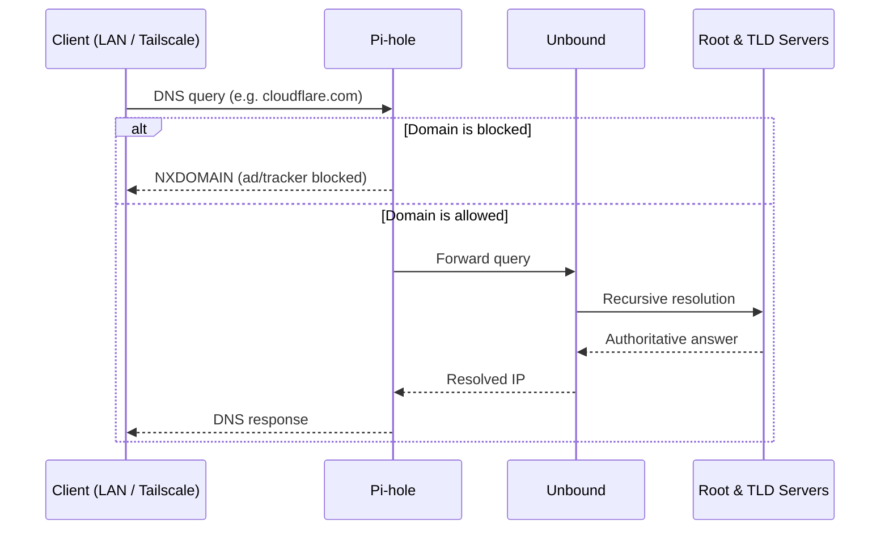

# Networking & DNS

## DNS Architecture

This stack implements a privacy-first, three-tier recursive DNS pipeline. No third-party DNS provider (Google, Cloudflare, etc.) ever sees your LAN queries.

### Three-Tier DNS



**Tier 1: Pi-hole**
- Ad/tracker filtering (uses blocklists)
- Local hostname resolution (`.pi.ajir.dev` records)
- Caching layer

**Tier 2: Unbound**
- Recursive resolver
- Walks DNS delegation tree from root servers
- No data leaves your network (privacy)

**Tier 3: Root Servers**
- Authoritative source (queries only for domains not cached)

### Components

| Container | Port | Network | Role |
|-----------|------|---------|------|
| **Pi-hole** | 53/udp, 53/tcp | macvlan + dns_internal | Ad filtering, blocking, local DNS |
| **Unbound** | 53/udp, 53/tcp | dns_internal (no internet) | Recursive resolution |

## Network Interfaces

### macvlan Interface (Physical LAN)

Pi-hole has a dedicated IP on your home LAN for direct DHCP/DNS:

```env
HOST_LAN_PARENT=eth0                    # Physical interface (usually eth0)
HOST_LAN_SUBNET=192.168.1.0/24          # Your home network CIDR
PIHOLE_IP=192.168.1.250                 # Pi-hole's static IP
```

**Benefits:**
- Responds to DHCP requests from home LAN devices
- Each device gets Pi-hole as its DNS server
- No extra forwarding needed

**Setup:**
1. Set `PIHOLE_IP` outside DHCP range (typically 192.168.1.200-254)
2. Reserve IP in router DHCP settings
3. On first start, Docker creates macvlan with the specified subnet

### DNS Internal Network (Isolated)

Pi-hole and Unbound communicate over `dns_internal` bridge network:

```
dns_internal: 172.30.53.0/24 (no internet gateway)
├── Pi-hole: 172.30.53.2
└── Unbound: 172.30.53.3
```

This network has **no internet gateway**:
- Pi-hole ↔ Unbound: ✓ Full communication
- Unbound → Internet: ✓ Can query root servers via egress network
- Other containers ↔ Unbound: ✗ Cannot reach Unbound directly (blocked)
- Internet → Unbound: ✗ Cannot reach Unbound (no inbound route)

**Why isolated?** Prevents containers/attackers from querying Unbound directly, bypassing Pi-hole's filtering.

## DNS Query Flow

### From Home LAN

```
Device (192.168.1.100)
  ↓ DNS query :53
Pi-hole (192.168.1.250)
  ↓ Check blocklists
  ├─ If blocked: NXDOMAIN ↓ Device
  └─ If allowed:
      ↓ Query :53 (dns_internal)
    Unbound (172.30.53.3)
      ↓ Recursive resolution
    Root Servers
      ↓ Answer
    Unbound (cache)
      ↓ Answer
    Pi-hole (cache)
      ↓ Answer
Device
```

### From Docker Containers

Containers **cannot query Unbound directly**. Instead:

```
Container → /etc/resolv.conf (127.0.0.11:53, Docker internal resolver)
  ↓
Docker DNS resolver
  → Pi-hole (172.30.11.1, frontend network)
  → Answers cached / forwards to Unbound
Container gets answer
```

Alternatively, configure container to use Pi-hole:
```yaml
services:
  myservice:
    dns:
      - 172.30.53.2  # Pi-hole's dns_internal IP
```

### From Tailscale VPN

Headscale pushes Pi-hole as global nameserver to all VPN clients:

```
VPN Client device
  ↓ Uses Pi-hole via MagicDNS
Pi-hole (172.30.53.2, from VPN perspective)
  ↓ Unbound query
Unbound → Root Servers
```

**MagicDNS:**
- Automatically sets Pi-hole as nameserver
- Works over WireGuard tunnel
- Encrypted DNS queries

## Split DNS Configuration

Headscale also sets up **split DNS** for your local domain (e.g., `pi.ajir.dev`):

```
VPN Client queries:
  - nextcloud.pi.ajir.dev → Pi-hole (returns local IP)
  - google.com → Unbound → Root Servers
```

This way:
- Internal services resolve to their local IPs
- External domains resolve normally
- All queries stay private (no leaks to ISP/Cloudflare)

## Network Isolation

Docker networks enforce traffic isolation:

```mermaid
flowchart TB
    subgraph frontend["frontend (172.30.11.0/24)"]
        Traefik
        PublicServices["Nextcloud, Immich, etc."]
    end

    subgraph auth["auth (internal)"]
        Authelia
        LLDAP
        Auth_DB["Postgres, Redis"]
    end

    subgraph dns_net["dns_internal (172.30.53.0/24)"]
        Pihole["Pi-hole"]
        Unbound["Unbound"]
    end

    subgraph lan_net["macvlan"]
        Pihole_LAN["Pi-hole (192.168.1.250)"]
    end

    Traefik -->|reverse proxy| PublicServices
    PublicServices -->|forward-auth| Authelia
    Authelia ↔ LLDAP
    Authelia ↔ Auth_DB

    Pihole ↔|internal| Unbound
    Pihole ↔ Pihole_LAN
```

**Isolation rules:**

| Network | Access | Blocked |
|---------|--------|---------|
| **frontend** | All frontend services, Traefik reverse proxy | Internet (except Traefik) |
| **auth** | Only Traefik (forward-auth) can reach | Internet, other services |
| **dns_internal** | Pi-hole ↔ Unbound | Internet (Unbound only), external queries |
| **macvlan** | Pi-hole (physical LAN), your home network | Docker networks |

**Effect:** If a container is compromised:
- Cannot query Unbound (bypassing Pi-hole filtering)
- Cannot access auth network (stealing LDAP password)
- Cannot access other app networks

## Firewall Configuration

### Ports Exposed

| Port | Protocol | Service | Exposed | Notes |
|------|----------|---------|---------|-------|
| **80** | TCP | Traefik | Internet | HTTP → HTTPS redirect |
| **443** | TCP | Traefik | Internet | HTTPS (TLS) |
| **53** | TCP/UDP | Pi-hole (macvlan) | Home LAN | DNS (also WireGuard/Tailscale) |

### Ports Blocked

| Port | Service | Hidden |
|------|---------|--------|
| **3000-8000** | Internal services (Nextcloud, Immich, etc.) | ✓ Behind Traefik |
| **5432** | PostgreSQL | ✓ Internal only |
| **6379** | Redis | ✓ Internal only |
| **389** | LLDAP | ✓ Internal only |
| **53 (Unbound)** | DNS recursive | ✓ Isolated network, no routes |

### Recommended Router Rules

1. **Port forwarding:**
   - Forward 80 → Pi's 80 (HTTP)
   - Forward 443 → Pi's 443 (HTTPS)

2. **DNS (optional):**
   - If you want home LAN devices to use Pi-hole:
     - Set DHCP DNS to `192.168.1.250`
   - Or manually configure devices

3. **Tailscale:**
   - No port forwarding needed
   - WireGuard works through NAT

## IPv4 Addressing Scheme

```
Home LAN: 192.168.1.0/24
├── Router: 192.168.1.1
├── Pi-hole: 192.168.1.250 (reserved, static)
├── Raspberry Pi: 192.168.1.100-200 (adjust as needed)
└── Other devices: DHCP pool (varies by router)

Docker frontend: 172.30.11.0/24
├── Traefik: 172.30.11.2
├── Services: 172.30.11.3-254

Docker dns_internal: 172.30.53.0/24
├── Pi-hole: 172.30.53.2
└── Unbound: 172.30.53.3

Docker auth: Internal (172.30.10.0/24)
Docker nextcloud: Internal (172.30.20.0/24)
Docker immich: Internal (172.30.30.0/24)

Tailscale VPN: 100.64.0.0/10 (default, auto-assigned)
```

## DNS Records

### Cloudflare (External DNS)

These records point to your Pi from the internet:

```
@        A     <your-public-ip>           # Root domain
*        A     <your-public-ip>           # Wildcard (*.example.com)
auth     CNAME <your-public-ip>           # Or A record
```

These are updated dynamically by ddns-updater if your ISP changes your IP.

### LLDAP (Internal DNS)

Optional local DNS records for internal hostnames:

```
nextcloud.pi.ajir.dev     → 172.30.11.4  (Nextcloud container)
immich.pi.ajir.dev        → 172.30.11.5  (Immich container)
pi.ajir.dev               → 192.168.1.100 (Raspberry Pi)
```

Configure in LLDAP admin UI → DNS Records (if available).

## Troubleshooting

### DNS not resolving

**Check Pi-hole is running:**
```bash
docker compose logs pihole | tail -20
```

**Test from LAN device:**
```bash
nslookup example.com 192.168.1.250      # Linux/Mac
nslookup example.com <pi-hole-ip>       # Windows
```

**Check DHCP:**
- Did device get Pi-hole IP as DNS? (depends on router config)
- Manually set to `192.168.1.250` to test

### Internal services not resolving

**Check Unbound:**
```bash
docker compose logs unbound | tail -20
```

**Test from container:**
```bash
docker compose exec nextcloud nslookup google.com
```

### Tailscale DNS not working

**Verify Headscale config:**
```bash
docker compose logs headscale | grep -i dns
docker compose logs headscale | grep -i magic
```

**Check on VPN client:**
```bash
# Linux/Mac
cat /etc/resolv.conf                    # Should show Tailscale DNS

# macOS
networksetup -getdnsservers "Wi-Fi"     # Or VPN adapter
```

### High DNS latency

**Causes:**
- Unbound root server lookups are slow on first query
- Pi hitting memory limits
- Blocklists are very large

**Fixes:**
- Restart Unbound to refresh root server cache
- Monitor RAM usage in Beszel
- Trim blocklists in Pi-hole

See also [Monitoring](MONITORING.md) for DNS query volume tracking.
