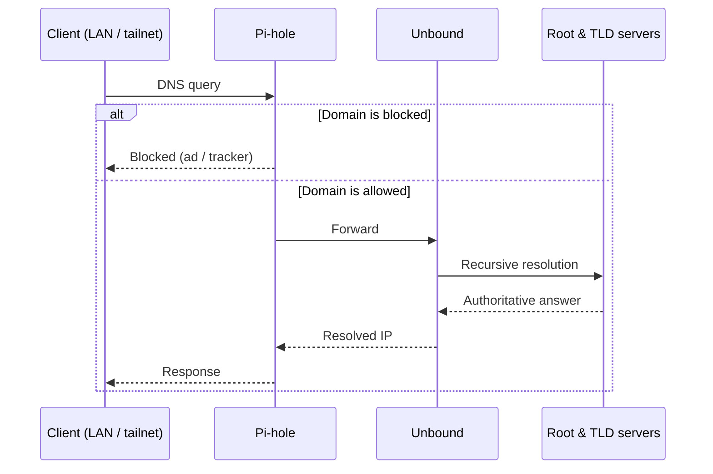

# Networking & DNS

## The DNS pipeline

Pi-hole filters and Unbound resolves recursively from the root servers, so most queries reach no third party. The public resolvers in `PIHOLE_DNS_UPSTREAMS` are **not** failover-only: dnsmasq spreads queries across every upstream it is given and periodically re-probes the ones it considers slower, so Cloudflare and Quad9 do see a share of normal traffic. That is an accepted trade rather than an oversight - the alternative, `strict-order`, leaves a DNSSEC-bogus domain with no answer at all instead of a prompt SERVFAIL. Remove them from `PIHOLE_DNS_UPSTREAMS` if you want Unbound to be the only resolver, at the cost of having no fallback when it is down.


```mermaid
sequenceDiagram
    participant C as Client (LAN / tailnet)
    participant P as Pi-hole
    participant U as Unbound
    participant R as Root & TLD servers

    C->>P: DNS query
    alt Domain is blocked
        P-->>C: Blocked (ad / tracker)
    else Domain is allowed
        P->>U: Forward
        U->>R: Recursive resolution
        R-->>U: Authoritative answer
        U-->>P: Resolved IP
        P-->>C: Response
    end
```

| Container | Address | Networks | Role |
|-----------|---------|----------|------|
| **Pi-hole** | host `:53` + `${PIHOLE_IP}` (macvlan) + `172.30.11.241` (frontend) | `dns_internal`, `frontend`, `lan` | Filtering, local DNS; web UI bound to `127.0.0.1:8082` and `172.30.11.241:8082` only — never on the macvlan address |
| **Unbound** | `172.30.53.53:5335` | `dns_internal` (no gateway), `egress_unbound` | Recursive resolution |

`dns_internal` is an internal bridge with no gateway; Unbound's own internet access for root-server queries goes through the separate `egress_unbound` network, of which it is the only member. No other container can reach Unbound, so nothing can bypass Pi-hole's filtering.

**Unbound validates DNSSEC.** The bind mount replaces the image's entire `unbound.conf`, which is where its own trust-anchor line lived — so before this the resolver did not validate at all, and the `harden-dnssec-stripped: yes` a few lines below it was inert. `auto-trust-anchor-file: "/opt/unbound/etc/unbound/var/root.key"` restores it, and `auto-` rather than a static `trust-anchor-file` so RFC 5011 can roll the key: `var/` is owned by `_unbound`, the user the daemon drops to, so it can rewrite the file. `val-clean-additional: yes` drops unvalidated additional-section records rather than passing them through. A bogus domain now answers SERVFAIL with no address.

## Local names

Pi-hole answers `<HOST_NAME>` and every `*.<HOST_NAME>` subdomain with the Pi's LAN IP (`FTLCONF_misc_dnsmasq_lines: address=/${HOST_NAME}/${HOST_LAN_IP}`). Traefik then routes by `Host` header. So on the LAN and on the VPN, `nextcloud.<HOST_NAME>` resolves to the Pi itself — never to a container IP, and always with a valid certificate.

`make install` also writes a `headscale.<HOST_NAME> → ${HOST_LAN_IP}` record into the Pi's own `/etc/hosts`, so the local `tailscale` container reaches its control plane without hairpinning through the WAN.

## Pi-hole on the physical LAN

Pi-hole gets its own address on your home network, so devices can point at it directly:

```env
HOST_LAN_PARENT=eth0                    # physical interface — must be wired
HOST_LAN_SUBNET=192.168.1.0/24
PIHOLE_IP=192.168.1.250                 # outside the DHCP range
```

Set your router's DHCP DNS option to `PIHOLE_IP`, or configure devices by hand — see below for the
routers that expose no such setting. Two macvlan consequences, both load-bearing:

- **The Docker host itself cannot reach a macvlan IP** over the parent interface. The Pi querying
  its own `${HOST_LAN_IP}:53` therefore times out; query `127.0.0.1` instead. Note that nothing in
  the installer points the Pi's own resolver at Pi-hole, so `/etc/resolv.conf` keeps whatever the
  router handed out. Containers using Docker's embedded resolver inherit that, and therefore
  resolve `*.<HOST_NAME>` to the **WAN** address — which is why several services carry an
  `extra_hosts` entry pinning a stack hostname to an internal address instead.
- **A LAN client must target `PIHOLE_IP`, never `${HOST_LAN_IP}`.** Docker DNATs the host's
  published `:53` to Pi-hole's *frontend* address, but the container has a direct route to the LAN
  subnet over the macvlan, so its reply leaves that way and never returns through the host's
  conntrack — the DNAT is never undone and the client rejects a `reply from unexpected source`.
  The host publish exists for the tailnet, where `100.64.0.0/10` has no direct route in the
  container, so the reply goes back out the default gateway and the reverse NAT applies correctly.

### Devices that cannot be pointed at Pi-hole

Cast receivers and locked-down TVs often ignore the DHCP DNS option, or expose no DNS field at all.
Left alone they resolve `<service>.<HOST_NAME>` through public DNS, get the WAN address, hairpin
back through the router with a SNAT'd source, and are refused by `lan@docker`.

The fix is a **specific** public A record pointing at the Pi's LAN address, unproxied:

```
<service>.<HOST_NAME>   A   <HOST_LAN_IP>    # DNS only
```

A specific record beats the `*.<HOST_NAME>` wildcard, and `ddns-updater` only manages `<HOST_NAME>`
and the wildcard, so it never overwrites it. The answer is identical to Pi-hole's, so nothing
diverges. Nothing new is exposed: `lan@docker` still refuses any non-LAN, non-tailnet source, and a
private address is not routable from outside anyway.

**Never do this on the wildcard.** `headscale.<HOST_NAME>` must keep resolving to the WAN address —
it is how remote nodes reach the control plane to enrol and reconnect from outside the tailnet.

**Nor on `comet.<HOST_NAME>`.** `comet-public@docker` routes `/s/<PUBLIC_API_TOKEN>/` without
`lan@docker` precisely so an addon installed on a Stremio account keeps resolving off-tailnet; a
specific record aimed at `HOST_LAN_IP` hands the internet a private address and silently un-publishes
it. The record is unnecessary here anyway: a cast receiver that hairpins to the WAN address now
reaches the addon endpoints through the public router instead of the `403` this section exists to
avoid. Only `/configure` and `/admin*` stay LAN-only, and neither is something a TV opens.

Verify the router does not strip private answers (some resolvers apply DNS rebinding protection):
`dig @<router> <service>.<HOST_NAME> +short` must return `<HOST_LAN_IP>`.

### Routers that cannot set the DHCP DNS option

Some ISP routers — an Orange Livebox 7, measured — expose no DHCP DNS field at all, so the whole
LAN keeps resolving through the router. Every client then lands on the WAN address and is refused
by `lan@docker`: a bare `403` with body `Forbidden`, no login redirect, on every gated service at
once. The middleware runs before `authelia@docker`, so this looks nothing like an auth problem.

Two ways to tell it apart from a broken app, both from the Pi:

- Traefik's access log is JSON. A rejected request carries `"DownstreamStatus":403` and a
  `"ClientHost"` equal to your **public** IP. It never reaches the app, so the app's own log
  stays silent — `docker logs pi-traefik` is the only place it appears.
- Pi-hole's query database lists the clients that actually use it. No address from
  `HOST_LAN_SUBNET` means nothing on the LAN resolves through it:

  ```sh
  docker exec pi-pihole pihole-FTL sqlite3 /etc/pihole/pihole-FTL.db \
    "select client, count(*) from queries where timestamp > strftime('%s','now')-86400 group by client;"
  ```

**The one-entry fix is `WAN_HAIRPIN_IP`.** Set it in `.env` to the line's public address as a
`/32`; the `lan` middleware appends it to `ALLOW_IP_RANGES`, and every device, hostname and
resolver is covered at once with nothing to configure per device:

```
WAN_HAIRPIN_IP=203.0.113.7/32
```

It admits LAN clients only, **provided the address is yours alone**. Hairpinning is what rewrites the
source to the WAN address, and only a connection that left the LAN gets hairpinned; a request that
really comes from the internet arrives with its own source, which the allowlist still refuses. That
argument fails on a CGNAT or otherwise shared line, where the same address fronts other subscribers
— so `scripts/wan-allowlist-sync.sh` refuses to allowlist anything in CGNAT or private space.

What the entry does do is expire: once the line's address moves, it keeps admitting whoever
inherits the old one. So that script keeps the value current on a 15-minute
`pi-pcloud-wan-allowlist.timer` installed by `make install`. Two things about it are deliberate:

- **The address comes from `tailscale netcheck`,** a STUN observation of what the line presents
  *now*. `ddns-updater`'s state file is the obvious source and the wrong one: it records what was
  last *published*, and is only rewritten when that changes, so it goes on confirming a stale value
  forever once publishing has broken.
- **The check is against the running container's label,** not against `.env`. `.env` is what the
  next `up` will render, not what Traefik is enforcing; keying off it alone means one failed
  `compose` call short-circuits every later run and leaves the stale range live. For the same
  reason it is `up` and not `restart` — Traefik reads middleware definitions from container labels,
  which are fixed at creation.

Measured cadence on the line this was written for is about twice a year, so the timer is insurance
rather than a hot path — and it is why the value is best left to the timer rather than hand-edited.

If you would rather not allowlist the public address at all, the per-device fallback is a `hosts`
entry per gated hostname — `/etc/hosts` on Linux and macOS, `%SystemRoot%\System32\drivers\etc\hosts` on Windows:

```
${HOST_LAN_IP}  nextcloud.<HOST_NAME>
${HOST_LAN_IP}  immich.<HOST_NAME>
...
```

`hosts` has no wildcard, so this is one line per gated hostname, to revisit whenever a service is
added. Two things make it work better than it looks: the Let's Encrypt certificate is a wildcard
for `*.<HOST_NAME>`, so aiming a name at the LAN address still presents a valid certificate; and
because the Pi advertises `HOST_LAN_SUBNET` as a tailnet route, `${HOST_LAN_IP}` stays reachable
from outside as well, so one static entry serves both on and off the LAN.

**Leave `headscale.<HOST_NAME>` out of it**, for the reason given above: pin it to a private
address and a laptop that is off-LAN with the tunnel down can no longer reach its control plane to
reconnect. `auth.<HOST_NAME>` is not gated and works either way; pinning it only keeps the Authelia
redirect on the local path.

**Correcting DNS is not enough on its own.** Because one certificate covers every hostname in the
stack, an HTTP/2 client that already holds a connection to the WAN address *coalesces* new
hostnames onto it and performs no DNS lookup at all. A dashboard left open keeps that connection
warm indefinitely, so it never re-resolves. Measured on Orion (WebKit): a single stale connection
kept serving `homepage`, `immich`, `kavita`, `nextcloud` and `qbittorrent` — all 403 — while Chrome
on the same machine, having resolved afresh, got 200. Quit the browser fully after editing `hosts`;
closing the tab is not enough.

### IPv6

Traefik serves `80`, `443/tcp` and `443/udp` over IPv6, and it is the **only** container with an
IPv6 address. That is the design: nothing else has one, so nothing else is reachable over IPv6
whatever the router's firewall says.

**Why one address rather than a dual-stack `frontend`.** A v6 subnet on `frontend` would hand a
global-egress address to `gluetun`, whose namespace `qbittorrent`, `stremio` and `kapowarr` share —
their traffic would leave outside the tunnel, on the residential address, and nothing here blocks
that (`FIREWALL_OUTBOUND_SUBNETS` is unset). Two smaller regressions follow it: healthchecks that
dial `localhost` can start resolving `::1` against a v4-only listener, and `internalapi-allow` and
Nextcloud's `TRUSTED_PROXIES` are single `/32`s that would stop matching. So Traefik joins one extra
network, `ingress6`, of which it is the sole member.

**What that buys.** With a v6 subnet on the network Docker programs an `ip6tables` DNAT rule instead
of falling back to userland `docker-proxy`, so the client's real address survives. Measured here:

| | logged `ClientHost` | verdict on a gated route |
|---|---|---|
| `[::]` served by docker-proxy | `172.30.12.1` (a Docker gateway) | `302` — **admitted**, `ALLOW_IP_RANGES` contains `172.30.0.0/16` |
| DNAT to `ingress6` | `2001:db8:1:200:…` (the caller) | `403` off-prefix, `302` from the LAN prefix |

Only the router's IPv6 firewall was holding the first row shut. Hence every port is written out per
family (`"0.0.0.0:443:443"` *and* `"[::]:443:443"`) rather than left bare.

**No daemon change, and no sysctl.** `ip6tables` has been on by default since Docker 27, and both
IPv6 subnets are pinned, so no IPv6 `default-address-pools` entry is needed either —
`/etc/docker/daemon.json` is untouched and Docker is never restarted.
`net.ipv6.conf.all.forwarding` is already set for Tailscale, and NetworkManager processes Router
Advertisements in user space, so the RA-derived address is renewed regardless of the kernel's
`accept_ra` — setting it would be a knob nothing reads.

**Addressing.** Both subnets are ULAs (`fd00::/8` — the counterpart of `172.30.0.0/16`) mirroring
the IPv4 numbering: `172.30.15.0/24` → `fd00:30:15::/64`, `172.31.242.0/24` → `fd00:31:242::/64`.
RFC 4193 asks for a random Global ID; mnemonic numbering is chosen instead because these prefixes
have to be read in an allowlist. The asymmetry is preserved: `egress_*` sits in `fd00:31:*`, outside
the allowlist, as its `172.31.*` sits outside `172.30.0.0/16`.

**The allowlist gains two kinds of entry.** Three fixed members in `ALLOW_IP_RANGES` — `::1/128`,
`fd00:30:15::/64`, `fd7a:115c:a1e0::/48`, the counterparts of `127.0.0.1/32`, `172.30.0.0/16` and
`100.64.0.0/10` — and `HOST_LAN_SUBNET6`, appended separately because the ISP owns it and it changes
when the line reconnects. `wan-allowlist-sync.sh` reads it off the LAN interface's routing table on
the same 15-minute timer as `WAN_HAIRPIN_IP`, refusing anything that is not global unicast
(`2000::/3`) or longer than a `/64`. It admits what `192.168.1.0/24` admits: every device on your
LAN. A source address cannot be forged through a TCP handshake, so only devices actually on the link
present one from that range.

**The hairpin problem does not exist here.** With no NAT a LAN client reaches the Pi's global
address over the local link, so there is nothing to SNAT and no `403`. `WAN_HAIRPIN_IP` is IPv4 only.

#### What stays IPv4, and why

- **Pi-hole's `:53`.** `FTLCONF_dns_listeningMode` is `all`, so FTL answers any source it can see,
  and IPv6 has no NAT in front of it: an open resolver as soon as the router's firewall is opened
  past `:443`. No client could use it anyway — the router advertises **itself** as the IPv6 resolver
  (RDNSS) and cannot be told otherwise (measured on iOS, where the manual per-network DNS entry did
  not displace it), and Headscale pushes an IPv4 nameserver. Filtering ads over IPv6 on the LAN is a
  limitation of the router, not of this stack.
- **Headscale's STUN `:3478`.** It has no IPv6 address, so a `[::]` publish would fall back to
  docker-proxy and report a Docker gateway address to its own clients.
- **Pi-hole's answers for `*.<HOST_NAME>`.** `address=/<HOST_NAME>/<lan-ip>` configures an A record
  only, and dnsmasq then answers AAAA for those names from config with `NODATA-IPv6` rather than
  forwarding (measured in `pihole.log`). A LAN client using Pi-hole keeps the IPv4 path, which
  works; one the router took off Pi-hole resolves publicly and, with AAAA published, reaches the Pi
  directly over the link instead of hairpinning into a `403`.
- **The `internal:` app segments and the `lan` macvlan.** East-west traffic already has an IPv4 path
  to both ends, and a macvlan would need a subnet carved from the delegated prefix, which is not
  stable.
- **Unbound's transport** (`do-ip6: no`). A real improvement, independent of this, and out of scope.

#### Making it reachable from the internet

Two steps, in this order — the reverse degrades remote access.

1. **Allow inbound `443/tcp` (and `443/udp` for HTTP/3) to the Pi in the router's IPv6 firewall.**
   A firewall rule, not a port forward: nothing is translated, so the rule names a device and a
   port. **Name the port, never just the Pi** — `sshd` listens on `[::]:22` and `tailscaled` on
   `41641/udp`, and with no NAT in front of them a wholesale rule publishes SSH to the internet.
2. **Set `IPV6_PUBLIC_RECORDS=1`**, which adds the AAAA records to ddns-updater's configuration.

Publishing before opening the pinhole makes every off-LAN client try IPv6 and fail. Left empty,
public DNS keeps A records only while IPv6 still works from the LAN.

## Casting to a DLNA renderer

Stremio can drive a UPnP/DLNA renderer itself, but only from the physical LAN: it finds
receivers by SSDP/mDNS **multicast**, which does not leave a Docker bridge, and which
gluetun's firewall rejects outright (`EPERM` on `239.255.255.250`). The default `stremio`
profile therefore never lists a device. The `stremio-lan` profile trades the VPN for a
macvlan address (`STREMIO_IP`) and discovers renderers normally.

Three things that mode needs, none of them obvious:

- **`FFMPEG_BIN` / `FFPROBE_BIN`.** The upstream image installs jellyfin-ffmpeg under
  `/usr/lib/jellyfin-ffmpeg/`, which is not on `PATH`, and ships both variables empty. Without
  them the server finds no binary and cannot remux anything — for casting or otherwise. Set in
  both profiles, since it is a plain defect.
- **`CASTING_DISABLED=`.** The image sets it to `1`, and `/casting` answers 404 to every client.
  Only its truthiness is read, so `0` would still disable it: it must be empty.
- **`extra_hosts` pointing `stremio.<HOST_NAME>` and `comet.<HOST_NAME>` at Traefik's frontend
  address.** A macvlan child cannot reach its parent host, so any public record aimed at
  `HOST_LAN_IP` is unusable from inside — upstream fetches fail with `EHOSTUNREACH`.

**The trade-off:** that address is off the VPN. With a debrid addon the server barely fetches
anything itself, but with plain torrent sources the pieces it pulls leave on the residential IP.

**A known limit.** `/casting/transcode.mp4` is a live ffmpeg pipe: chunked, no `Content-Length`,
`Accept-Ranges: none`. Renderers that require a seekable resource of known length refuse it and
stop with `ERROR_OCCURRED`, whatever the container or MIME type — a SoftAtHome (Orange decoder)
renderer was measured doing exactly that while playing the same content served as a static file.
Casting here works with renderers that accept a non-seekable stream; for the others the answer is
a media server that serves files, not this.

## DNS inside containers

Containers use Docker's embedded resolver (`127.0.0.11`), which forwards to the host's configuration. Two exceptions pin public resolvers directly in `compose.yaml` (`dns: 1.1.1.1`): **`prowlarr`** and **`flaresolverr`**, so indexer lookups neither depend on nor are filtered by Pi-hole.

**`ddns-updater` is a third**, at the application level (`RESOLVER_ADDRESS: 1.1.1.1:53`) since only the names in its own settings need it. It looks a name up *before* writing it, so the first AAAA publication seeds a `NODATA` into the router's negative cache, and its healthcheck — which verifies each record by resolving it — then reports a mismatch on a correct record. Measured: `any.<HOST_NAME>` returned nothing through the router and the right address at `1.1.1.1`, five failed checks before the resolver was pinned.

Unrelated to IPv6 and not worth engineering around: when an address genuinely changes, the old one stays cached for its TTL, so ddns-updater reads unhealthy for a few minutes. That now applies to a prefix change too.

## DNS on the VPN

Headscale pushes DNS to every client (`config/headscale/config.yaml`):

- **Global nameserver `100.64.0.1`** — the Pi's own tailnet IP, so every query from a VPN client travels the WireGuard tunnel to Pi-hole. Ad blocking follows the device everywhere.
- **Split DNS** for `<HOST_NAME>` pointing at the same address, plus **MagicDNS** under `tailnet.<HOST_NAME>`.

Since Pi-hole resolves `*.<HOST_NAME>` to the Pi, every service works from the VPN with valid TLS. See [Tailscale](TAILSCALE.md).

## Network isolation

| Network | Subnet | Members | Purpose |
|---------|--------|---------|---------|
| `frontend` | `172.30.11.0/24` (Traefik `.250`, Homepage `.240`, Pi-hole `.241`; everything else dynamic) | Traefik + every routed service except Backrest, Dockhand and Vaultwarden | The network Traefik proxies to by default (`--providers.docker.network`). The three static addresses exist because something binds to or allowlists them by number: Pi-hole's `FTLCONF_webserver_port`, Traefik's `internalapi-allow` ipallowlist, and Homepage's Traefik widget URL. They are high in the range because Docker allocates dynamically from `.2` upwards |
| `backup` | `172.30.12.0/24` | Traefik, Homepage, Backrest | Backrest's `:9898` returns the restic key and the S3 credentials to any authenticated caller, so it is not left on a segment with ~24 other containers. Not internal: restic reaches S3 through it. A service opts in with `traefik.docker.network=backup`. The subnet is pinned rather than left to Docker, which handed out `172.31.0.0/16` — outside `ALLOW_IP_RANGES`, so any request Traefik answered from its `backup` address was refused by `lan@docker` with a bare `403` |
| `auth` | internal | Authelia, LLDAP, Postgres, Redis, Backrest | LDAP and auth traffic never crosses an app network. Backrest is there only to `pg_dump` the `authelia` and `lldap` databases |
| `nextcloud`, `immich`, `ai`, `vault`, `ntfy` | internal | each app + its own backends | Per-app isolation; `vault` deliberately has no path to LLDAP. Backrest also joins `nextcloud` and `immich` for their dumps, and `ntfy` to push a failed run |
| `dns_internal` | `172.30.53.0/24`, no gateway | Pi-hole, Unbound | Nothing else can query Unbound |
| `dockhand` | `172.30.13.0/24` (Traefik `.250`) | Traefik, Dockhand | Dockhand reads the Docker socket, so `:3000` is a path to every container on the host; it is not left on a segment with ~20 neighbours. Also on `ntfy`, for its OOM/unhealthy notifications |
| `vaultwarden_web` | `172.30.14.0/24` (Traefik `.250`) | Traefik, Vaultwarden | The vault has no east-west consumer at all. Traefik's address is static here because Vaultwarden's `extra_hosts` names it by number, so the OIDC discovery call resolves |
| `egress_unbound`, `egress_immich`, `egress_ddns` | `172.31.240-242.0/24`; `egress_ddns` also `fd00:31:242::/64` | one container each | Outbound-only internet access. One shared `dns_egress` used to hold Unbound and immich-machine-learning, which let the model downloader open `unbound:5335` for no functional reason. Pinned outside `172.30.0.0/16` on purpose: these have unrestricted egress and no peer, and an address inside `ALLOW_IP_RANGES` would be a hairpin route to every LAN-only service, and the IPv6 numbering keeps that asymmetry. `egress_ddns` has IPv6 because ddns-updater has to observe its own public v6 address to publish an AAAA |
| `lan` | macvlan on `HOST_LAN_PARENT` | Pi-hole, Stremio (`stremio-lan` profile only) | Direct LAN presence — DNS, and SSDP/mDNS cast discovery |
| `n8n_runners` | bridge | n8n, n8n-runners | Task-runner traffic |
| `ingress6` | `172.30.15.0/24` + `fd00:30:15::/64` (Traefik `.250` / `::250`) | Traefik only | The IPv6 ingress, and the stack's only IPv6 address. Docker publishes **both** families from here (measured), so the `/24` is pinned inside `172.30.0.0/16` too. See [IPv6](#ipv6) |

## Ports

| Port | Protocol | Family | Service | Scope |
|------|----------|--------|---------|-------|
| 80 | TCP | IPv4 + IPv6 | Traefik | HTTP → HTTPS redirect only |
| 443 | TCP | IPv4 + IPv6 | Traefik | HTTPS for every web service |
| 443 | UDP | IPv4 + IPv6 | Traefik | HTTP/3 (QUIC). `--entrypoints.websecure.http3=true` advertises it via `Alt-Svc`, which browsers cache for ~30 days; without the UDP listener every connection retried QUIC, timed out and fell back |
| 53 | TCP/UDP | IPv4 only | Pi-hole | Host + macvlan IP, for LAN and VPN clients. IPv6 would be an open resolver with no client — see [IPv6](#what-stays-ipv4-and-why) |
| 3478 | UDP | IPv4 only | Headscale | STUN, via the embedded DERP relay. IPv6 would report a Docker address to its own clients |
| 41641 | UDP | IPv4 + IPv6 | Tailscale (host network) | WireGuard. `tailscaled` binds a socket in each family; unlike the rows above this is the host's own listener, not a Docker publish |

Each is written out per family (`"0.0.0.0:443:443"`, `"[::]:443:443"`) rather than left as a bare `"443:443"`, which binds both: an IPv6 listener is only safe once the container behind it has an IPv6 address to DNAT to, and only Traefik has one. See [IPv6](#ipv6).

Everything else — Postgres `5432`, Redis `6379`, LDAP `3890`, every app port — is `expose`-only inside Docker networks and never published on the host.

**On your router,** only `443/tcp` has to be forwarded: certificates use the Cloudflare DNS challenge, so port 80 need not be reachable from outside. Forward `443/udp` too if you want HTTP/3 from the internet — without it, remote browsers still connect over TCP, but each one wastes a QUIC timeout first because `Alt-Svc` is advertised regardless. Forward `41641/udp` and `3478/udp` as well for direct VPN connections; without them, traffic still works but rides the relay.

## Why there is no Cloudflare Tunnel

A tunnel is the obvious way to stop forwarding `443/tcp` and keep your public IP
out of DNS. It was built, measured against this stack, and removed. The blocker
is not the tunnel — it is where TLS gets terminated.

A tunnel only works on a **proxied** record, so Cloudflare terminates TLS at its
edge and serves *its own* certificate. The free Universal SSL certificate covers
the zone apex and exactly one label below it (`example.com`, `*.example.com`),
because a DNS wildcard matches one label and no more. With the layout this
project suggests — `HOST_NAME=pi.example.com`, services at
`<svc>.pi.example.com` — every hostname is one level too deep. Measured on a
live zone: the edge answered `sslv3 alert handshake failure` in 0.09 s, before
the tunnel was reached at all. Traefik's own Let's Encrypt wildcard cannot
substitute for it: that certificate protects the `cloudflared → Traefik` leg,
which no visitor ever sees.

There is no free way around it. Covering `*.pi.example.com` needs [Advanced
Certificate Manager](https://developers.cloudflare.com/ssl/edge-certificates/advanced-certificate-manager/),
[custom edge certificates](https://developers.cloudflare.com/ssl/edge-certificates/custom-certificates/)
start at the Business plan, and [subdomain
zones](https://developers.cloudflare.com/dns/zone-setups/subdomain-setup/) are
Enterprise-only.

**If you want a tunnel, set `HOST_NAME` one level up** so services land at
`<svc>.example.com`, which the free certificate does cover. Use a domain
dedicated to the stack: pointing `HOST_NAME` at one that also serves a website
or mail backfires, because Pi-hole's `address=/$HOST_NAME/<lan-ip>` would
resolve that entire domain to the Pi for every LAN client, `www` and MX lookups
included.

Two things worth knowing before rebuilding it. `cloudflared` must sit on its own
Docker network *outside* `ALLOW_IP_RANGES` — on `frontend` its address satisfies
`lan@docker`, which would quietly publish every LAN-only service. That network
has to pin its subnet by hand, and to a range outside `172.30.0.0/16`: the
daemon's address pool is deliberately configured to allocate *inside* that
range (see [Security → Network segmentation](SECURITY.md#network-segmentation)),
so a `cloudflared` network left to allocate itself would land in the allowlist —
precisely the failure this paragraph warns about, and silently. And a wildcard
hostname must never point at the tunnel, for the same reason. `ALLOW_IP_RANGES`
itself cannot be narrowed instead: Uptime Kuma probes the gated routers from whatever
address Docker hands it on `frontend`, and tailnet traffic arrives SNATed as that
network's gateway, `172.30.11.1`.

## Cloudflare records

ddns-updater maintains exactly two records against your zone, pointed at your current public IP.

```
<HOST_NAME>      A   <your-public-ipv4>
*.<HOST_NAME>    A   <your-public-ipv4>
```

With `IPV6_PUBLIC_RECORDS=1` it maintains four, the same two names in both families:

```
<HOST_NAME>      AAAA   <the-pi's-global-ipv6>
*.<HOST_NAME>    AAAA   <the-pi's-global-ipv6>
```

Note what the AAAA points at: the Pi itself, not the router. With no NAT there is no WAN address to
publish — which is also why a LAN client resolving publicly still reaches it over the local link.
Only set this once the router permits inbound `443`; see
[IPv6](#making-it-reachable-from-the-internet).

Nothing else is created automatically. The one case for adding a record by hand is a device that
cannot be pointed at Pi-hole — see [above](#devices-that-cannot-be-pointed-at-pi-hole). Because
ddns-updater only ever touches those two names, a specific record for a subdomain is safe from it.

---

DNS not resolving, links dying on a blank page, high latency? See [Troubleshooting → DNS](TROUBLESHOOTING.md#dns).
