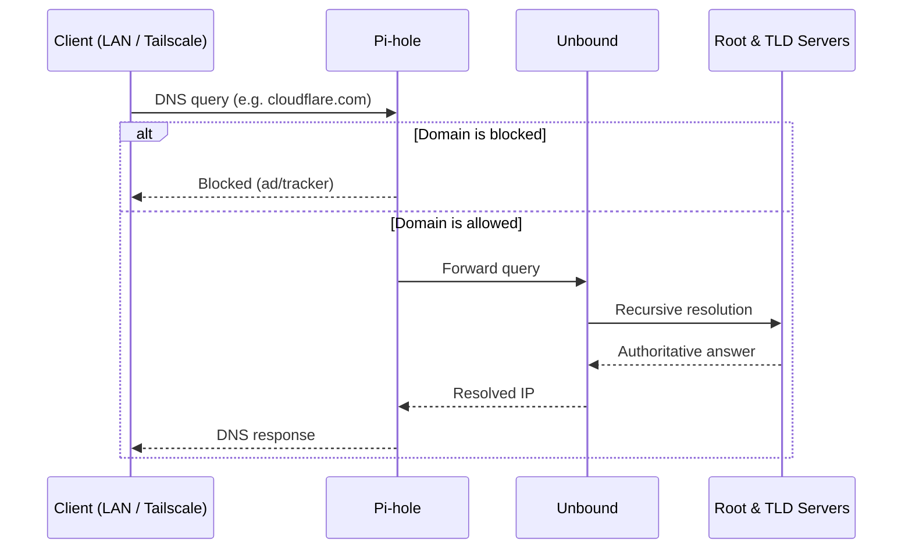

# Networking & DNS

## DNS Architecture

This stack implements a privacy-first, recursive DNS pipeline. No third-party DNS provider sees your LAN queries (public resolvers are configured only as failover if Unbound stops answering — see `PIHOLE_DNS_UPSTREAMS`).


```mermaid
sequenceDiagram
    participant C as Client (LAN / Tailscale)
    participant P as Pi-hole
    participant U as Unbound
    participant R as Root & TLD Servers

    C->>P: DNS query (e.g. cloudflare.com)
    alt Domain is blocked
        P-->>C: Blocked (ad/tracker)
    else Domain is allowed
        P->>U: Forward query
        U->>R: Recursive resolution
        R-->>U: Authoritative answer
        U-->>P: Resolved IP
        P-->>C: DNS response
    end
```

**Pi-hole** — ad/tracker filtering, local DNS for `*.<HOST_NAME>`, caching. Listens on the host's port 53 and on its own macvlan IP (`PIHOLE_IP`).

**Unbound** — recursive resolver; walks the delegation tree from the root servers itself, so no upstream provider sees the queries. Reached only by Pi-hole.

| Container | Address | Networks | Role |
|-----------|---------|----------|------|
| **Pi-hole** | host `:53` + `${PIHOLE_IP}` (macvlan) | `dns_internal`, `frontend`, `lan` | Filtering, local DNS, web UI on 8082 |
| **Unbound** | `172.30.53.53:5335` | `dns_internal` (no internet), `dns_egress` | Recursive resolution |

`dns_internal` is an internal bridge (no gateway); Unbound's internet access for root-server queries goes through the separate `dns_egress` network. Other containers cannot reach Unbound directly, so nothing can bypass Pi-hole's filtering.

## Local DNS Records

Pi-hole answers `<HOST_NAME>` and every `*.<HOST_NAME>` subdomain with the Pi's LAN IP (`FTLCONF_misc_dnsmasq_lines: address=/${HOST_NAME}/${HOST_LAN_IP}` in `compose.yaml`). Traefik then routes by `Host` header. So on the LAN and on the VPN, `nextcloud.<HOST_NAME>` resolves to the Pi itself — never to a container IP.

`make install` also writes a `headscale.<HOST_NAME> → ${HOST_LAN_IP}` override into the Pi's own `/etc/hosts`, so the local `tailscale` container can reach its control plane without hairpinning through the WAN.

## macvlan Interface (Physical LAN)

Pi-hole has a dedicated IP on your home LAN so devices can use it as their DNS server directly:

```env
HOST_LAN_PARENT=eth0                    # Physical interface
HOST_LAN_SUBNET=192.168.1.0/24          # Your home network CIDR
PIHOLE_IP=192.168.1.250                 # Pi-hole's static IP (outside DHCP range)
```

Set your router's DHCP DNS option to `PIHOLE_IP` (or configure devices manually). A macvlan caveat: the Docker host itself cannot reach a macvlan IP over the parent interface — Pi-hole is also published on the host's port 53 for that.

## DNS for Containers

Containers use Docker's embedded resolver (`127.0.0.11`), which forwards to the host's DNS configuration. Exceptions: `prowlarr` and `flaresolverr` pin public resolvers (`dns: 1.1.1.1`) directly in `compose.yaml` so indexer lookups don't depend on — and aren't filtered by — Pi-hole.

## DNS from the VPN

Headscale pushes DNS to all clients (see `config/headscale/config.yaml`):

- **Global nameserver** `100.64.0.1` — the Pi's own tailnet IP, so every query from a VPN client travels the WireGuard tunnel to Pi-hole. Ad blocking works everywhere.
- **Split DNS** for `<HOST_NAME>` pointing at the same address, plus **MagicDNS** under `tailnet.<HOST_NAME>`.

Since Pi-hole resolves `*.<HOST_NAME>` to the Pi's IP, all services work from the VPN with valid TLS via Traefik.

## Network Isolation

| Network | Subnet | Who's on it | Purpose |
|---------|--------|-------------|---------|
| `frontend` | `172.30.11.0/24` (Traefik at `.250`) | Traefik + every routed service | The only network Traefik proxies to |
| `auth` | internal | Authelia, LLDAP, Postgres, Redis | LDAP and auth traffic never crosses app networks |
| `nextcloud`, `immich`, `ai`, `vault`, `ntfy` | internal | each app + its backends | Per-app isolation; `vault` deliberately has no path to LLDAP |
| `dns_internal` | `172.30.53.0/24`, no gateway | Pi-hole, Unbound | Nothing else can query Unbound |
| `dns_egress` | bridge | Unbound, immich-machine-learning | Outbound-only internet access |
| `lan` | macvlan on `HOST_LAN_PARENT` | Pi-hole | Direct LAN presence for DNS |
| `n8n_runners` | bridge | n8n, n8n-runners | Task-runner traffic |

**Effect:** a compromised app container cannot query Unbound directly, cannot reach LLDAP, and cannot see another app's database traffic.

## Exposed Ports

| Port | Protocol | Service | Scope |
|------|----------|---------|-------|
| 80 | TCP | Traefik | HTTP → HTTPS redirect only |
| 443 | TCP | Traefik | HTTPS for all web services |
| 53 | TCP/UDP | Pi-hole | Host + macvlan IP, LAN/VPN DNS |
| 3478 | UDP | Headscale | STUN (embedded DERP relay) |
| 41641 | UDP | Tailscale (host network) | WireGuard |

Everything else (`5432` Postgres, `6379` Redis, `3890` LDAP, app ports) is `expose`-only inside Docker networks, never published on the host.

**Router port forwarding:** only `443/tcp` is required for HTTPS access (certificates use the Cloudflare DNS challenge, so 80 need not be reachable from outside). Forward `41641/udp` and `3478/udp` for direct VPN connections; without them traffic falls back to relayed paths.

## Cloudflare DNS Records

ddns-updater maintains two records against your zone, keeping them pointed at your current public IP:

```
<HOST_NAME>      A   <your-public-ip>
*.<HOST_NAME>    A   <your-public-ip>
```

Nothing else needs to be created by hand.

## Troubleshooting

### DNS not resolving

```bash
docker compose logs pihole | tail -20
nslookup example.com <PIHOLE_IP>         # from a LAN device
```

If devices aren't using Pi-hole, check the router's DHCP DNS setting or set it manually on one device to test.

### Upstream resolution broken

```bash
docker compose logs unbound | tail -20
docker compose exec unbound drill @127.0.0.1 -p 5335 cloudflare.com
```

The Uptime Kuma `dns resolution` monitor covers this chain continuously — see [Monitoring](MONITORING.md#what-is-actually-checked).

### A link or a redirect leads nowhere

Sponsored search results, newsletter links and affiliate links route through ad
infrastructure, so the block lists catch them and the click dies on a blank page
instead of just losing an ad. `scripts/pihole-bootstrap.sh` keeps an
`ALLOW_LISTS` of the known offenders; add the domain there rather than only in
the web UI, or the next rebuild loses it.

To find the real culprit, check the Pi-hole query log for the click: the blocked
domain is often not the one you typed. A status of *blocked (CNAME)* means an
alias is at fault — `g.live.com` was blocked because it points at `g.msn.com`.

### High DNS latency

First queries are slower while Unbound walks the delegation tree; its cache warms up quickly. If latency stays high, check RAM pressure in Beszel and consider trimming very large blocklists in Pi-hole.
