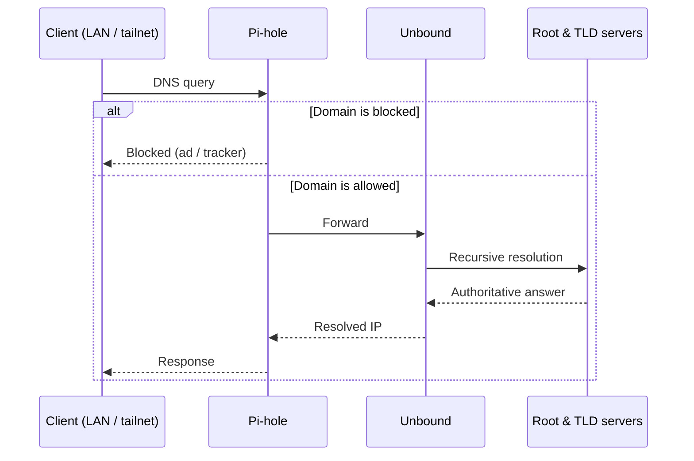

# Networking & DNS

## The DNS pipeline

No third-party resolver sees your LAN queries. Pi-hole filters, Unbound resolves recursively from the root servers; the public resolvers in `PIHOLE_DNS_UPSTREAMS` are failover only, for when Unbound stops answering.


```mermaid
sequenceDiagram
    participant C as Client (LAN / tailnet)
    participant P as Pi-hole
    participant U as Unbound
    participant R as Root & TLD servers

    C->>P: DNS query
    alt Domain is blocked
        P-->>C: Blocked (ad / tracker)
    else Domain is allowed
        P->>U: Forward
        U->>R: Recursive resolution
        R-->>U: Authoritative answer
        U-->>P: Resolved IP
        P-->>C: Response
    end
```

| Container | Address | Networks | Role |
|-----------|---------|----------|------|
| **Pi-hole** | host `:53` + `${PIHOLE_IP}` (macvlan) | `dns_internal`, `frontend`, `lan` | Filtering, local DNS, web UI on 8082 |
| **Unbound** | `172.30.53.53:5335` | `dns_internal` (no gateway), `dns_egress` | Recursive resolution |

`dns_internal` is an internal bridge with no gateway; Unbound's own internet access for root-server queries goes through the separate `dns_egress` network. No other container can reach Unbound, so nothing can bypass Pi-hole's filtering.

## Local names

Pi-hole answers `<HOST_NAME>` and every `*.<HOST_NAME>` subdomain with the Pi's LAN IP (`FTLCONF_misc_dnsmasq_lines: address=/${HOST_NAME}/${HOST_LAN_IP}`). Traefik then routes by `Host` header. So on the LAN and on the VPN, `nextcloud.<HOST_NAME>` resolves to the Pi itself — never to a container IP, and always with a valid certificate.

`make install` also writes a `headscale.<HOST_NAME> → ${HOST_LAN_IP}` record into the Pi's own `/etc/hosts`, so the local `tailscale` container reaches its control plane without hairpinning through the WAN.

## Pi-hole on the physical LAN

Pi-hole gets its own address on your home network, so devices can point at it directly:

```env
HOST_LAN_PARENT=eth0                    # physical interface — must be wired
HOST_LAN_SUBNET=192.168.1.0/24
PIHOLE_IP=192.168.1.250                 # outside the DHCP range
```

Set your router's DHCP DNS option to `PIHOLE_IP`, or configure devices by hand. Two macvlan
consequences, both load-bearing:

- **The Docker host itself cannot reach a macvlan IP** over the parent interface. The Pi querying
  its own `${HOST_LAN_IP}:53` therefore times out; it uses `127.0.0.1` instead.
- **A LAN client must target `PIHOLE_IP`, never `${HOST_LAN_IP}`.** Docker DNATs the host's
  published `:53` to Pi-hole's *frontend* address, but the container has a direct route to the LAN
  subnet over the macvlan, so its reply leaves that way and never returns through the host's
  conntrack — the DNAT is never undone and the client rejects a `reply from unexpected source`.
  The host publish exists for the tailnet, where `100.64.0.0/10` has no direct route in the
  container, so the reply goes back out the default gateway and the reverse NAT applies correctly.

### Devices that cannot be pointed at Pi-hole

Cast receivers and locked-down TVs often ignore the DHCP DNS option, or expose no DNS field at all.
Left alone they resolve `<service>.<HOST_NAME>` through public DNS, get the WAN address, hairpin
back through the router with a SNAT'd source, and are refused by `lan@docker`.

The fix is a **specific** public A record pointing at the Pi's LAN address, unproxied:

```
<service>.<HOST_NAME>   A   <HOST_LAN_IP>    # DNS only
```

A specific record beats the `*.<HOST_NAME>` wildcard, and `ddns-updater` only manages `<HOST_NAME>`
and the wildcard, so it never overwrites it. The answer is identical to Pi-hole's, so nothing
diverges. Nothing new is exposed: `lan@docker` still refuses any non-LAN, non-tailnet source, and a
private address is not routable from outside anyway.

**Never do this on the wildcard.** `headscale.<HOST_NAME>` must keep resolving to the WAN address —
it is how remote nodes reach the control plane to enrol and reconnect from outside the tailnet.

Verify the router does not strip private answers (some resolvers apply DNS rebinding protection):
`dig @<router> <service>.<HOST_NAME> +short` must return `<HOST_LAN_IP>`.

## Casting to a DLNA renderer

Stremio can drive a UPnP/DLNA renderer itself, but only from the physical LAN: it finds
receivers by SSDP/mDNS **multicast**, which does not leave a Docker bridge, and which
gluetun's firewall rejects outright (`EPERM` on `239.255.255.250`). The default `stremio`
profile therefore never lists a device. The `stremio-lan` profile trades the VPN for a
macvlan address (`STREMIO_IP`) and discovers renderers normally.

Three things that mode needs, none of them obvious:

- **`FFMPEG_BIN` / `FFPROBE_BIN`.** The upstream image installs jellyfin-ffmpeg under
  `/usr/lib/jellyfin-ffmpeg/`, which is not on `PATH`, and ships both variables empty. Without
  them the server finds no binary and cannot remux anything — for casting or otherwise. Set in
  both profiles, since it is a plain defect.
- **`CASTING_DISABLED=`.** The image sets it to `1`, and `/casting` answers 404 to every client.
  Only its truthiness is read, so `0` would still disable it: it must be empty.
- **`extra_hosts` pointing `stremio.<HOST_NAME>` and `comet.<HOST_NAME>` at Traefik's frontend
  address.** A macvlan child cannot reach its parent host, so any public record aimed at
  `HOST_LAN_IP` is unusable from inside — upstream fetches fail with `EHOSTUNREACH`.

**The trade-off:** that address is off the VPN. With a debrid addon the server barely fetches
anything itself, but with plain torrent sources the pieces it pulls leave on the residential IP.

**A known limit.** `/casting/transcode.mp4` is a live ffmpeg pipe: chunked, no `Content-Length`,
`Accept-Ranges: none`. Renderers that require a seekable resource of known length refuse it and
stop with `ERROR_OCCURRED`, whatever the container or MIME type — a SoftAtHome (Orange decoder)
renderer was measured doing exactly that while playing the same content served as a static file.
Casting here works with renderers that accept a non-seekable stream; for the others the answer is
a media server that serves files, not this.

## DNS inside containers

Containers use Docker's embedded resolver (`127.0.0.11`), which forwards to the host's configuration. Two exceptions pin public resolvers directly in `compose.yaml` (`dns: 1.1.1.1`): **`prowlarr`** and **`flaresolverr`**, so indexer lookups neither depend on nor are filtered by Pi-hole.

## DNS on the VPN

Headscale pushes DNS to every client (`config/headscale/config.yaml`):

- **Global nameserver `100.64.0.1`** — the Pi's own tailnet IP, so every query from a VPN client travels the WireGuard tunnel to Pi-hole. Ad blocking follows the device everywhere.
- **Split DNS** for `<HOST_NAME>` pointing at the same address, plus **MagicDNS** under `tailnet.<HOST_NAME>`.

Since Pi-hole resolves `*.<HOST_NAME>` to the Pi, every service works from the VPN with valid TLS. See [Tailscale](TAILSCALE.md).

## Network isolation

| Network | Subnet | Members | Purpose |
|---------|--------|---------|---------|
| `frontend` | `172.30.11.0/24` (Traefik at `.250`) | Traefik + every routed service | The only network Traefik proxies to |
| `auth` | internal | Authelia, LLDAP, Postgres, Redis | LDAP and auth traffic never crosses an app network |
| `nextcloud`, `immich`, `ai`, `vault`, `ntfy` | internal | each app + its own backends | Per-app isolation; `vault` deliberately has no path to LLDAP |
| `dns_internal` | `172.30.53.0/24`, no gateway | Pi-hole, Unbound | Nothing else can query Unbound |
| `dns_egress` | bridge | Unbound, immich-machine-learning | Outbound-only internet access |
| `lan` | macvlan on `HOST_LAN_PARENT` | Pi-hole, Stremio (`stremio-lan` profile only) | Direct LAN presence — DNS, and SSDP/mDNS cast discovery |
| `n8n_runners` | bridge | n8n, n8n-runners | Task-runner traffic |

## Ports

| Port | Protocol | Service | Scope |
|------|----------|---------|-------|
| 80 | TCP | Traefik | HTTP → HTTPS redirect only |
| 443 | TCP | Traefik | HTTPS for every web service |
| 53 | TCP/UDP | Pi-hole | Host + macvlan IP, for LAN and VPN clients |
| 3478 | UDP | Headscale | STUN, via the embedded DERP relay |
| 41641 | UDP | Tailscale (host network) | WireGuard |

Everything else — Postgres `5432`, Redis `6379`, LDAP `3890`, every app port — is `expose`-only inside Docker networks and never published on the host.

**On your router,** only `443/tcp` has to be forwarded: certificates use the Cloudflare DNS challenge, so port 80 need not be reachable from outside. Forward `41641/udp` and `3478/udp` as well for direct VPN connections; without them, traffic still works but rides the relay.

## Cloudflare records

ddns-updater maintains exactly two records against your zone, pointed at your current public IP.

```
<HOST_NAME>      A   <your-public-ip>
*.<HOST_NAME>    A   <your-public-ip>
```

Nothing else is created automatically. The one case for adding a record by hand is a device that
cannot be pointed at Pi-hole — see [above](#devices-that-cannot-be-pointed-at-pi-hole). Because
ddns-updater only ever touches those two names, a specific record for a subdomain is safe from it.

---

DNS not resolving, links dying on a blank page, high latency? See [Troubleshooting → DNS](TROUBLESHOOTING.md#dns).
