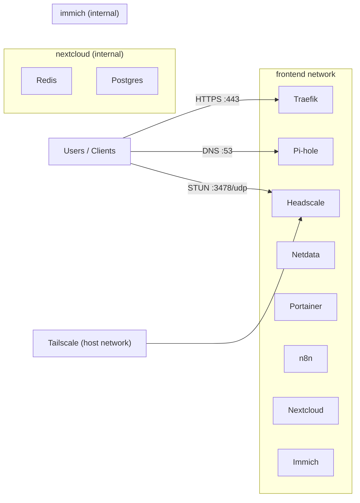

# pi-web

[](https://opensource.org/licenses/MIT)
[](https://docker.com/)
[](https://www.raspberrypi.org/)

`pi-web` is a compact self-hosting stack for Raspberry Pi, managed with a single Docker Compose setup.

It includes:
- Reverse proxy + TLS (`traefik`)
- DNS filtering (`pihole`)
- Monitoring (`netdata`) and container management (`portainer`)
- Productivity apps (`nextcloud`, `n8n`, `immich-server`)
- Data services (`postgres`, `redis`)
- Connectivity (`headscale`, `tailscale`)
- Maintenance (`ddns-updater`, `watchtower`)

---

## Architecture



---

## Install guide

1. Clone the repository.
2. Copy `.env.dist` to `.env` and fill required values.
3. Run preflight checks.
4. Install/start via systemd helper.

```bash
git clone https://github.com/florianajir/pi-web.git
cd pi-web
cp .env.dist .env
make preflight
make install
make status
```

---

## Make commands

| Command | Description |
| --- | --- |
| `make preflight` | Verify Docker/cgroup readiness |
| `make install` | Install systemd units and start stack |
| `make uninstall` | Remove stack, volumes, and units (destructive) |
| `make start` | Start stack |
| `make stop` | Stop stack |
| `make restart` | Restart stack |
| `make status` | Show stack status |
| `make logs` | Follow stack logs |
| `make update` | Pull latest changes and restart |
| `make headscale-register <key>` | Register a Headscale node |

---

## Variables listing (`.env`)

### Personal
- `HOST_NAME`
- `TIMEZONE`
- `EMAIL`
- `USER`
- `PASSWORD`

### Network
- `HOST_LAN_IP`
- `HOST_LAN_PARENT` (default: `eth0`)
- `HOST_LAN_SUBNET` (default: `192.168.1.0/24`)
- `HOST_LAN_GATEWAY` (default: `192.168.1.1`)
- `PIHOLE_IP` (default: `192.168.1.29`)
- `TAILSCALE_DNS_IP` (default: `100.64.0.1`)
- `ALLOW_IP_RANGES` (default: `127.0.0.1/32,192.168.1.0/24,100.64.0.0/10`)

### Traefik / Cloudflare
- `CLOUDFLARE_DNS_API_TOKEN`
- `CLOUDFLARE_ZONE_ID`

### PostgreSQL (shared)
- `DB_PASSWORD`
- `DB_USERNAME` (default: `postgres`)
- `DB_DATABASE_NAME` (default: `postgres`)
- `DB_DATA_LOCATION` (default: `./data/postgres`)

### Immich
- `IMMICH_DB_NAME` (default: `immich`)
- `IMMICH_DB_USER` (default: `immich`)
- `IMMICH_DB_PASSWORD`
- `IMMICH_UPLOAD_LOCATION` (default: `./data/immich`)

### Nextcloud
- `NEXTCLOUD_DB_NAME` (default: `nextcloud`)
- `NEXTCLOUD_DB_USER` (default: `nextcloud`)
- `NEXTCLOUD_DB_PASSWORD` (default: `nextcloud-secure-password`)
- `NEXTCLOUD_TRUSTED_PROXIES` (default: `172.30.11.0/24`)

### Netdata Cloud (optional)
- `NETDATA_CLAIM_TOKEN`
- `NETDATA_CLAIM_URL`
- `NETDATA_CLAIM_ROOMS`

## License

MIT (see `LICENSE`).

