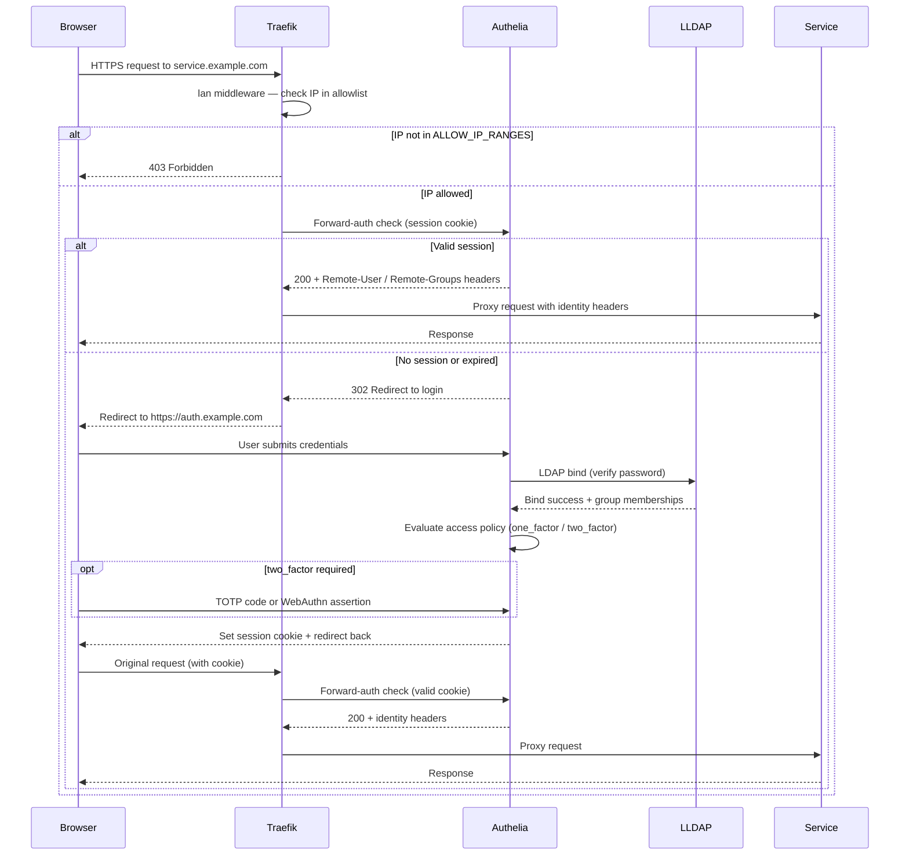
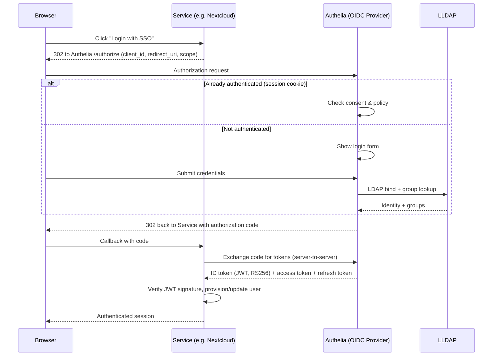
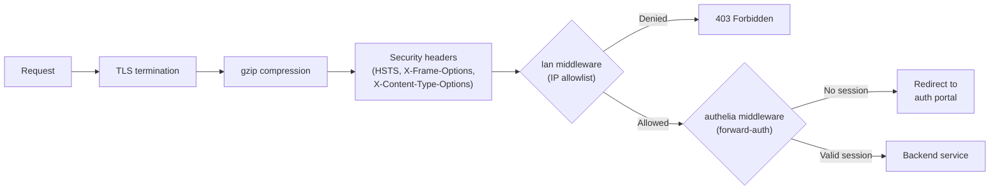
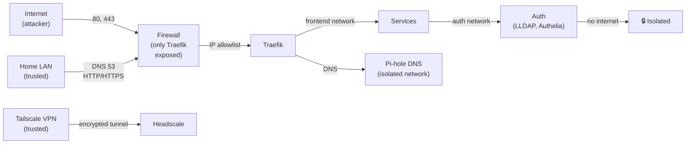

# Security & Authentication

## Overview

This stack implements defense-in-depth authentication with multiple layers:

1. **Network-level IP filtering** — Only allowed IPs/ranges can access services
2. **VPN mesh** — Private Tailscale network for remote access without exposing ports
3. **SSO portal** — Centralized login via Authelia
4. **Per-service OIDC** — Some services bypass forward-auth and authenticate directly
5. **LDAP directory** — Single source of truth for users & groups via LLDAP

## Components

| Component | Role |
|-----------|------|
| **Traefik** | Reverse proxy — TLS termination, middleware chains (IP allowlist, forward-auth) |
| **Authelia** | SSO portal & OIDC provider — login, sessions, 2FA, token issuance |
| **LLDAP** | Lightweight LDAP directory — user identities, group memberships |
| **Tailscale / Headscale** | WireGuard VPN mesh — encrypted tunnel to access from anywhere |
| **PostgreSQL** | Persistent storage for Authelia (prefs, TOTP, WebAuthn) |
| **Redis** | Session store (cookie-based with inactivity/absolute timeouts) |

## Authentication Flows

### Forward-Auth Flow (Session-based)

Services protected by forward-auth redirect unauthenticated users to the SSO portal:



### OIDC Single Sign-On (Token-based)

Services that support OpenID Connect authenticate directly against Authelia:



**Registered OIDC clients:**

| Client | Scopes | Auth Method | Consent | Policy | Notes |
|--------|--------|-------------|---------|--------|-------|
| **Nextcloud** | openid profile email groups offline_access | client_secret_post | implicit | one_factor | Group provisioning enabled |
| **Immich** | openid profile email | client_secret_post | implicit | one_factor | Mobile app callback |
| **Beszel** | openid profile email | client_secret_basic | implicit | one_factor | PKCE (S256) enabled |
| **Dockhand** | openid profile email groups | client_secret_post | implicit | admin_only | Callback `/api/auth/oidc/callback` |
| **Headplane** | openid profile email | client_secret_basic | implicit | **two_factor** | VPN admin (stricter) |

## Request Middleware Chain

Every incoming request passes through Traefik's middleware stack:



**Security headers applied:**

- `Strict-Transport-Security: max-age=31536000` — Force HTTPS for 1 year
- `X-Frame-Options: DENY` — Prevent clickjacking
- `X-Content-Type-Options: nosniff` — Prevent MIME type sniffing
- `Referrer-Policy: strict-origin-when-cross-origin` — Limit referrer leakage

**Rate limiting on auth routes:**

Auth endpoints (`auth.*` for Authelia, publicly accessible, and `lldap.*` for LLDAP, LAN-only) are protected by the `rate-limit-auth` middleware:

- **Average rate**: 10 requests/s per source IP
- **Burst**: up to 20 requests allowed in a burst
- Applies before authentication to prevent brute-force and credential-stuffing attacks

## Per-Service Protection

| Service | `lan` Middleware | `authelia` Middleware | `rate-limit-auth` Middleware | Own OIDC | Protection |
|---------|:---:|:---:|:---:|:---:|----------|
| Authelia portal | — | — | ✓ | — | Public (login entry point) + rate-limited |
| Nextcloud | — | — | — | ✓ | OIDC + LAN implicit |
| Immich | ✓ | — | — | ✓ | LAN-only + OIDC |
| Beszel | ✓ | — | — | ✓ | LAN-only + OIDC |
| n8n | ✓ | — | — | — | LAN-only + own auth |
| Ntfy | ✓ | — | — | — | LAN-only + own auth |
| Homepage | ✓ | ✓ | — | — | LAN-only + SSO |
| Uptime Kuma | ✓ | ✓ | — | — | LAN-only + SSO |
| Traefik dashboard | ✓ | ✓ | — | — | LAN-only + admin + 2FA |
| Pi-hole | ✓ | ✓ | — | — | LAN-only + admin + 2FA |
| Backrest | ✓ | ✓ | — | — | LAN-only + admin + 2FA |
| LLDAP | ✓ | ✓ | ✓ | — | LAN-only + admin + 2FA + own auth + rate-limited |
| Headplane | ✓ | — | — | ✓ | LAN-only + OIDC + admin + 2FA |
| Dockhand | ✓ | — | — | ✓ | LAN-only + OIDC-only + admin + 2FA |

## Access Control Policies

Authelia enforces group-based rules per domain:

| Domain Pattern | Required Group | Policy | Description |
|---|---|---|---|
| `auth.*` | — | bypass | SSO portal itself |
| `homepage.*`, `uptime.*` | users | one_factor | General services (login only) |
| `backrest.*`, `pihole.*`, `traefik.*` | admin or lldap_admin | two_factor | Admin tools |
| `lldap.*` | users, admin, or lldap_admin | two_factor | Directory itself |
| `*.*` (catch-all) | users | **deny** | All others blocked by default |

**Group management:**

- **users** — Standard users (can log in to general services)
- **admin** — Full admin access (requires 2FA)
- **lldap_admin** — LDAP directory admins (requires 2FA)

Create/manage groups in LLDAP admin UI, assign users to groups.

## Two-Factor Authentication

2FA is enforced for admin interfaces (Traefik, Pi-hole, Dockhand, Backrest, LLDAP) and Headplane (VPN admin).

**Supported 2FA methods:**

- **TOTP** — Time-based codes (Google Authenticator, Authy, etc.)
- **WebAuthn** — Hardware/platform security keys (FIDO2)

Users enroll in **Authelia portal** → **Security**:
1. Enable TOTP or register WebAuthn
2. Save backup codes for account recovery
3. On next login, Authelia prompts for 2FA

## Secret Management

Secrets are **auto-generated on first start** and stored with restricted permissions:

```bash
${DATA_LOCATION}/authelia-config/secrets/
├── jwt_secret                          # Identity token signing
├── session_secret                      # Session cookie signing
├── storage_encryption_key              # Database credential encryption
├── oidc_hmac_secret                    # OIDC token HMAC signing
├── oidc_private_key.pem                # RSA-2048 for JWT RS256
├── oidc_nextcloud_secret.txt           # Per-client shared secrets
├── oidc_immich_secret.txt
├── oidc_beszel_secret.txt
├── oidc_dockhand_secret.txt
├── oidc_headplane_secret.txt
└── ldap_password                       # LLDAP bind password
```

**Generated by:** `scripts/authelia-pre-start.sh`
**Permissions:** `600` (read/write by owner only)
**Storage:** Never committed to git, always in `${DATA_LOCATION}`

OIDC client secrets are injected into services via read-only Docker volumes — no secrets in environment or images.

## Session & Cookie Management

**Session storage:**
- Medium: Redis (fast, volatile)
- Fallback: PostgreSQL (persistent)

**Cookie settings:**
- **Secure flag** — HTTPS only
- **SameSite=Lax** — CSRF protection
- **HttpOnly** — JavaScript cannot access
- **Inactivity timeout** — Default 1 hour (configurable)
- **Absolute timeout** — Default 24 hours (configurable)

Idle sessions expire automatically; users must re-authenticate.

## Network Isolation



**Isolation layers:**

1. **Firewall** — Only expose Traefik; hide internal services
2. **IP allowlist** — Block non-LAN/non-VPN traffic
3. **Docker networks** — Internal services isolated from internet
4. **No default route** — DNS network has no internet gateway
5. **Read-only volumes** — Backrest accesses app data read-only

## Best Practices

1. **Set strong passwords** — LLDAP admin & Authelia system account
2. **Enable 2FA** — Especially for admin users
3. **Use WebAuthn** — More secure than TOTP (resistant to phishing)
4. **Rotate credentials** — Change passwords regularly, especially after compromises
5. **Monitor logs** — Check Authelia logs for brute-force attempts
6. **Keep secrets secure** — Never share `.env`, `authelia-config/secrets/`, API tokens
7. **Backup verification** — Test restores from backups periodically
8. **Update regularly** — Pull latest images, rebuild stack

## Compliance & Encryption

- **TLS 1.2+** — All HTTPS connections
- **Certificate** — Auto-provisioned by Traefik + Cloudflare DNS challenge
- **LDAP encryption** — STARTTLS supported for external LDAP
- **Database encryption** — Authelia credentials encrypted at rest
- **Backup encryption** — Backrest uses restic encryption (optional passphrase)
- **VPN encryption** — WireGuard 256-bit cipher by Tailscale/Headscale
- **Session encryption** — Redis & PostgreSQL (unencrypted by default, add your own)

**Note:** Redis and local PostgreSQL are not encrypted at rest by default. To add encryption, either:
- Mount on encrypted filesystem (LUKS)
- Use external managed PostgreSQL/Redis with encryption at rest
- Add encryption layer (e.g., Nextcloud full-disk encryption for file contents)

See [Configuration](CONFIGURATION.md) for detailed security settings and overrides.
