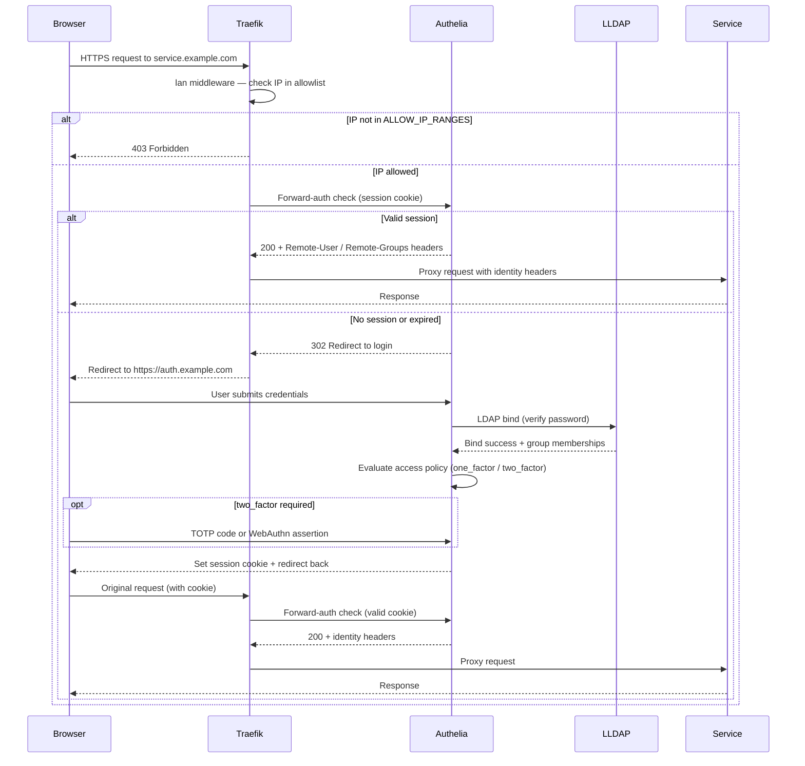
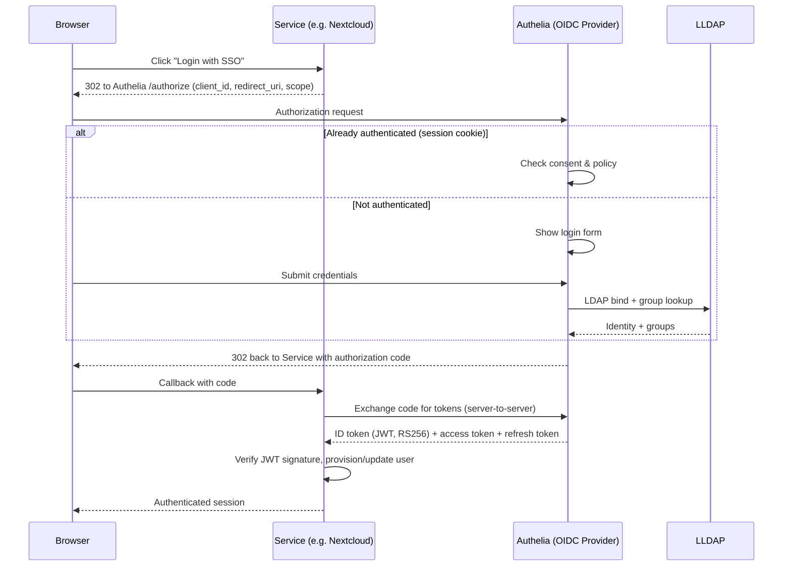
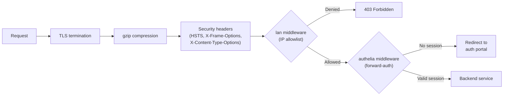
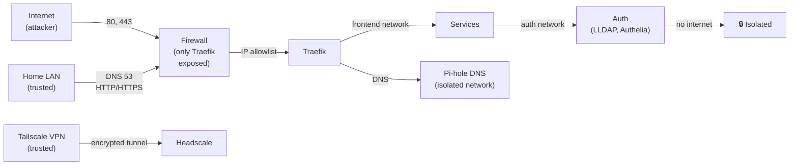

# Security & Authentication

## Overview

This stack implements defense-in-depth authentication with multiple layers:

1. **Network-level IP filtering** — Only allowed IPs/ranges can access services
2. **VPN mesh** — Private Tailscale network for remote access without exposing ports
3. **SSO portal** — Centralized login via Authelia
4. **Per-service OIDC** — Some services bypass forward-auth and authenticate directly
5. **LDAP directory** — Single source of truth for users & groups via LLDAP

## Components

| Component | Role |
|-----------|------|
| **Traefik** | Reverse proxy — TLS termination, middleware chains (IP allowlist, forward-auth) |
| **Authelia** | SSO portal & OIDC provider — login, sessions, 2FA, token issuance |
| **LLDAP** | Lightweight LDAP directory — user identities, group memberships |
| **Tailscale / Headscale** | WireGuard VPN mesh — encrypted tunnel to access from anywhere |
| **PostgreSQL** | Persistent storage for Authelia (prefs, TOTP, WebAuthn) |
| **Redis** | Session store (cookie-based with inactivity/absolute timeouts) |

## Authentication Flows

### Forward-Auth Flow (Session-based)

Services protected by forward-auth redirect unauthenticated users to the SSO portal:


```mermaid
sequenceDiagram
    participant B as Browser
    participant T as Traefik
    participant A as Authelia
    participant L as LLDAP
    participant S as Service

    B->>T: HTTPS request to service.example.com
    T->>T: lan middleware — check IP in allowlist

    alt IP not in ALLOW_IP_RANGES
        T-->>B: 403 Forbidden
    else IP allowed
        T->>A: Forward-auth check (session cookie)
        alt Valid session
            A-->>T: 200 + Remote-User / Remote-Groups headers
            T->>S: Proxy request with identity headers
            S-->>B: Response
        else No session or expired
            A-->>T: 302 Redirect to login
            T-->>B: Redirect to https://auth.example.com
            B->>A: User submits credentials
            A->>L: LDAP bind (verify password)
            L-->>A: Bind success + group memberships
            A->>A: Evaluate access policy (one_factor / two_factor)
            opt two_factor required
                B->>A: TOTP code or WebAuthn assertion
            end
            A-->>B: Set session cookie + redirect back
            B->>T: Original request (with cookie)
            T->>A: Forward-auth check (valid cookie)
            A-->>T: 200 + identity headers
            T->>S: Proxy request
            S-->>B: Response
        end
    end
```

### OIDC Single Sign-On (Token-based)

Services that support OpenID Connect authenticate directly against Authelia:


```mermaid
sequenceDiagram
    participant B as Browser
    participant S as Service (e.g. Nextcloud)
    participant A as Authelia (OIDC Provider)
    participant L as LLDAP

    B->>S: Click "Login with SSO"
    S-->>B: 302 to Authelia /authorize (client_id, redirect_uri, scope)
    B->>A: Authorization request

    alt Already authenticated (session cookie)
        A->>A: Check consent & policy
    else Not authenticated
        A->>A: Show login form
        B->>A: Submit credentials
        A->>L: LDAP bind + group lookup
        L-->>A: Identity + groups
    end

    A-->>B: 302 back to Service with authorization code
    B->>S: Callback with code
    S->>A: Exchange code for tokens (server-to-server)
    A-->>S: ID token (JWT, RS256) + access token + refresh token
    S->>S: Verify JWT signature, provision/update user
    S-->>B: Authenticated session
```

**Registered OIDC clients** (all `consent_mode: implicit`; see `config/authelia/configuration.yml.template`):

| Client | Scopes | Auth Method | Policy | Notes |
|--------|--------|-------------|--------|-------|
| **Nextcloud** | openid profile email groups offline_access | client_secret_post | one_factor | Group provisioning enabled |
| **Immich** | openid profile email | client_secret_post | one_factor | Mobile app callback |
| **Beszel** | openid profile email | client_secret_basic | one_factor | PKCE (S256) required |
| **Dockhand** | openid profile email groups | client_secret_post | **admin_only** | 2FA + `admin` group |
| **Headplane** | openid profile email offline_access | client_secret_basic | **admin_only** | 2FA + `admin` group |
| **Headscale** | openid profile email | client_secret_basic | one_factor | VPN device registration |
| **Open WebUI** | openid profile email | client_secret_basic | one_factor | — |
| **Vaultwarden** | openid profile email offline_access | client_secret_basic | one_factor | Master password still required |
| **Kavita** | openid profile email groups offline_access | client_secret_post | one_factor | Roles from `groups` claim |

`admin_only` is a named authorization policy in the template: default deny, `two_factor` for members of the `admin` group.

## Request Middleware Chain

Every incoming request passes through Traefik's middleware stack:


```mermaid
flowchart LR
    R[Request] --> TLS["TLS termination"]
    TLS --> Compress["gzip compression"]
    Compress --> Headers["Security headers\n(HSTS, X-Frame-Options,\nX-Content-Type-Options)"]
    Headers --> LAN{"lan middleware\n(IP allowlist)"}
    LAN -->|Denied| Block[403 Forbidden]
    LAN -->|Allowed| Auth{"authelia middleware\n(forward-auth)"}
    Auth -->|No session| Login["Redirect to\nauth portal"]
    Auth -->|Valid session| Backend["Backend service"]
```

**Security headers applied** (the `security-headers` middleware, attached to the `websecure` entrypoint):

- `Strict-Transport-Security: max-age=15552000; includeSubDomains` — Force HTTPS for 180 days
- `X-Frame-Options: DENY` — Prevent clickjacking
- `X-Content-Type-Options: nosniff` — Prevent MIME type sniffing
- `Referrer-Policy: same-origin` — Limit referrer leakage

**Rate limiting on auth routes:**

The `rate-limit-auth` middleware is applied to LLDAP (`lldap.*`) only:

- **Average rate**: 10 requests/s per source IP
- **Burst**: up to 20 requests allowed in a burst
- Applied after the `authelia` forward-auth middleware on LLDAP to prevent credential-stuffing

The Authelia portal (`auth.*`) has **no IP allowlist and no rate limiting** at the Traefik level for two reasons:
1. Its SPA makes multiple API calls on page load which would trigger the rate limit
2. OIDC clients (Open WebUI, Nextcloud, Immich, etc.) make server-side requests to Authelia's OIDC endpoints (discovery, token exchange) — an IP allowlist would block those container-to-container calls with 403

Authelia's own `regulation` config (`max_retries: 3`, `ban_time: 5m`) handles brute-force protection.

**Forward-auth cookie forwarding:**

The `authelia` forward-auth middleware is configured with `authRequestHeaders=Accept,Cookie,Authorization` so Traefik passes the session cookie to Authelia on every protected request. Without this, Authelia cannot look up the session in Redis and returns a "user state" error.

## Per-Service Protection

| Service | `lan` Middleware | `authelia` Middleware | Own OIDC | Protection |
|---------|:---:|:---:|:---:|----------|
| Authelia portal | — | — | — | Public login entry point — Authelia's `regulation` handles brute-force; no IP restriction so OIDC clients can reach it server-side |
| Headscale | — | — | ✓ | Public by necessity: VPN clients register from anywhere; device auth is OIDC. The `/admin` path (Headplane) is separately LAN-only + SSO + 2FA |
| Nextcloud | ✓ | — | ✓ | LAN-only + OIDC; a second router leaves the public share paths (`/s/`, `/public.php`, …) open |
| Immich | ✓ | — | ✓ | LAN-only + OIDC; second router leaves share paths (`/share`, `/s/`, `/api`) open |
| Beszel | ✓ | — | ✓ | LAN-only + OIDC (password login disabled) |
| n8n | ✓ | — | — | LAN-only + own auth |
| Ntfy | ✓ | — | — | LAN-only + own accounts/ACLs (`deny-all` default) |
| Homepage | ✓ | ✓ | — | LAN-only + SSO |
| Uptime Kuma | ✓ | ✓ | — | LAN-only + SSO |
| Traefik dashboard | ✓ | ✓ | — | LAN-only + admin + 2FA |
| Pi-hole | ✓ | ✓ | — | LAN-only + admin + 2FA |
| Backrest | ✓ | ✓ | — | LAN-only + admin + 2FA |
| LLDAP | ✓ | ✓ | — | LAN-only + 2FA + own auth + `rate-limit-auth` |
| Open WebUI | ✓ | — | ✓ | LAN-only + OIDC |
| qBittorrent | ✓ | ✓ | — | LAN-only + SSO |
| Prowlarr / Kapowarr | ✓ | ✓ | — | LAN-only + SSO |
| Stremio | ✓ | ✓ | — | LAN-only + SSO; a higher-priority router bypasses SSO for LAN source IPs (streaming clients can't do the portal) |
| Comet | ✓ | — | — | LAN-only; Stremio clients fetch manifests programmatically and can't pass interactive SSO |
| Kavita | ✓ | — | ✓ | LAN-only + own accounts/OIDC (OPDS clients can't pass interactive SSO) |
| Headplane | ✓ | ✓ | ✓ | LAN-only + SSO + OIDC + admin + 2FA |
| Dockhand | ✓ | — | ✓ | LAN-only + OIDC + admin + 2FA (local login disabled) |
| Vaultwarden | ✓ | — | ✓ | LAN-only + OIDC + master password |

## Vaultwarden account setup

Vaultwarden is served at `https://vault.<YOUR_DOMAIN>`. Its data lives in the
shared PostgreSQL instance (database and role `vaultwarden`, created by
`config/postgres/init-databases.sh`), so it is dumped by
`scripts/db-backup.sh vaultwarden` from a Backrest snapshot hook like every other
database here. Only attachments, sends and the RSA signing key stay on disk in
`${DATA_LOCATION}/vaultwarden`. It reaches PostgreSQL over its own internal
`vault` network, which deliberately does not include LLDAP.

**Accounts.** `SIGNUPS_ALLOWED` is `false`: the router sits behind the LAN
allowlist only, so open registration would let anyone on the LAN or the tailnet
create a vault. `INVITATIONS_ALLOWED` stays `true`.

**SSO.** Authentication is federated to Authelia over OIDC (client `vaultwarden`,
callback `https://vault.<YOUR_DOMAIN>/identity/connect/oidc-signin`, which
Vaultwarden derives from `DOMAIN` and is not configurable). Two things follow:

- A **master password is still required.** It is the vault's encryption key and
  never reaches the identity provider, so OIDC centralises login and user
  management but does not remove the second secret.
- `SSO_ONLY` is `true`, so email + master password is refused outright
  (`SSO sign-in is required`). **Every account must be able to sign in through
  Authelia, which means existing in LLDAP.** An invitation only creates a stub
  account; it is claimed by signing in via Authelia. There is deliberately no
  local fallback: if Authelia, LLDAP or PostgreSQL is down, nobody can log in.
  Keep an offline export if that matters to you.

Do **not** stack Authelia forward-auth (`authelia@docker`) on this router: the
Bitwarden browser extension and mobile clients cannot complete Authelia's
interactive portal. OIDC is a different mechanism, which they do support.

**Emergency access (trusted contact).** `EMERGENCY_ACCESS_ALLOWED` is `true`, and
the flow is entirely email-driven — invite, grant, and the takeover notice that
starts the waiting period — so it depends on the shared SMTP relay being
configured (see [EMAIL.md](EMAIL.md)). Because `SSO_ONLY` is on, a trusted
contact also needs an LLDAP account to claim their invitation and complete a
takeover. Someone outside your directory cannot serve as an emergency contact
without either being added to LLDAP or `SSO_ONLY` being turned off.

Note the `/admin` panel is disabled: no `ADMIN_TOKEN` is set. Manage users
through LLDAP and organisation invitations rather than the admin UI.

## Access Control Policies

Authelia's rules, in evaluation order (`config/authelia/configuration.yml.template`, default policy **deny**):

| Domain | Subject | Policy |
|---|---|---|
| `auth.*` | — | bypass (the portal itself) |
| `uptime.*`, `homepage.*`, `qbittorrent.*`, `prowlarr.*`, `kapowarr.*`, `ai.*` | any user | one_factor |
| `headscale.*` path `/admin` | `admin` group | two_factor |
| `backrest.*`, `pihole.*`, `traefik.*`, `lldap.*` | `admin` group | two_factor |
| `lldap.*` (fallback) | any user | two_factor |
| anything else | — | **deny** |

The only group with meaning here is **admin** — create it in the LLDAP UI and add your admin accounts. Any authenticated user can reach the one_factor services; there is no required "users" group. (Note the deny catch-all only applies to routers carrying the `authelia` middleware; OIDC services enforce their own policy from the client table above.)

## Two-Factor Authentication

2FA is enforced for the admin surfaces: Traefik, Pi-hole, Backrest and LLDAP (forward-auth rules), plus Dockhand and Headplane (`admin_only` OIDC policy).

**Supported 2FA methods:**

- **TOTP** — Time-based codes (Google Authenticator, Authy, etc.)
- **WebAuthn** — Hardware/platform security keys (FIDO2)

Users enroll in **Authelia portal** → **Security**:
1. Enable TOTP or register WebAuthn
2. Save backup codes for account recovery
3. On next login, Authelia prompts for 2FA

## Secret Management

Secrets are **auto-generated on first start** and stored with restricted permissions:

```bash
${DATA_LOCATION}/authelia-config/secrets/
├── jwt_secret                          # Identity token signing
├── session_secret                      # Session cookie signing
├── storage_encryption_key              # Database credential encryption
├── oidc_hmac_secret                    # OIDC token HMAC signing
├── oidc_private_key.pem                # RSA for JWT RS256
├── oidc_<client>_secret.txt            # Per-client shared secrets (plaintext, mounted
│                                       #   into the client) + _hash (PBKDF2, for Authelia)
│                                       #   for: nextcloud, immich, beszel, dockhand,
│                                       #   headplane, headscale, open-webui, vaultwarden, kavita
├── db_password                         # Authelia's Postgres password
└── ldap_password                       # LLDAP bind password
```

**Generated by:** `scripts/authelia-pre-start.sh`
**Permissions:** `600` (read/write by owner only)
**Storage:** Never committed to git, always in `${DATA_LOCATION}`

OIDC client secrets are injected into services via read-only Docker volumes — no secrets in environment or images.

## Session & Cookie Management

Sessions live in Redis; persistent state (user preferences, TOTP/WebAuthn credentials) lives in PostgreSQL.

**Cookie settings** (from the template's `session` block):
- **Secure + HttpOnly**, **SameSite=Lax**
- **Inactivity timeout** — 45 minutes
- **Absolute expiration** — 12 hours
- **Remember me** — 1 month

Idle sessions expire automatically; users must re-authenticate.

## Network Isolation


```mermaid
flowchart LR
    Internet["Internet\n(attacker)"]
    LAN["Home LAN\n(trusted)"]
    VPN["Tailscale VPN\n(trusted)"]

    Internet -->|80, 443| Firewall["Firewall\n(only Traefik\nexposed)"]
    LAN -->|DNS 53\nHTTP/HTTPS| Firewall
    VPN -->|encrypted tunnel| Headscale

    Firewall -->|IP allowlist| Traefik
    Traefik -->|frontend network| Services["Services"]
    Services -->|auth network| AuthServices["Auth\n(LLDAP, Authelia)"]
    AuthServices -->|no internet| Secure["🔒 Isolated"]

    Traefik -->|DNS| PiholeDNS["Pi-hole DNS\n(isolated network)"]
```

**Isolation layers:**

1. **Firewall** — Only expose Traefik; hide internal services
2. **IP allowlist** — Block non-LAN/non-VPN traffic
3. **Docker networks** — Internal services isolated from internet
4. **No default route** — DNS network has no internet gateway
5. **Read-only volumes** — Backrest accesses app data read-only

## Operational Notes

- **Rotate credentials after a leak** — `make rotate-password` (LLDAP admin + Authelia, the actual SSO master credential) or `make rotate-password-full` (also every Postgres role and every other service using `PASSWORD`). See the "Changing Passwords" section in [Configuration](CONFIGURATION.md#changing-passwords).
- **Failed logins are pushed to your phone** — the Authelia log watcher publishes them to the ntfy `security` topic; see [Monitoring](MONITORING.md#authelia-failed-login-alerts).
- **Encryption at rest is not the default** — TLS covers transport (Traefik + Cloudflare DNS challenge certificates) and restic encrypts backups, but Postgres/Redis data on disk is plain. Put `DATA_LOCATION` on an encrypted filesystem (LUKS) if that matters to you.
