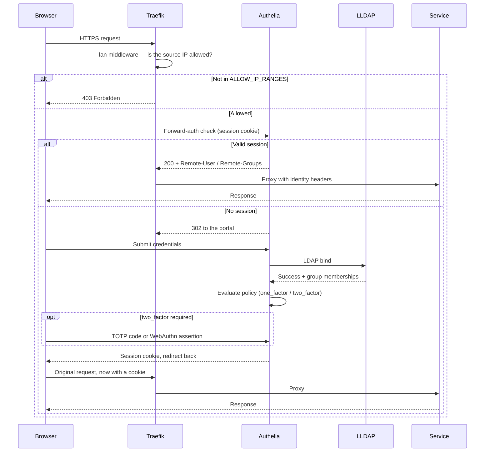
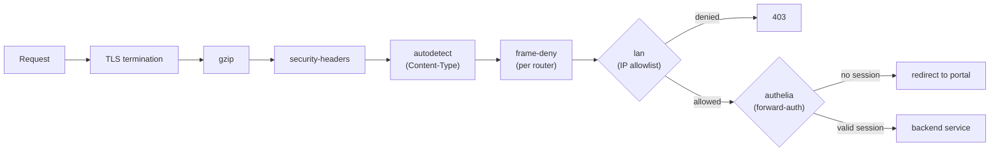

# Security & Authentication

Five layers, in the order a request meets them:

1. **Nothing is exposed but Traefik** — one port, `443`, and the DNS-challenge certificates mean port 80 never has to be reachable.
2. **IP allowlist** (`lan` middleware) — only your LAN, your tailnet and the Docker networks reach a service at all.
3. **VPN mesh** — remote access happens over WireGuard, not over an opened port.
4. **SSO** — Authelia, either as forward-auth or as an OIDC provider.
5. **LLDAP** — one directory of users and groups, the single source of truth for both.

The only deliberate exceptions to layer 2 are the Authelia portal and Headscale, both of which must answer from anywhere; each is explained below.

## How a login works

Which mechanism applies to which service is in [Per-service protection](#per-service-protection).

### Forward-auth — for services with no login of their own


```mermaid
sequenceDiagram
    participant B as Browser
    participant T as Traefik
    participant A as Authelia
    participant L as LLDAP
    participant S as Service

    B->>T: HTTPS request
    T->>T: lan middleware — is the source IP allowed?
    alt Not in ALLOW_IP_RANGES
        T-->>B: 403 Forbidden
    else Allowed
        T->>A: Forward-auth check (session cookie)
        alt Valid session
            A-->>T: 200 + Remote-User / Remote-Groups
            T->>S: Proxy with identity headers
            S-->>B: Response
        else No session
            A-->>T: 302 to the portal
            B->>A: Submit credentials
            A->>L: LDAP bind
            L-->>A: Success + group memberships
            A->>A: Evaluate policy (one_factor / two_factor)
            opt two_factor required
                B->>A: TOTP code or WebAuthn assertion
            end
            A-->>B: Session cookie, redirect back
            B->>T: Original request, now with a cookie
            T->>S: Proxy
            S-->>B: Response
        end
    end
```

### OIDC — for services that can authenticate themselves

Standard authorization-code flow: the service redirects to Authelia's `/authorize`, Authelia authenticates the user against LLDAP (reusing an existing session if there is one), redirects back with a code, and the service exchanges it server-to-server for an ID token — a JWT signed RS256 with the key in `oidc_private_key.pem`. The service verifies the signature and provisions or updates the local user from the claims.

Two consequences specific to this stack: **group membership travels in the `groups` claim**, which is why Nextcloud and Kavita can map LLDAP groups onto their own roles; and the token exchange is a *container-to-container* call, which is why the Authelia router carries no IP allowlist ([below](#the-middleware-chain)).

**The LDAP bind is tuned for a busy host, not a fast one.** `authentication_backend.ldap` raises `timeout` to `15s` and enables `pooling` (5 connections, 2 retries). Authelia's 5-second default is shorter than an I/O stall on a host under swap pressure, and a bind that times out *during* a token grant does not fail politely: the client sees a `500`, which for a refresh grant costs it the token it was rotating. Pooling keeps connections warm so a stall costs a retry instead of a session.

That tolerance is not free, and it is not scoped to token grants: `timeout` covers every LDAP operation, and `pooling.timeout` adds up to 10 s waiting for a free connection on top. With LLDAP genuinely wedged, a forward-auth request can now hang ~25 s where it used to fail at 5 s — and Authelia's `/api/health` touches no LDAP, so the container stays healthy and its Uptime Kuma monitor stays green throughout. The trade is deliberate: a slow gated router beats a destroyed session on a vault that has no local fallback, and Authelia caches user details between refreshes rather than binding on every request. If a wedged LLDAP ever needs to fail fast instead, lower `timeout` — do not remove `pooling`, which is what turns a transient stall into a retry.

**Registered clients** — all `consent_mode: implicit`, defined in `config/authelia/configuration.yml.template`:

| Client | Scopes | Auth method | Policy | Notes |
|--------|--------|-------------|--------|-------|
| **Nextcloud** | openid profile email groups offline_access | client_secret_post | one_factor | Group provisioning enabled |
| **Immich** | openid profile email | client_secret_post | one_factor | Mobile app callback |
| **Beszel** | openid profile email | client_secret_basic | one_factor | PKCE (S256) required |
| **Dockhand** | openid profile email groups | client_secret_post | **admin_only** | 2FA + `admin` group |
| **Headplane** | openid profile email offline_access | client_secret_basic | **admin_only** | 2FA + `admin` group |
| **Headscale** | openid profile email | client_secret_basic | one_factor | VPN device registration |
| **Open WebUI** | openid profile email | client_secret_basic | one_factor | — |
| **Vaultwarden** | openid profile email offline_access | client_secret_basic | one_factor | Master password still required |
| **Kavita** | openid profile email groups offline_access | client_secret_post | one_factor | Roles come from the `groups` claim |
| **Shelfmark** | openid profile email groups | client_secret_basic | one_factor | PKCE (S256) required; admin comes from the `admin` group; local login disabled |
| **Audiobookshelf** | openid profile email | client_secret_basic | one_factor | PKCE (S256) required; **no `groups` scope** — it reads the claim as a role and denies anyone outside admin/user/guest |

`admin_only` is a named policy in the template: deny by default, `two_factor` for members of the `admin` group.

## Per-service protection

| Service | `lan` | `authelia` | Own OIDC | Effective protection |
|---------|:---:|:---:|:---:|----------|
| Authelia portal | — | — | — | Public login entry point. No IP restriction so OIDC clients can reach it server-side; Authelia's own `regulation` handles brute force |
| Headscale | — | — | ✓ | Public by necessity — VPN clients register from anywhere. `/admin` (Headplane) is separately LAN-only + SSO + 2FA |
| Nextcloud | ✓ | — | ✓ | LAN-only + OIDC; a second router leaves the public share paths (`/s/`, `/public.php`, …) open. Its `files_external` mounts are **read-write**, so an account in the `admin` group can delete or move anything in the download and library tree — see [Architecture](ARCHITECTURE.md#the-reading-libraries) |
| Immich | ✓ | — | ✓ | LAN-only + OIDC; second router leaves share paths (`/share`, `/s/`, `/api`) open |
| Vaultwarden | ✓ | — | ✓ | LAN-only + OIDC + master password — see [below](#vaultwarden) |
| Beszel | ✓ | — | ✓ | LAN-only + OIDC, password login disabled |
| Open WebUI | ✓ | — | ✓ | LAN-only + OIDC |
| Dockhand | ✓ | — | ✓ | LAN-only + OIDC + admin + 2FA, local login disabled |
| Headplane | ✓ | ✓ | ✓ | LAN-only + SSO + OIDC + admin + 2FA |
| Kavita | ✓ | — | ✓ | LAN-only + own accounts / OIDC — OPDS clients can't pass an interactive portal |
| Shelfmark | ✓ | — | ✓ | LAN-only + OIDC only; password login disabled (`DISABLE_LOCAL_AUTH`), so requests and download history stay per-user |
| Audiobookshelf | ✓ | — | ✓ | LAN-only + OIDC only; local login disabled once the bootstrap holds an API key, so the shared `PASSWORD` is not a second way into everyone's listening history. No forward-auth: the mobile apps can't pass an interactive portal, and they have their own OIDC redirect URI |
| n8n | ✓ | — | — | LAN-only + its own auth |
| ntfy | ✓ | — | — | LAN-only + its own accounts and ACLs (`deny-all` default) |
| Homepage | ✓ | ✓ | — | LAN-only + SSO |
| Uptime Kuma | ✓ | ✓ | — | LAN-only + SSO |
| qBittorrent | ✓ | ✓ | — | LAN-only + SSO |
| Prowlarr / Kapowarr | ✓ | ✓ | — | LAN-only + SSO |
| Traefik dashboard | ✓ | ✓ | — | LAN-only + admin + 2FA |
| Pi-hole | ✓ | ✓ | — | LAN-only + admin + 2FA |
| Backrest | ✓ | ✓ | — | LAN-only + admin + 2FA + **its own login**, whose password is per-service (`config/backrest/backrest.env`), not `${PASSWORD}` — the API hands the restic repository password and the S3 keys to any *authenticated* caller, and forward-auth only guards the Traefik path, not the container network. Which is why Backrest is also off `frontend`, on the dedicated `backup` segment: only Traefik and Homepage can open `:9898` at all |
| Gluetun HTTP proxy | — | — | — | Not routed through Traefik at all. `gluetun:8888` is unauthenticated and reachable by anything on `frontend` — gluetun's firewall accepts the whole Docker network by design. Enabled for Shelfmark's direct downloads; the exposure is VPN egress for a container that already has internet, not a path to data |
| LLDAP | ✓ | ✓ | — | LAN-only + 2FA + its own auth + `rate-limit-auth` |
| Stremio | ✓ | — | — | LAN-only; streaming clients and cast receivers can't do the portal |
| Comet | partial | — | — | Split in two routers. `/s/<PUBLIC_API_TOKEN>/` is public so an addon installed on a Stremio account resolves off-tailnet; `/configure` is excluded from it, and `/`, `/health` and `/admin*` stay LAN-only. No forward-auth on either — Stremio fetches manifests programmatically. The public half carries `rate-limit-auth`, because each request fans out to Torrentio/MediaFusion/Zilean from the Pi's WAN IP. Its two passwords are generated per-service (`config/comet/comet.env`), never `${PASSWORD}` |

Services with their own account system (Immich, Kavita, Shelfmark, Audiobookshelf) deliberately do **not** stack forward-auth on top of OIDC — their apps and clients cannot complete an interactive portal.

## The middleware chain

Every request through Traefik:


```mermaid
flowchart LR
    R[Request] --> TLS["TLS termination"]
    TLS --> Compress["gzip"]
    Compress --> Headers["security-headers"]
    Headers --> Autodetect["autodetect\n(Content-Type)"]
    Autodetect --> Frame["frame-deny\n(per router)"]
    Frame --> LAN{"lan\n(IP allowlist)"}
    LAN -->|denied| Block[403]
    LAN -->|allowed| Auth{"authelia\n(forward-auth)"}
    Auth -->|no session| Login["redirect to portal"]
    Auth -->|valid session| Backend["backend service"]
```

**Security headers**, on the `websecure` entrypoint:

| Header | Value | Why |
|--------|-------|-----|
| `Strict-Transport-Security` | `max-age=15552000; includeSubDomains` | Force HTTPS for 180 days |
| `X-Content-Type-Options` | `nosniff` | MIME sniffing |
| `Referrer-Policy` | `same-origin` | Referrer leakage |

**`nosniff` needs something to sniff-proof.** Traefik v3 [stopped filling in a missing
`Content-Type`](https://doc.traefik.io/traefik/migrate/v2-to-v3-details/), and the `lan` 403 sets
none — so `nosniff` leaves a WebKit browser nothing to render and it downloads the denial as a
file. `autodetect` restores the v2 behaviour; it is listed **last** on the entrypoint so it wraps
the router middlewares that write such responses. It only fills a `Content-Type` that is absent,
never overriding a backend's own.

**`X-Frame-Options` is separate, and per router.** An entrypoint middleware wraps every router's own middlewares, so its response headers win and no router can opt out. Vaultwarden has to opt out — its `*-connector.html` pages must carry no frame header at all — so the policy lives in a standalone `frame-deny` middleware that each router lists instead. Every router gets `DENY` except Vaultwarden's, which uses `SAMEORIGIN` on the main router and nothing on the connector router (see [Vaultwarden](#vaultwarden)).

List `frame-deny@docker` **first** in a router's chain. Middlewares listed later sit further inside, and anything that short-circuits — the `lan` 403, an Authelia portal redirect, the Stremio redirect — returns without reaching them, so a frame middleware placed last silently omits the header on exactly those responses. Adding a new router means adding it there too; nothing enforces this automatically.

**Rate limiting** — `rate-limit-auth` is applied to LLDAP only (`lldap.*`), after the forward-auth middleware: 10 req/s average per source IP, burst 20, to blunt credential stuffing.

**Why the Authelia portal has neither an allowlist nor a rate limit.** Two reasons, both structural: its SPA fires several API calls on page load and would trip the limiter, and OIDC clients (Open WebUI, Nextcloud, Immich…) make *server-side* calls to its discovery and token endpoints — an IP allowlist would 403 those container-to-container requests. Brute force is handled instead by Authelia's own `regulation` block: `max_retries: 3` within `find_time: 2m`, then `ban_time: 5m`.

**Cookie forwarding.** The `authelia` middleware sets `authRequestHeaders=Accept,Cookie,Authorization` so Traefik passes the session cookie on every protected request. Without it, Authelia cannot find the session in Redis and returns a "user state" error.

## Access-control policies

Authelia's rules in evaluation order (`config/authelia/configuration.yml.template`, default policy **deny**):

| Domain | Subject | Policy |
|--------|---------|--------|
| `auth.*` | — | bypass (the portal itself) |
| `uptime.*`, `homepage.*`, `qbittorrent.*`, `prowlarr.*`, `kapowarr.*`, `ai.*` | any user | one_factor |
| `headscale.*` path `/admin` | `admin` group | two_factor |
| `backrest.*`, `pihole.*`, `traefik.*`, `lldap.*` | `admin` group | two_factor |
| `lldap.*` (fallback) | any user | two_factor |
| anything else | — | **deny** |

**`admin` is the only group that means anything here.** Create it in the LLDAP UI and add your admin accounts; regular users need no group. The deny catch-all applies only to routers carrying the `authelia` middleware — OIDC services enforce their own policy from the client table above.

## Two-factor authentication

Enforced on every admin surface: Traefik, Pi-hole, Backrest and LLDAP through the forward-auth rules, plus Dockhand and Headplane through the `admin_only` OIDC policy.

Users enrol at the Authelia portal under **Security**, with **TOTP** (any authenticator app) or **WebAuthn** (FIDO2 keys, platform authenticators). Save the backup codes.

## Vaultwarden

Served at `https://vault.<HOST_NAME>`. Its data lives in the shared PostgreSQL instance (database and role `vaultwarden`, created by `config/postgres/init-databases.sh`), so it is dumped by `scripts/db-backup.sh vaultwarden` from a Backrest snapshot hook like every other database here. Only attachments, sends and the RSA signing key stay on disk, in `${DATA_LOCATION}/vaultwarden`. It reaches PostgreSQL over its own internal `vault` network, which deliberately does not include LLDAP.

**Accounts.** `SIGNUPS_ALLOWED` is `false`: the router sits behind the LAN allowlist only, so open registration would let anyone on the LAN or the tailnet create a vault. `INVITATIONS_ALLOWED` stays `true`, and `ADMIN_TOKEN` is set, so `/admin` is where you invite people. Read the token with:

```bash
sudo cat ${DATA_LOCATION}/authelia-config/secrets/vaultwarden_admin_token
```

**The admin token is not `PASSWORD`.** `scripts/vaultwarden-pre-start.sh` generates a random token on first start and hands the container only its Argon2id digest, so the plaintext never appears in `compose.yaml`, the container's environment or `docker inspect`. That matters because `/admin` inherits this router's middleware — the LAN allowlist and nothing else, no Authelia forward-auth — so reusing the SSO password would make a `PASSWORD` leak an admin-panel compromise as well. Like the OIDC client secrets and the ntfy passwords, `rotate-password.sh` deliberately leaves it alone; to change it, delete both files and restart.

Vaultwarden accepts a plaintext `ADMIN_TOKEN` but logs a NOTICE about it on every start, and hashing has to happen outside the container because neither tool that can produce a PHC string reads the secret from stdin: `vaultwarden hash` wants a TTY, and Authelia's `crypto hash generate` wants `--password` on argv. The script borrows Authelia's CLI through a throwaway `docker run`, at its default `m=65536,t=3,p=4` — the same cost as Vaultwarden's own `bitwarden` preset.

**Frame headers.** Vaultwarden sets its own `X-Frame-Options` and CSP, and its `/admin` diagnostics validate them end to end — so a reverse proxy that overwrites them shows up there as an `HTTP Response validation` error. Its API needs `SAMEORIGIN`, and `webauthn-connector.html` / `sso-connector.html` need *no* frame header, because the browser extension frames them from a `chrome-extension://` origin that any value would block. That is why these two routers are exempt from `frame-deny` ([above](#the-middleware-chain)); the connector router exists purely to carve those paths out.

**SSO, with consequences.** Authentication is federated to Authelia (client `vaultwarden`, callback `https://vault.<HOST_NAME>/identity/connect/oidc-signin`, which Vaultwarden derives from `DOMAIN` and is not configurable). Two things follow:

- **A master password is still required.** It is the vault's encryption key and never reaches the identity provider. OIDC centralises login and user management; it does not remove the second secret.
- **`SSO_ONLY` is `true`**, so email + master password is refused outright. Every account must be able to sign in through Authelia, which means existing in LLDAP. An invitation only creates a stub account, claimed by signing in via Authelia. There is deliberately **no local fallback**: if Authelia, LLDAP or PostgreSQL is down, nobody can log in. Keep an offline export if that matters to you.
- **`SSO_AUTH_ONLY_NOT_SESSION` is `true`**, so Authelia authenticates the login and nothing more: the session that follows is Vaultwarden's own (access token 2 h, refresh token 7 days idle, renewable). Without it the session rides on Authelia's refresh token, and Authelia rotates those **single-use with no grace period** while the Bitwarden clients refresh even while their access token is still valid — so one refresh response lost to a restart or a transient 500 burns the only token the client holds and locks it out permanently, with a re-login unable to recover it. That failure mode is why this is set.

  **The trade-off is where revocation lives.** Disabling an account in LLDAP or Authelia no longer ends sessions already open — they survive until the Vaultwarden refresh token idles out, up to 7 days. Revoke at `/admin` → the user's **Deauthorize sessions**, which is the authority for a vault anyway. For a password manager on `SSO_ONLY`, being locked *out* of your own credentials is the worse failure of the two; if your threat model reverses that, drop the variable and accept the lockout risk.

Do **not** stack `authelia@docker` forward-auth on this router — the Bitwarden browser extension and mobile clients cannot complete an interactive portal. OIDC is a different mechanism, which they do support.

**Emergency access.** `EMERGENCY_ACCESS_ALLOWED` is `true`, and the flow is entirely email-driven — invite, grant, and the takeover notice that starts the waiting period — so it depends on working SMTP ([Email](EMAIL.md)). Because `SSO_ONLY` is on, a trusted contact also needs an LLDAP account. Someone outside your directory cannot serve as an emergency contact without being added to LLDAP, or `SSO_ONLY` being turned off.

## Secrets

Generated on first start, mode `600`, under `${DATA_LOCATION}/authelia-config/secrets/`, never committed. All but the last two come from `scripts/authelia-pre-start.sh`:

| Secret | Purpose |
|--------|---------|
| `jwt_secret` | Identity token signing |
| `session_secret` | Session cookie signing |
| `storage_encryption_key` | Database credential encryption |
| `oidc_hmac_secret` | OIDC token HMAC |
| `oidc_private_key.pem` | RSA key for JWT RS256 |
| `oidc_<client>_secret.txt` + `_hash` | Per-client shared secrets — plaintext mounted into the client, PBKDF2 hash for Authelia. One pair per client in the table above |
| `db_password` | Authelia's Postgres password |
| `ldap_password` | LLDAP bind password |
| `vaultwarden_admin_token` | Vaultwarden `/admin` token, plaintext — the one you type. Written by `scripts/vaultwarden-pre-start.sh`, never mounted into any container |
| `vaultwarden_admin_token_hash` | Argon2id digest of the above, the only form Vaultwarden receives |

Two more live outside that directory, in `config/comet/comet.env` (mode `600`, gitignored), written by
`scripts/comet-pre-start.sh`: `ADMIN_DASHBOARD_PASSWORD` and `CONFIGURE_PAGE_PASSWORD`, the credentials
for Comet's `/admin` and `/configure` pages. Generated per-service rather than reusing `PASSWORD`, for the
same reason as the Vaultwarden token — Comet has no forward-auth in front of it, and `/configure` is where
a user's debrid API key is stored. Read the one you need with `grep CONFIGURE_PAGE_PASSWORD
config/comet/comet.env`. Neither feeds `PUBLIC_API_TOKEN`, which lives in the `comet_data` volume, so
rotating them leaves every installed Stremio addon URL valid — but `env_file` values are frozen at
container creation, so pick them up with `docker compose up -d comet`, not `restart`.

OIDC client secrets are injected into services through read-only Docker volumes, or written into the
service's own configuration file by its bootstrap script (Kavita's `appsettings.json`, Shelfmark's
`plugins/security.json`) or pushed over its admin API (Audiobookshelf's `PATCH /api/auth-settings`, whose
settings live only in its SQLite database) — never through environment variables, where `docker inspect`
would print them, and never baked into images.

## Sessions

Sessions live in Redis; persistent state (preferences, TOTP and WebAuthn credentials) lives in PostgreSQL. Cookies are **Secure + HttpOnly, SameSite=Lax**, with a **45-minute inactivity timeout**, a **12-hour absolute expiry**, and **1 month** for "remember me".

## Operating it

- **After a leak**, rotate with `make rotate-password` (LLDAP admin + Authelia — the actual SSO master credential) or `make rotate-password-full` (also every Postgres role and every other service using `PASSWORD`). See [Configuration → Changing passwords](CONFIGURATION.md#changing-passwords).
- **Failed logins reach your phone.** The Authelia log watcher publishes them to the ntfy `security` topic, including regulation bans and rejected OIDC grants — see [Monitoring](MONITORING.md#authelia-log-alerts).
- **Encryption at rest is not the default.** TLS covers transport and restic encrypts the backups, but Postgres and Redis data on disk is plain. Put `DATA_LOCATION` on an encrypted filesystem (LUKS) if that matters to you.
