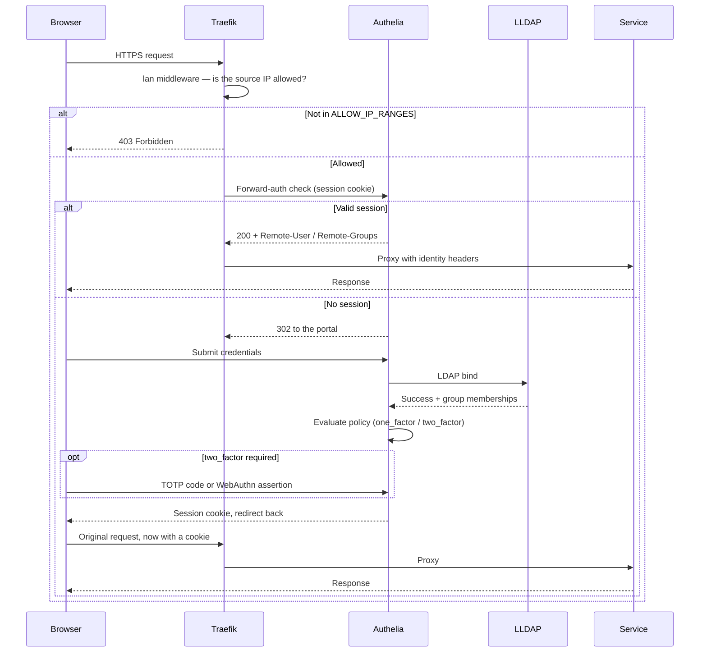
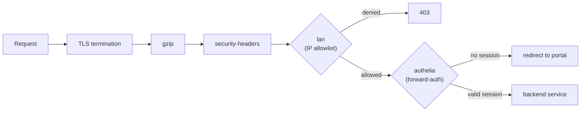

# Security & Authentication

Five layers, in the order a request meets them:

1. **Nothing is exposed but Traefik** — one port, `443`, and the DNS-challenge certificates mean port 80 never has to be reachable.
2. **IP allowlist** (`lan` middleware) — only your LAN, your tailnet and the Docker networks reach a service at all.
3. **VPN mesh** — remote access happens over WireGuard, not over an opened port.
4. **SSO** — Authelia, either as forward-auth or as an OIDC provider.
5. **LLDAP** — one directory of users and groups, the single source of truth for both.

The only deliberate exceptions to layer 2 are the Authelia portal and Headscale, both of which must answer from anywhere; each is explained below.

## How a login works

Which mechanism applies to which service is in [Per-service protection](#per-service-protection).

### Forward-auth — for services with no login of their own

```mermaid
sequenceDiagram
    participant B as Browser
    participant T as Traefik
    participant A as Authelia
    participant L as LLDAP
    participant S as Service

    B->>T: HTTPS request
    T->>T: lan middleware — is the source IP allowed?
    alt Not in ALLOW_IP_RANGES
        T-->>B: 403 Forbidden
    else Allowed
        T->>A: Forward-auth check (session cookie)
        alt Valid session
            A-->>T: 200 + Remote-User / Remote-Groups
            T->>S: Proxy with identity headers
            S-->>B: Response
        else No session
            A-->>T: 302 to the portal
            B->>A: Submit credentials
            A->>L: LDAP bind
            L-->>A: Success + group memberships
            A->>A: Evaluate policy (one_factor / two_factor)
            opt two_factor required
                B->>A: TOTP code or WebAuthn assertion
            end
            A-->>B: Session cookie, redirect back
            B->>T: Original request, now with a cookie
            T->>S: Proxy
            S-->>B: Response
        end
    end
```

### OIDC — for services that can authenticate themselves

Standard authorization-code flow: the service redirects to Authelia's `/authorize`, Authelia authenticates the user against LLDAP (reusing an existing session if there is one), redirects back with a code, and the service exchanges it server-to-server for an ID token — a JWT signed RS256 with the key in `oidc_private_key.pem`. The service verifies the signature and provisions or updates the local user from the claims.

Two consequences specific to this stack: **group membership travels in the `groups` claim**, which is why Nextcloud and Kavita can map LLDAP groups onto their own roles; and the token exchange is a *container-to-container* call, which is why the Authelia router carries no IP allowlist ([below](#the-middleware-chain)).

**Registered clients** — all `consent_mode: implicit`, defined in `config/authelia/configuration.yml.template`:

| Client | Scopes | Auth method | Policy | Notes |
|--------|--------|-------------|--------|-------|
| **Nextcloud** | openid profile email groups offline_access | client_secret_post | one_factor | Group provisioning enabled |
| **Immich** | openid profile email | client_secret_post | one_factor | Mobile app callback |
| **Beszel** | openid profile email | client_secret_basic | one_factor | PKCE (S256) required |
| **Dockhand** | openid profile email groups | client_secret_post | **admin_only** | 2FA + `admin` group |
| **Headplane** | openid profile email offline_access | client_secret_basic | **admin_only** | 2FA + `admin` group |
| **Headscale** | openid profile email | client_secret_basic | one_factor | VPN device registration |
| **Open WebUI** | openid profile email | client_secret_basic | one_factor | — |
| **Vaultwarden** | openid profile email offline_access | client_secret_basic | one_factor | Master password still required |
| **Kavita** | openid profile email groups offline_access | client_secret_post | one_factor | Roles come from the `groups` claim |

`admin_only` is a named policy in the template: deny by default, `two_factor` for members of the `admin` group.

## Per-service protection

| Service | `lan` | `authelia` | Own OIDC | Effective protection |
|---------|:---:|:---:|:---:|----------|
| Authelia portal | — | — | — | Public login entry point. No IP restriction so OIDC clients can reach it server-side; Authelia's own `regulation` handles brute force |
| Headscale | — | — | ✓ | Public by necessity — VPN clients register from anywhere. `/admin` (Headplane) is separately LAN-only + SSO + 2FA |
| Nextcloud | ✓ | — | ✓ | LAN-only + OIDC; a second router leaves the public share paths (`/s/`, `/public.php`, …) open |
| Immich | ✓ | — | ✓ | LAN-only + OIDC; second router leaves share paths (`/share`, `/s/`, `/api`) open |
| Vaultwarden | ✓ | — | ✓ | LAN-only + OIDC + master password — see [below](#vaultwarden) |
| Beszel | ✓ | — | ✓ | LAN-only + OIDC, password login disabled |
| Open WebUI | ✓ | — | ✓ | LAN-only + OIDC |
| Dockhand | ✓ | — | ✓ | LAN-only + OIDC + admin + 2FA, local login disabled |
| Headplane | ✓ | ✓ | ✓ | LAN-only + SSO + OIDC + admin + 2FA |
| Kavita | ✓ | — | ✓ | LAN-only + own accounts / OIDC — OPDS clients can't pass an interactive portal |
| n8n | ✓ | — | — | LAN-only + its own auth |
| ntfy | ✓ | — | — | LAN-only + its own accounts and ACLs (`deny-all` default) |
| Homepage | ✓ | ✓ | — | LAN-only + SSO |
| Uptime Kuma | ✓ | ✓ | — | LAN-only + SSO |
| qBittorrent | ✓ | ✓ | — | LAN-only + SSO |
| Prowlarr / Kapowarr | ✓ | ✓ | — | LAN-only + SSO |
| Traefik dashboard | ✓ | ✓ | — | LAN-only + admin + 2FA |
| Pi-hole | ✓ | ✓ | — | LAN-only + admin + 2FA |
| Backrest | ✓ | ✓ | — | LAN-only + admin + 2FA |
| LLDAP | ✓ | ✓ | — | LAN-only + 2FA + its own auth + `rate-limit-auth` |
| Stremio | ✓ | ✓ | — | LAN-only + SSO; a higher-priority router bypasses SSO for LAN source IPs, since streaming clients can't do the portal |
| Comet | ✓ | — | — | LAN-only; Stremio fetches manifests programmatically |

Services with their own account system (Immich, Kavita) deliberately do **not** stack forward-auth on top of OIDC — their apps and clients cannot complete an interactive portal.

## The middleware chain

Every request through Traefik:

```mermaid
flowchart LR
    R[Request] --> TLS["TLS termination"]
    TLS --> Compress["gzip"]
    Compress --> Headers["security-headers"]
    Headers --> LAN{"lan\n(IP allowlist)"}
    LAN -->|denied| Block[403]
    LAN -->|allowed| Auth{"authelia\n(forward-auth)"}
    Auth -->|no session| Login["redirect to portal"]
    Auth -->|valid session| Backend["backend service"]
```

**Security headers**, on the `websecure` entrypoint:

| Header | Value | Why |
|--------|-------|-----|
| `Strict-Transport-Security` | `max-age=15552000; includeSubDomains` | Force HTTPS for 180 days |
| `X-Frame-Options` | `DENY` | Clickjacking |
| `X-Content-Type-Options` | `nosniff` | MIME sniffing |
| `Referrer-Policy` | `same-origin` | Referrer leakage |

**Rate limiting** — `rate-limit-auth` is applied to LLDAP only (`lldap.*`), after the forward-auth middleware: 10 req/s average per source IP, burst 20, to blunt credential stuffing.

**Why the Authelia portal has neither an allowlist nor a rate limit.** Two reasons, both structural: its SPA fires several API calls on page load and would trip the limiter, and OIDC clients (Open WebUI, Nextcloud, Immich…) make *server-side* calls to its discovery and token endpoints — an IP allowlist would 403 those container-to-container requests. Brute force is handled instead by Authelia's own `regulation` block: `max_retries: 3` within `find_time: 2m`, then `ban_time: 5m`.

**Cookie forwarding.** The `authelia` middleware sets `authRequestHeaders=Accept,Cookie,Authorization` so Traefik passes the session cookie on every protected request. Without it, Authelia cannot find the session in Redis and returns a "user state" error.

## Access-control policies

Authelia's rules in evaluation order (`config/authelia/configuration.yml.template`, default policy **deny**):

| Domain | Subject | Policy |
|--------|---------|--------|
| `auth.*` | — | bypass (the portal itself) |
| `uptime.*`, `homepage.*`, `qbittorrent.*`, `prowlarr.*`, `kapowarr.*`, `ai.*` | any user | one_factor |
| `headscale.*` path `/admin` | `admin` group | two_factor |
| `backrest.*`, `pihole.*`, `traefik.*`, `lldap.*` | `admin` group | two_factor |
| `lldap.*` (fallback) | any user | two_factor |
| anything else | — | **deny** |

**`admin` is the only group that means anything here.** Create it in the LLDAP UI and add your admin accounts; regular users need no group. The deny catch-all applies only to routers carrying the `authelia` middleware — OIDC services enforce their own policy from the client table above.

## Two-factor authentication

Enforced on every admin surface: Traefik, Pi-hole, Backrest and LLDAP through the forward-auth rules, plus Dockhand and Headplane through the `admin_only` OIDC policy.

Users enrol at the Authelia portal under **Security**, with **TOTP** (any authenticator app) or **WebAuthn** (FIDO2 keys, platform authenticators). Save the backup codes.

## Vaultwarden

Served at `https://vault.<HOST_NAME>`. Its data lives in the shared PostgreSQL instance (database and role `vaultwarden`, created by `config/postgres/init-databases.sh`), so it is dumped by `scripts/db-backup.sh vaultwarden` from a Backrest snapshot hook like every other database here. Only attachments, sends and the RSA signing key stay on disk, in `${DATA_LOCATION}/vaultwarden`. It reaches PostgreSQL over its own internal `vault` network, which deliberately does not include LLDAP.

**Accounts.** `SIGNUPS_ALLOWED` is `false`: the router sits behind the LAN allowlist only, so open registration would let anyone on the LAN or the tailnet create a vault. `INVITATIONS_ALLOWED` stays `true`, and `ADMIN_TOKEN` is set to `PASSWORD`, so `/admin` is where you invite people. The token is plaintext rather than an Argon2 PHC hash — Vaultwarden logs a startup warning about it — because a hash would have to be regenerated on every rotation, while a plain `${PASSWORD}` reference simply follows `.env` the next time the container is recreated. `scripts/rotate-password.sh` does not recreate Vaultwarden, so a rotated token only takes effect on the next reboot, `make restart` or image bump. Bear in mind `/admin` inherits this router's middleware, which is the LAN allowlist and nothing else: anyone on the LAN or the tailnet who knows `PASSWORD` reaches it.

**SSO, with consequences.** Authentication is federated to Authelia (client `vaultwarden`, callback `https://vault.<HOST_NAME>/identity/connect/oidc-signin`, which Vaultwarden derives from `DOMAIN` and is not configurable). Two things follow:

- **A master password is still required.** It is the vault's encryption key and never reaches the identity provider. OIDC centralises login and user management; it does not remove the second secret.
- **`SSO_ONLY` is `true`**, so email + master password is refused outright. Every account must be able to sign in through Authelia, which means existing in LLDAP. An invitation only creates a stub account, claimed by signing in via Authelia. There is deliberately **no local fallback**: if Authelia, LLDAP or PostgreSQL is down, nobody can log in. Keep an offline export if that matters to you.

Do **not** stack `authelia@docker` forward-auth on this router — the Bitwarden browser extension and mobile clients cannot complete an interactive portal. OIDC is a different mechanism, which they do support.

**Emergency access.** `EMERGENCY_ACCESS_ALLOWED` is `true`, and the flow is entirely email-driven — invite, grant, and the takeover notice that starts the waiting period — so it depends on working SMTP ([Email](EMAIL.md)). Because `SSO_ONLY` is on, a trusted contact also needs an LLDAP account. Someone outside your directory cannot serve as an emergency contact without being added to LLDAP, or `SSO_ONLY` being turned off.

## Secrets

Generated on first start by `scripts/authelia-pre-start.sh`, mode `600`, under `${DATA_LOCATION}/authelia-config/secrets/`, never committed:

| Secret | Purpose |
|--------|---------|
| `jwt_secret` | Identity token signing |
| `session_secret` | Session cookie signing |
| `storage_encryption_key` | Database credential encryption |
| `oidc_hmac_secret` | OIDC token HMAC |
| `oidc_private_key.pem` | RSA key for JWT RS256 |
| `oidc_<client>_secret.txt` + `_hash` | Per-client shared secrets — plaintext mounted into the client, PBKDF2 hash for Authelia. One pair per client in the table above |
| `db_password` | Authelia's Postgres password |
| `ldap_password` | LLDAP bind password |

OIDC client secrets are injected into services through read-only Docker volumes — never through environment variables or baked into images.

## Sessions

Sessions live in Redis; persistent state (preferences, TOTP and WebAuthn credentials) lives in PostgreSQL. Cookies are **Secure + HttpOnly, SameSite=Lax**, with a **45-minute inactivity timeout**, a **12-hour absolute expiry**, and **1 month** for "remember me".

## Operating it

- **After a leak**, rotate with `make rotate-password` (LLDAP admin + Authelia — the actual SSO master credential) or `make rotate-password-full` (also every Postgres role and every other service using `PASSWORD`). See [Configuration → Changing passwords](CONFIGURATION.md#changing-passwords).
- **Failed logins reach your phone.** The Authelia log watcher publishes them to the ntfy `security` topic, including regulation bans — see [Monitoring](MONITORING.md#authelia-failed-login-alerts).
- **Encryption at rest is not the default.** TLS covers transport and restic encrypts the backups, but Postgres and Redis data on disk is plain. Put `DATA_LOCATION` on an encrypted filesystem (LUKS) if that matters to you.
